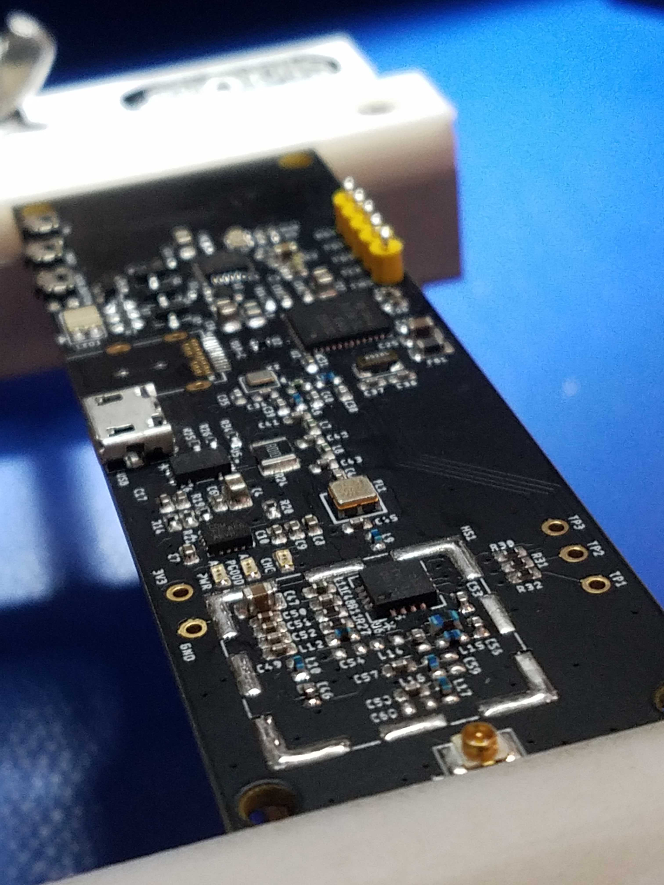
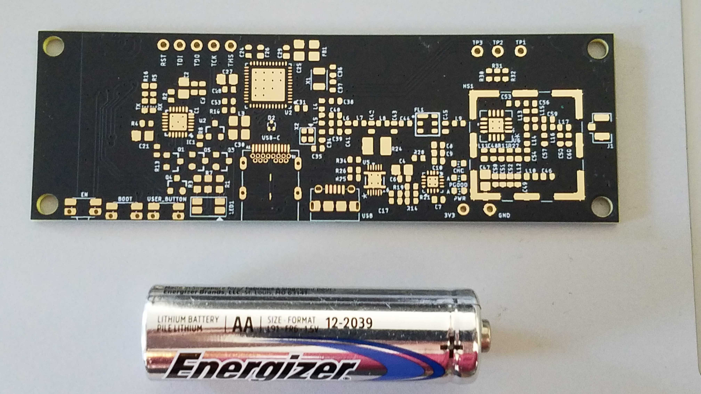

  

  <a href="https://locha.io/">Project Website</a> |
  <a href="https://locha.io/donate">Donate</a> |
  <a href="https://github.com/sponsors/rdymac">Sponsor</a> |
  <a href="https://locha.io/buy">Buy</a>

  <a href="https://github.com/btcven/locha/graphs/contributors">Contributors</a> |
  <a href="#backers">Backers</a>

<h1 align="center">Locha Mesh</h1>

The Locha Mesh is a radio network for off-grid messaging, Bitcoin and other cryptocurrencies
transactions without access to the Internet. We are developing the protocol and the firmware for affordable devices like the *Turpial*,
*Harpia*, or their DIY equivalents. We adhere to open source ethos at every
step and aim to make this tool as decentralized as possible so users can
transmit with freedom.

## Backers

### Become a backer

You can support the Locha Mesh open-source software and hardware efforts by donating through any of the methods listed below. Depending o the amount donated you could be eligible to receive a Locha Mesh Turpial device in pre-order. [Contact us](mailto:randy+donation@locha.io) if you've made a donation of $350 USD or more and you'd like to receive (or donate to a cause) a Turpial device.

* Become a Sponsor here in GitHub: https://github.com/sponsors/rdymac (your sponsorship may be matched by GitHub!)

* Donate any amount using Bitcoin and Lightning Network to the open-source efforts: https://locha.io/donate

* Pre-order 3 Turpial devices for a $1000 USD worth of BTC donation to the open-source efforts: https://locha.io/buy

* Support and donate XMR to our Monero Community Crowdfunding System (CCS) proposal [here](https://repo.getmonero.org/monero-project/ccs-proposals/merge_requests/115).

* Donate ETH and ERC20 tokens through the Gitcoin Grants page [here](https://gitcoin.co/grants/385/locha-mesh-private-txs-censorship-resistant-dapps?tab=activity).

## Getting started

The Locha Mesh is under active development. If you want to join the development efforts, please follow the instructions below on how to get started.

* You need to acquire a Turpial device (currently only available as a [pre-order](https://locha.io/buy)); or [compatible development hardware](https://github.com/btcven/locha/blob/master/documents/turpial-description.md) which is comprised of an ESP32 and a radio module.

* Once you have the hardware you need to follow the instructions on [how to flash the ESP32](https://github.com/btcven/turpial-firmware#getting-started), and [how to flash the radio module](https://github.com/btcven/radio-firmware#getting-started).

* If you need help, please join our Telegram group [here](https://t.me/Locha_io).

## What's in the code?

* The first application that communicates with the Turpial devices can be found
[here](https://github.com/btcven/locha-mesh-chat).

* Our firmware for the Turpial boards (ESP32) can be found
[here](https://github.com/btcven/turpial-firmware).

* Our firmware for the radio modules can be found
[here](https://github.com/btcven/radio-firmware).

* The routing protocol and code for the mesh network can be found
[here](https://github.com/btcven/radio-firmware).

* You can find a Locha Mesh simulator, datasheets, and more in the
[Bitcoin Venezuela organization](https://github.com/btcven).

* Documentation can be found
[here](https://github.com/btcven/locha/tree/master/documents).

## Contribution guidelines

Please read our [contributing guide.](CONTRIBUTING.md)

## Supported devices

### Turpial
A Turpial is a small and portable device
[ESP32](https://www.espressif.com/en/products/hardware/esp-wroom-32/overview)
based system.

Radio module, battery type, and more details about the board are currently
described
[here](https://github.com/btcven/locha/blob/master/documents/turpial-description.md).

  
   
  <i>Actual board photo</i>

  
   
  <i>Size comparison of a Turpial board</i>

----
#### :warning: Warning :warning:

Please take into account that some things in this repo are in a very early
stage. Thank you for reading through the code and for sharing your ideas on
Twitter and the [Issues](https://github.com/btcven/locha/issues) section here
at GitHub or under each specific repo.

----
## Stay connected

- Twitter [@Locha_io](https://twitter.com/Locha_io).
- Website [locha.io](https://locha.io).
- Telegram [Locha](t.me/Locha_io)

## License

Copyright (c) 2019 Bitcoin Venezuela and Locha Mesh developers.

Licensed under the **Apache License, Version 2.0**

---
**A text quote is shown below**

Unless required by applicable law or agreed to in writing, software
distributed under the License is distributed on an "AS IS" BASIS,
WITHOUT WARRANTIES OR CONDITIONS OF ANY KIND, either express or implied.
See the License for the specific language governing permissions and
limitations under the License.

Read the full text:
[Locha Mesh Apache License 2.0](https://github.com/btcven/locha/blob/master/LICENSE)

----
Leeme en: [Español](README.es.md)
