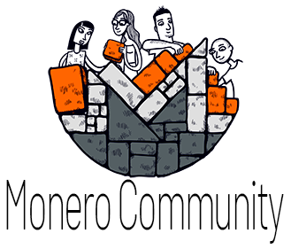

  

  <a href="https://locha.io/">Project Website</a> |
  <a href="https://locha.io/donate">Donate</a> |
  <a href="https://github.com/sponsors/rdymac">Sponsor</a> |
  <a href="https://locha.io/buy">Buy</a>

  <a href="./AUTHORS">Authors</a> |
  <a href="#backers">Backers</a>

<h1 align="center">Locha Mesh</h1>

## What is the Locha Mesh?

During the year 2018 in Venezuela there were power blackouts throughout the whole country which left cities without power for weeks, even cell towers run out of power supply after a few days, so despite people managed to charge their phones with generators or cars' battery, there wasn’t any cell service for them to communicate with others. No calls, no SMS, no mobile data.

How do you communicate and do commerce when there is no communication infrastructure, nor power grid at all?

The Locha Mesh is an open-source and open-hardware project initiated by the non-profit [Bitcoin Venezuela](https://www.bitcoinvenezuela.com) in 2018, to create the software, protocol, and hardware needed for a resilient, decentralized, mesh network of devices capable of transmitting messages, data, Bitcoin transactions, and services completely off-grid without having to rely on an Internet connection or even the electrical grid, for disaster hit countries and privacy-concerned individuals and groups.

The Locha Mesh devices are battery powered and could also use solar panels. There will be custom made hardware, the Turpial, which is mobile-first so you can carry it around. (you can pre-order a Turpial device by making a donation to the project) and also DIY alternatives. The Turpial device can also be attached to a computer (desktop, laptop, Raspberry Pi...) to offer services to others and get paid in Bitcoin, Lightning Network, and Monero RPC-Pay. You can add a bigger antenna and power amplifier to serve a wider area or reach longer distances.

 

## Table of Contents
- [Table of Contents](#table-of-contents)
  - [Backers](#backers)
    - [Become a backer](#become-a-backer)
  - [Getting started](#getting-started)
  - [What's in the code?](#whats-in-the-code)
  - [Contribution guidelines](#contribution-guidelines)
  - [Reporting issues](#reporting-issues-bugs-or-improvements)
  - [Stay connected](#stay-connected)
  - [License](#license)

## Backers

<figure>
  
</figure>

### Become a backer

You can support the Locha Mesh open-source software and hardware efforts by donating through any of the methods listed below. Depending o the amount donated you could be eligible to receive a Locha Mesh Turpial device in pre-order. [Contact us](mailto:randy+donation@locha.io) if you've made a donation of $350 USD or more and you'd like to receive (or donate to a cause) a Turpial device.

* Become a Sponsor here in GitHub and get Turpial devices for yoru contributions: https://github.com/sponsors/rdymac

* Donate any amount using Bitcoin and Lightning Network to the open-source efforts: https://locha.io/donate

* Pre-order 3 Turpial devices for $500 USD or 1 for $200 USD donation to the open-source efforts using Bitcoin, Monero, card, Apple Pay or Google Pay: https://locha.io/#pre-order

* Support and share our Monero Community Crowdfunding System (CCS) proposals [here](https://locha.io/monero/).

* Donate ETH and ERC20 tokens through the Gitcoin Grants page [here](https://gitcoin.co/grants/385/locha-mesh-private-txs-censorship-resistant-dapps?tab=activity).

 

## Getting started

In this page you will find all the information related to the progress of the project, in two languages, [Spanish](./documentation/es/index.md), and [English](./documentation/en/index.md). This work is still under development stage, but all days we are updating the information to expose all the progress about the project

The Locha Mesh is under active development. If you are a C/C++ developer and you want to join the development efforts, or you are a maker and would like to setup the development kits to have them ready for when the firmwares are ready, or if you are a phreaker and you want to hack new ways for decentralized communications, please follow the instructions below on how to get started.

* You need to acquire a Turpial device (currently only available as a [pre-order](https://locha.io/buy)); or the DIY [compatible development hardware](./documentation/en/diy_turpial.md) which is comprised of an ESP32 and a CC1312R radio module.

* Once you have the hardware you need to follow the instructions on [how to flash the ESP32](https://github.com/btcven/turpial-firmware#getting-started), and [how to flash the radio module](https://github.com/btcven/radio-firmware#getting-started); If you want to collaborate in transcription in other different languages, you are welcome.

* If you need help, please join our Telegram group [here](https://t.me/Locha_io).

## What's in the code?

* The first application that communicates with the Turpial devices can be found
[here](https://github.com/btcven/locha-mesh-chat).

* Our firmware for the Turpial boards (ESP32) can be found
[here](https://github.com/btcven/turpial-firmware).

* Our firmware for the radio modules can be found
[here](https://github.com/btcven/radio-firmware).

* The routing protocol and code for the mesh network can be found
[here](https://github.com/btcven/radio-firmware).

* You can find a Locha Mesh simulator, datasheets, and more in the
[Bitcoin Venezuela organization](https://github.com/btcven).

## Contribution guidelines

* Please read our [contributing guide.](CONTRIBUTING.md)

* Pull Requests need to be made to the latest `dev` branch.

 

## Reporting issues, bugs, or improvements

Thank you for reading through the code if you have any idea, bug report, or improvement you can make a PR to the `dev` branch or open an issue [here](https://github.com/btcven/locha/issues) for general questions or suggestions, or under each specific repo:

- General: https://github.com/btcven/locha/issues/issues
- Messaging app: https://github.com/btcven/locha-mesh-chat/issues
- Firmware of the Turpial boards: https://github.com/btcven/turpial-firmware/issues
- Radio firmware and protocol: https://github.com/btcven/radio-firmware/issues

 

## Stay connected

- Twitter [@Locha_io](https://twitter.com/Locha_io)
- Website [locha.io](https://locha.io)
- Telegram [Locha](https://t.me/Locha_io)

 

## License

Copyright (c) 2019 Bitcoin Venezuela and Locha Mesh developers.

Licensed under the **Apache License, Version 2.0**

---
**A text quote is shown below**

Unless required by applicable law or agreed to in writing, software
distributed under the License is distributed on an "AS IS" BASIS,
WITHOUT WARRANTIES OR CONDITIONS OF ANY KIND, either express or implied.
See the License for the specific language governing permissions and
limitations under the License.

Read the full text:
[Locha Mesh Apache License 2.0](https://github.com/btcven/locha/blob/master/LICENSE)

