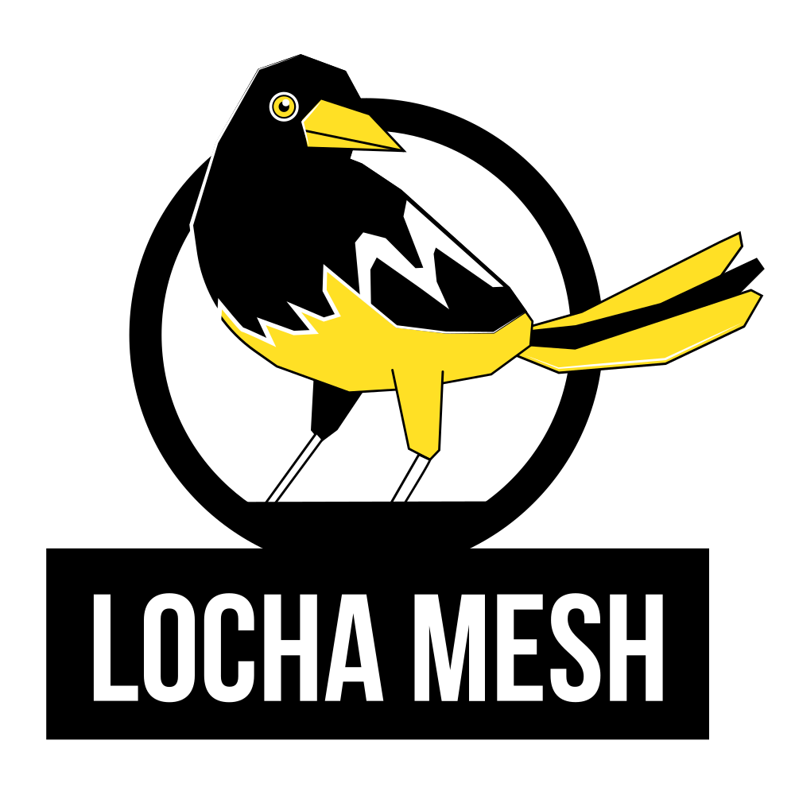

 

<h1 align="center"> Locha </h1>

Nos encanta que nos visites y puedas leer mas acerca de nosotros. Aquí puedes encontrar el firmware para tu dispositivo compatible con **lochaMesh** y estar al tanto del proceso de desarrollo. 

<sumary>

<h2 align="center"> ¿Qué es locha? </h2>
</sumary>

La red mesh de Locha es una red via radio para el intercambio de **mensajes de texto** o **transacciones en la blockchain de Bitcoin**
El principal objetivo es conseguir establecer una red de largo alcance para cualquier persona en cualquier lugar, por esta razón, estamos trabajando no sólo en la creación del protocolo, si no también en el firmware de dispositivos asequibles, como **Turpial** ó **Harpia** [más info](https://es.wikipedia.org/wiki/Red_en_malla).

---

<sumary>

<h2 align="center"> Turpial </h2>
</sumary>

Es un pequeño dispositivo portátil basado en un MCU [ESP32](https://www.espressif.com/en/products/hardware/esp-wroom-32/overview).

**Características**
- Doble nucleo de 32 bits a 240 MHz de reloj.
- 8MB de almacenamiento flash.
- WiFi b/g/n doble modo Punto de acceso(AP) y cliente(ST)
- Bluetooth (Para acceso al administrador)
- Módulo de radio (para la red mesh de largo alcance)
- Batería de 1000 mAh
- micro USB para cargar la bateria y actualización de software.
- Pantalla OLED de 0.96".

_([descubre Turpial](saber mas sobre Turpial))_

---

<sumary>

<h2 align="center"> Harpia </h2>
</sumary>

**Características**
- Cuádruple nucleo de 64 bits a 1.4 Ghz de reloj.
- Almacena hasta 128Gb.
- WiFi doble modo, doble banda 2.4Ghz/5Ghz.
- Bluetooth 4.2
- Módulo de radio (para la red mesh de largo alcance).
- Ethernet port.
- 4 USB ports.

_([descubre Harpia](saber mas sobre Harpia))_

---

<sumary>

<h2 align="center"> ¿Es posible instalar el firmware de locha en otros dispositivos? </h2>
</sumary>

**¡Claro!** Hemos probado su instalación en routers domésticos con [openWRT](https://es.wikipedia.org/wiki/OpenWrt), algunos MCUs de ARM pueden ser una estupenda opción para hacerlo. El firmware usa poca memoria RAM y estamos intentando seguir la linea de un producto agnóstico al hardware o marca concreta.

<sumary>

<h2 align="center"> El Código </h2>
</sumary>

* En el siguiente repo puedes encontrar el firmware para [Turpial](https://github.com/btcven/locha-mesh-app/tree/master/Turpial) y [Harpia](Harpia) (soon).
* Documentos de carácter general y otras cosas [Docs](documents/README_ES.md)
* La aplicación movil usada por locha [aqui](https://gitlab.com/btcven/locha/mobile-app)

<h2 align="center"> Síguenos! </h2>

- Twitter [Locha_io](https://twitter.com/Locha_io)
- Web [locha.io](https://locha.io)

#### :warning: Atención :warning:
**Nos encanta que leas el código y compartas tus ideas, algunas cosas en los repositorios estan en una etapa muy temprana. Recomendamos encarecidamente que esperes a futuras releases del software antes de usarlo.**

<h2 align="center"> Licencia </h2>
Copyright (c) 2019 desarrolladores de locha.io

El software está bajo una licencia [MIT](LICENSE), puedes leer el texto completo de la misma _[aquí](LICENSE)_.

Léeme en: [English](README.md) y [Portugués](README_PT.md)
