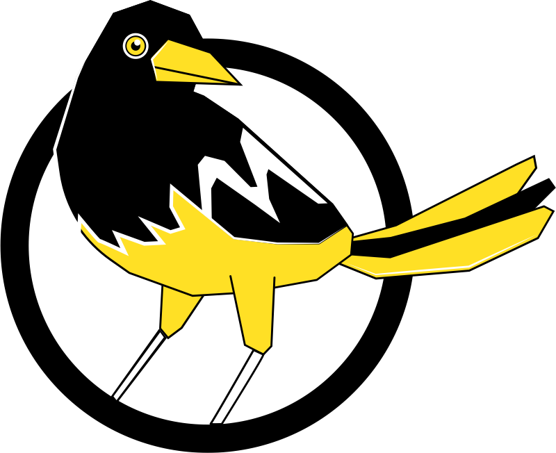

# Locha Mesh

Locha Mesh es una red de radio que permite tanto comunicacion entre individuos como transacciones Bitcoin, sin internet o incluso sin electricidad procedente de la red electrica. Estamos trabajando no solo en el protocolo, tambien desarrollamos el firmware para dispositivos asequibles como **Turpial** o **Harpia**.

## Sobre el código
* El firmware que corre sobre los dispositivos Turpial puede ser encontrado [aquí](https://github.com/btcven/locha-mesh-app)

* Ejemplo de algunos mensajes del protocolo de enrutado puedes encontrarlos [aquí](https://github.com/btcven/locha-mesh-app/blob/master/Turpial/routing_incoming.cpp)

* La actual aplicación móvil puedes encontrarla [aquí](https://gitlab.com/btcven/locha/mobile-app), corre sobre Android, en versiones igual o superior a la 5.0

* Estamos trabajando en la nueva aplicación móvil, funcinará sobre iOS o Android y esperamos publicarla en las correspondientes tiendas de aplicaciones. Visita [aquí](https://github.com/btcven/LochaMesh-Chat) el repositorio.

* Documentacion y otras cosas, echa un vistazo por [aquí](https://github.com/btcven/locha/tree/master/documents)

## ¿El software para Locha Mesh puede ser instalado en otros dispositivos?

¡Claro!, hemos testeado el código en algunos routers ejecutando OpenWRT, también algunas MCUs de ARM pueden ser una buena elección. El firmware tiene muy bajo impacto sobre la RAM e intentamos mantenerlo "vendor agnostic".

## Dispositivos soportados

### Turpial

Es un dispositivo pequeño y portable basado en [ESP32](https://www.espressif.com/en/products/hardware/esp-wroom-32/overview).

**Características**

- Doble nucleo de 32 bits corriendo a 240MHz.
- 8MB de almacenamiento flash.
- WiFi b/g/n modo dual, punto de acceso y estación cliente (AP/Station).
- Bluetooth (para administración)
- Módulo de radio (para la red en maya de larga distancia)
- Batería de 1000 mAh
- micro USB para carga y actualizar el software.
- ~~Pantalla OLED de 0.96".~~ (*)

En cada Turpial podemos conectar hasta 3 clientes via WiFi para enviar/recibir mensajes de texto o transacciones Bitcoin.

_(*) La pantalla se ha eliminado del hardware de referencia para mejorar el rendimiento de la batería._

### Harpia (pronto)

**Características**

- Quad core 64 bits a 1.4 Ghz.
- Almacenamiento de hasta 128Gb.
- WiFi doble modo y doble banda 2.4Ghz/5Ghz.
- Bluetooth 4.2
- Módulo de radio (para la red en maya de larga distancia).
- Puerto Ethernet.
- 4 puertos USB.

----
#### :warning: Warning :warning:
Por favor, tenga en cuenta que en este y otros repositorios relacionados con Locha Mesh algunas cosas están en una fase temprana. Gracias por leer el código, compartir tus ideas en Twitter ó mejoras en la sección *Issues* aquí en GitHub.

----
## Conecta con nosotros

- Twitter [@Locha_io](https://twitter.com/Locha_io)
- Web [locha.io](https://locha.io)

## Licencia

Copyright (c) 2019 Bitcoin Venezuela y desarrolladores de Locha Mesh.

Licenciado bajo la **Apache License, Version 2.0**

---
**Un extracto de la licencia es mostrado a continuación**

Unless required by applicable law or agreed to in writing, software
distributed under the License is distributed on an "AS IS" BASIS,
WITHOUT WARRANTIES OR CONDITIONS OF ANY KIND, either express or implied.
See the License for the specific language governing permissions and
limitations under the License.

Lee el texto completo:
[Locha Mesh Apache License 2.0](https://github.com/btcven/locha/blob/master/LICENSE)

----
Leeme en: [Inglés](README.md), [Portugués](README_PT.md)
