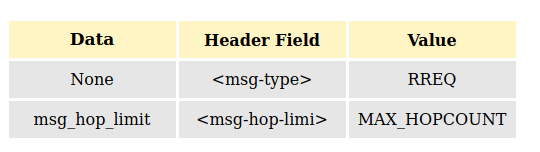

<br>
<h1 align="center">Capitulo 9</h1>
<br>

# 9. Formato de paquetes para redes MANET

AODVv2 especifica en su draft que los mensajes de control tienen que mapearse en un contenedor llamado Generalized Mobile Ad Hoc Network (MANET) Packet/Message Format[RFC5444]. Este formato de paquete proporciona un encapsulado único para múltiples protocolos de enrutamiento Ad Hoc.

El RFC5444 dota de una mayor eficiencia a las trasmisiones de los mensajes de control, estructura de tal manera el contenido que reduce el número de bytes a transmitir.

El formato RFC5444 define los siguientes elementos:
- Paquete: Es la entidad de mayor nivel. Un paquete contiene una cabecera y cero o más mensajes.
- Mensaje: Es la entidad que transporta la información del protocolo. Un mensaje estáformado por una cabecera, un bloque TLV y un bloque de direcciones.
- Bloque de direcciones: Está formado por una o más direcciones, y un bloque de atributos.
- Bloque TLV: Está formado por uno o másTLV.
- TLV: Es una estructuraque tiene la forma “type-length-value”. Donde 
 - Type: Es el identificador del tipo de dato que viene a continuación.
 - Length: Este campo indica cuantos bytes ocupa el campo value.
 - Value: Es el valor concreto del objeto al que se refiere.

En la siguiente imagen se representa la estructura de un paquete RFC544 y sus dependencias.

 

Cada tipo de mensaje de control se tiene que adaptar al formato del paquete RFC5444.

AODVv2 no requiere acceso al encabezado del paquete [RFC5444].

En el encabezado del paquete AODVv2 usa:
- **msg-type**. 
- **msg-hop-limit**.
- **msg-addr-length**.

**msg-addr-length** indica el tamano de la direccion en el mensaje, el cual su valor corresponde a ```addr_length en octetos -1```, por ejemplo para IPV4 seria 3 y para IPV6 seria igual 15.

 Para esto primero vamos a revisar cuales son los campos de cabecera del paquete RFC5444 que AODVv2 utiliza.


## 9.1 Paquetes

### 9.1.1 pkt-header

Esta definido como sigue:

**version**: Es un campo conteniendo un entero sin signo e 4 bits y especifica la version en la cual el paquete y el contenido del mensaje ha sido construido.

**pkt-flag**: Es un campo de 4 bits que especifica la interpretación del resto del encabezado del paquete:
- **bit 0**(phaseseqnum) si esta seteado a uno('1'), entonces significa que el **pkt-seq--num** esta incluido en el **pkt-header**, en caso contrario no lo esta.
- **bit 1**(phastlv): Si esta seteado en uno('1'), significa que el **tlv-block** esta incluido en el **pkt-header**, en caso contrario no lo esta.
- **bit 2-3**: Estan reservados y deberian ser limpiados en cada transmision y deben ser ignorados en cada recepcion.
 
**pkt-seq-num**: Es omitido si el ```phaseseqnum``` flag esta establecido en cero('0'), en caso contrario es un entero sin signo de 16 bits, especificando el numero de secuencia de un paquete.

**tlv*block**: Es omitido si el ```phastlv``` flag esta seteado en cero('0'), en caso contrario, se define en el [RFC4544 seccion 5.4](https://tools.ietf.org/html/rfc5444#section-5.2)


## 9.2 Mensajes
Los paquetes pueden, además del encabezado del paquete, contener uno o más mensajes Los mensajes contienen:

- Un mensaje header
- Un bloque de mensaje TLV que contiene cero mas TLVs, asociados con le mensaje completo.
- Cero o mas bloques de direcciones , cada bloque conteniendo uno o mas objetos de direcciones.
- Un bloque TLV de bloque de dirección, que contiene cero o más TLV.

```
 <message> = <msg-header>
 <tlv-block>
 (<addr-block><tlv-block>)*

 <msg-header> = <msg-type>
 <msg-flags>
 <msg-addr-length>
 <msg-size>
 <msg-orig-addr>?
 <msg-hop-limit>?
 <msg-hop-count>?
 <msg-seq-num>?
```

### 9.2.1 msg-header

**msg-type**: Es un campo que aloja un entero sin signo de 8 bits, especificando el tipo de mensaje.

**msg-flags**: Es un campo de 4 bits que especifica la interpretación del resto del encabezado del mensaje:
- **bit 0**(mhasorig): Si esta establecido en uno('1') entonces significa que el **msg-orig-addr** sera incluido en el **msg-header**, en caso contrario no.
- **bit 1**(mhashoplimit): Si esta estabecido en uno('1'), significa que **msg-hop-limit** sera incluido en el **msg-header**, en caso contrario no.
- **bit 2**(mhashopcount): Si esta establecido en uno('1'), significa qu eel **msg-hop-count** sera incluido en el **msg-header**, en caso contrario no.
- **bit 3**(mhaseqnum): Si esta establecido en uno('1'), entonces significa que el **msg-seq-num** sera incluido en el **msg-header**, en caso contrario no.

### 9.2.2 msg-header-length

**No revisar aun EN PROCESO DE DESARROLLO**
Es un campo que contiene un entero sin signo de 8 bits 

AODVv2 utilza los siguientes campos del mensaje Header RFC5444



<br>

<h3> El address block esta formado por:</h3>


<h3> El TLV para OrigPrefix estará formado por:</h3>


<h3>El TLV para TargPrefix estará formado por:</h3>


## 9.3 oonf_api
Para el encapsulado del paquete AODVv2 dentro del contenedor de paquete RFC5444, para cumplir el objetivo, en este proyecto se hace uso de la api llamada [oon_api](https://github.com/benpicco/oonf_api), la cual facilita la lectura y escritura de dicho paquete dentro del contenedor.


