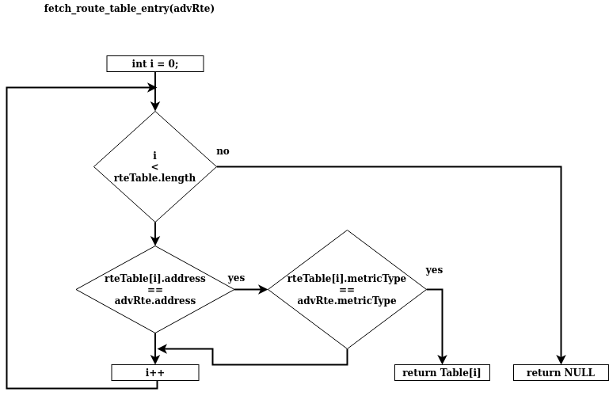

# 11. Operaciones generales del protocolo AODVv2.
Explicaremos cómo las operaciones del protocolo _AODVv2_ sirven, por ejemplo, para comparar mensajes entrantes y actualizar tabla de rutas locales, entre  otras funciones.

## 11.1 Operaciones de ruta.
Existen diferentes funciones en el proceso de búsqueda de rutas. Las funciones que implementaremos serán las siguientes:

- check_route_state.
- process_routing_info.
- fetch_route_table_entry.
- update_route_table_entry.
- create_route_table_entry.
- loop_free.

Primero vamos a definir los siguientes términos utilizados en los algoritmos.

- **rteMsg**: es mensaje de ruta recibido. Este mensaje puede ser _RREQ_ o _RREP_.
- **advRte**: es la ruta definida dentro del mensaje de ruta (_RREQ_ o _RREP_). 
- **localRoute**: es una ruta local existente dentro de la tabla de rutas, que coincide con **address**,**prefix_length**,**metric_type** y **seqNoRtr** del advRte.


## 11.2 Información del proceso de enrutamiento.

Un mensaje _RREQ_ contiene una ruta a su origen, mientras un mensaje de respuesta _RREP_ contiene una ruta a su destino.

Por lo tanto, como las rutas están identificadas por sus destinos, en el primer caso (_RREQ_) el destino de la ruta es el creador del mensaje y en el segundo caso (_RREP_), es el destino del mensaje.

En **Locha Mesh** decimos que un enrutador es mejor que otros si tiene un número de secuencia mayor o igual que otros mientras que su coste o su número de saltos es menor.

La tabla de rutas se debe actualizar ante algunas de las siguientes condiciones:

- No existe una ruta en la tabla de rutas: la ruta debe ser añadida a la tabla de rutas
- Todas las rutas existentes en la tabla de rutas están en estado _no confirmado_: la ruta es añadida a la tabla de rutas.
- La ruta entrante es mejor que la ruta válida existente: si el próximo salto de la ruta es confirmado, se actualiza la ruta existente con la ruta entrante. En otro caso, se agrega la ruta a la tabla, ya que se podría confirmar en el futuro y reemplazar la ruta existente.
- Si la ruta entrante es mejor que la ruta existente "inválida", esta ruta inválida puede ser reemplazada con la entrante.

```cpp
/* Compare incoming route information to stored route, and if better, 
use to update stored route. */

process_routing_info (advRte)
{
 rte = fetch_route_table_entry (advRte);
 if (!rte exists)
 {
 rte = create_route_table_entry(advRte);
 return rte;
 }

 if (AdvRte.SeqNum > rte.reqNum /* stored route is stale */
 OR
 (AdvRte.SeqNum == rte.reqNum /* same SeqNum */
 AND 
 ((rte.state == Invalid AND LoopFree(advRte, rte))
 /* advRte can repair stored */
 OR AdvRte.Cost < rte.Metric))) /* advRte is better */
 {
 if (advRte is from a RREQ)
 rte = create_route_table_entry(advRte);
 else
 update_route_table_entry (rte, advRte);
 }
 return rte;
}
```


<br>
<br>
<br>

## 11.3 Creación de entradas en la tabla de rutas.

```cpp
/* Create a route table entry from address and prefix length */

create_route_table_entry (address, prefixLength, seqNum, metricType)
{
 rte = allocate_memory();
 rte.Address = address;
 rte.PrefixLength = prefixLength;
 rte.SeqNum = seqNum;
 rte.MetricType = metricType;
}


/* Create a route table entry from the advertised route */

create_route_table_entry(advRte)
{
 rte = allocate_memory();

 rte.Address = advRte.Address;
 if (advRte.PrefixLength)
 rte.PrefixLength = advRte.PrefixLength;
 else
 rte.PrefixLength = maxPrefixLenForAddressFamily;

 rte.SeqNum = advRte.SeqNum;
 rte.NextHop = advRte.NextHopIp;
 rte.NextHopInterface = advRte.NextHopIntf;
 rte.LastUsed = CurrentTime;
 rte.LastSeqNumUpdate = CurrentTime;
 if (validityTime)
 rte.ExpirationTime = CurrentTime + advRte.ValidityTime;
 else
 rte.ExpirationTime = INFINITY_TIME;
 rte.MetricType = advRte.MetricType;
 rte.Metric = advRte.Metric;
 rte.State = Idle (if advRte is from RREP);
 or Unconfirmed (if advRte is from RREQ);
}
```


## 11.4 Actualización de entradas en la tabla de rutas.

```cpp
/* Update a route table entry using AdvRte in received RteMsg */

update_route_table_entry (rte, advRte);
{
 rte.SeqNum = advRte.SeqNum;
 rte.NextHop = advRte.NextHopIp;
 rte.NextHopInterface = advRte.NextHopIntf;
 rte.LastUsed = CurrentTime;
 rte.LastSeqNumUpdate = CurrentTime;
 if (validityTime)
 rte.ExpirationTime = CurrentTime + advRte.ValidityTime;
 else
 rte.ExpirationTime = INFINITY_TIME;

 rte.Metric = advRte.Cost;
 if (rte.State == Invalid)
 rte.State = Idle (if advRte is from RREP);
 or Unconfirmed (if advRte is from RREQ);
}
```


## 11.5 Búsqueda de una entrada en la tabla de rutas.
```cpp
/* Lookup a route table entry matching an advertised route */

fetch_route_table_entry (advRte)
{
 foreach (rteTableEntry in rteTable)
 {
 if (rteTableEntry.Address == advRte.Address 
 AND rteTableEntry.MetricType == advRte.MetricType)
 return rteTableEntry;
 }
 return null;
}

/* Lookup a route table entry matching address and metric type */

fetch_route_table_entry (destination, metricType)
{
 foreach (rteTableEntry in rteTable)
 {
 if (rteTableEntry.Address == destination 
 AND rteTableEntry.MetricType == metricType)
 return rteTableEntry;
 }
 return null;
}
```


<br>
<br>


## 11.6 Valoración del número de saltos de una ruta.

Esta función señala si una ruta es mejor que otra en función de la cantidad de saltos entre nodos que se deben dar para alcanzar el destino.
Si el número de saltos de la ruta que se quiere instalar en el nodo tiene menos que la ruta que ya está instalada en su tabla  de rutas, la función es "verdadero".

```cpp
loop_free(advRte, rte)
 {
 if (advRte.Cost <= rte.Cost)
 return TRUE;
 else
 return FALSE;
 }
```


## 11.7 Verificación del estado de la ruta.

El estado de la entrada de ruta se actualiza en función de los tiempos de espera, si la ruta se puede usar para reenviar un paquete.

```cpp
check_route_state(route)
{
 if (CurrentTime > route.ExpirationTime)
 route.State = Invalid;
 if ((CurrentTime - route.LastUsed > ACTIVE_INTERVAL + MAX_IDLETIME)
 AND (route.State != Unconfirmed)
 AND (route.ExpirationTime == INFINITY_TIME)) //not a timed route
 route.State = Invalid;
 if ((CurrentTime - route.LastUsed > ACTIVE_INTERVAL)
 AND (route.State != Unconfirmed)
 AND (route.ExpirationTime == INFINITY_TIME)) //not a timed route
 route.State = Idle;
 if ((CurrentTime - route.LastSeqNumUpdate > MAX_SEQNUM_LIFETIME)
 AND (route.State == Invalid OR route.State == Unconfirmed))
 /* remove route from route table */
 if ((CurrentTime - route.LastSeqNumUpdate > MAX_SEQNUM_LIFETIME)
 AND (route.State != Invalid)
 route.SeqNum = 0;

 if (route still exists AND route.State != Invalid
 AND Route.State != Unconfirmed)
 return TRUE;
 else
 return FALSE;
}
```