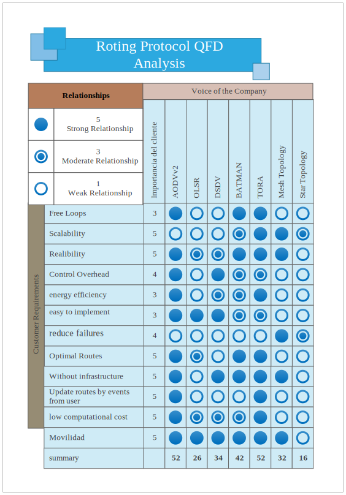

# 5. Bases Teóricas

## 5.1 Protocolos de Enrutamiento

Como bien sabemos en la actualidad existe un gran número de protocolos usados para el manejo de la información, pero no todos los protocolos existentes son aplicables a las RIS (Red inalambrica de sensores) ya que el medio en el que se emplean es totalmente diferente. En las redes cableadas la pérdida de información se debe a la gran cantidad de tráfico que corre por el medio, mientras que en las RIS el medio usado para la comunicación es más hostil, el aire, donde los dispositivos y las transmisiones están expuestas a las implicaciones medioambientales,al ruido y todo tipo de inconveniente que se pueda dar en el medio, todo esto sin mencionar que los dispositivos deben “luchar” por acceder al medio de comunicación. Es por ello que el enfoque que se le da a un protocolo para redes ad-hoc es muy diferente al usado en redes cableadas, ya que en este ultimo caso los protocolos no están pensados para trabajar con tanto “stress”. 

## 5.2 Clasificación de los protocolos según su funcionamiento. 
[3] Los protocolos usados en las redes inalámbricas se clasifican en tres tipos; estos protocolos se han desarrollado ante la necesidad de controlar el enrutamiento en las redes ad-hoc, teniendo en cuenta las limitaciones que tienen los dispositivos:

<ol>
 <li>Proactivos.</li>
 <li>Reactivos.</li>
 <li>Híbridos.</li>
</ol>

### 5.2.1 Protocolos Proactivos

[3] Son aquellos que tienen periódicamente actualizadas las tablas de enrutamiento de todos los nodos de la red aunque no estén enviando información. 

Cuando surge algún cambio entre las conexiones de la red la tabla de enrutamiento se actualiza y el protocolo elige la ruta mas optima para enviar información. Este proceso se debe al intercambio de mensajes de control, con lo que se incrementa el consumo de la batería, el número de paquetes enviados por la red.

### 5.2.2 Protocolos Reactivos 

[3] Estos protocolos únicamente tienen rutas de encaminamiento en sus tablas cuando un nodo origen tiene que realizar una comunicación con otro nodo en la red. 

Los protocolos reactivos al iniciar una comunicación y no tener una ruta para llegar al nodo destino, se envía un mensaje de descubrimiento de ruta y cuando recibe la respuesta a dicho mensaje, añade esta ruta en su tabla de enrutamiento. Es entonces cuando es posible la comunicación con el destino. El mayor inconveniente es la latencia que se añade al primer paquete de la transmisión por esa nueva ruta, pero a su vez mejora las prestaciones de la batería en los nodos.

Dentro de estos protocolos existen dos clases de protocolos: 
- **Enrutamiento origen**: La ruta de los nodos por donde tiene que pasar la información es almacenada en las cabeceras de los paquetes, de este modo los nodos intermedios no necesitan tablas de enrutamiento, ya que solo basta con leer las cabeceras para saber a quien reenviar la información.
Este tipo de enrutamiento no es aconsejable usarlo en redes extensas, ya que a medida que el mensaje pasa por cada nodo se incrementa la cabecera del paquete.

- **Enrutamiento salto a salto**: En este caso la ruta la escoge cada nodo en cualquier momento, ya que cuando se envía la información la cabecera del paquete contiene la dirección del nodo destino y la dirección del siguiente salto. 

En este caso se adapta más rápido a los cambios de la topología pero se genera un gasto superior de recursos en los nodos intermedios ya que tienen que almacenar en tablas de enrutamiento las rutas correspondientes. 

### 5.2.3 Protocolos Híbridos 
Los protocolos híbridos son una mezcla de los protocolos proactivos con los reactivos. El fin de estos es usar las mejores características que ofrecen ambos. Los protocolos dividen las redes en zonas, y los nodos que están lejos del destino utilizan enrutamiento reactivo, mientras que los que están cerca utilizan enrutamiento proactivo; como es el caso de ZRP (The Zone Routing Protocol). 

Otros ejemplos de protocolos híbridos son IS-IS de OSI (Intermediate System to Intermediate System) y EIGRP(Enhanced Interior Gateway Routing Protocol) de CISCO. 


### 5.2.4 Criterios para seleccionar el protocolo a utilizar

Como sabemos, el tipo de red a implementar es una red basada en dispositivos embebidos de bajo consumo energético, lo cual limita el hardware que lo compone; por lo tanto el protocolo de enrutamiento a utilizar en este proyecto debe cumplir una serie de requisitos para ser adecuado y encaje perfectamente con los requerimientos del proyecto, entre estos destaca la vida útil de la batería que compone el dispositivo. 

Entre los criterios más importantes para seleccionar un protocolo de esta índole se debe tener en cuenta que:
- Se obtengan las mejores rutas de encaminamiento.
- Halla un mínimo de transmisión de mensajes.
- Presente baja latencia de los paquetes entre la fuente y el destino.
- La red se estabilice en el menor tiempo posible.
- No se sobrecargue la red con mensajes de control.
- Sea tolerante a fallos.

En todos los protocolos de encaminamiento usados para redes inalámbricas y de sensores uno de los factores más importantes es el establecimiento de ruta. Si un protocolo elige buenas rutas de encaminamiento ofrecerá menor latencia entre la fuente y el destino, por consiguiente se realizaran menos transmisiones de mensajes que a su vez se representa en menos consumo de energía.


## 5.3 Seleccion del protocolo para la implementación de la red

<br>



Este diagrama muestra los criterios más importantes a la hora de seleccionar el protocolo que más se adecue para el proyecto, la idea detrás de esto es evaluar y comparar cada característica ofrecida por el protocolo y tener una base para la selección de dicho protocolo.

Entre los parámetros más importantes se pueden destacar que: 
- Tiene que ser libre de ```loops```.
- El costo computacional debe ser muy bajo, debido a que se ejecuta dentro de un sistema embebido con recursos limitados.
- El protocolo debe ser reactivo, para evitar inundar la red con mensajes aun cuando las rutas no se están utilizando, y para ahorrar batería mientras no se requieren rutas por parte del usuario.

Como se puede apreciar en la tabla la puntuación más alta después de sumar cada columna es para el protocolo **AODVv2** y **TORA**, hemos decidido trabajar con el protocolo AODVv2, debido a que tiene documentación muy actualizada en la web, aunque TORA también merecería la pena revisarlo.

Otro punto a tener en cuenta es el tipo de topología de red se utilizará para la implementación, y según la tabla y respetando los criterios por parte del cliente y resaltando que se deben reducir los puntos de fallo, la topología en estrella es descartada y en su lugar se utilizará la topología en malla para el actual proyecto.

