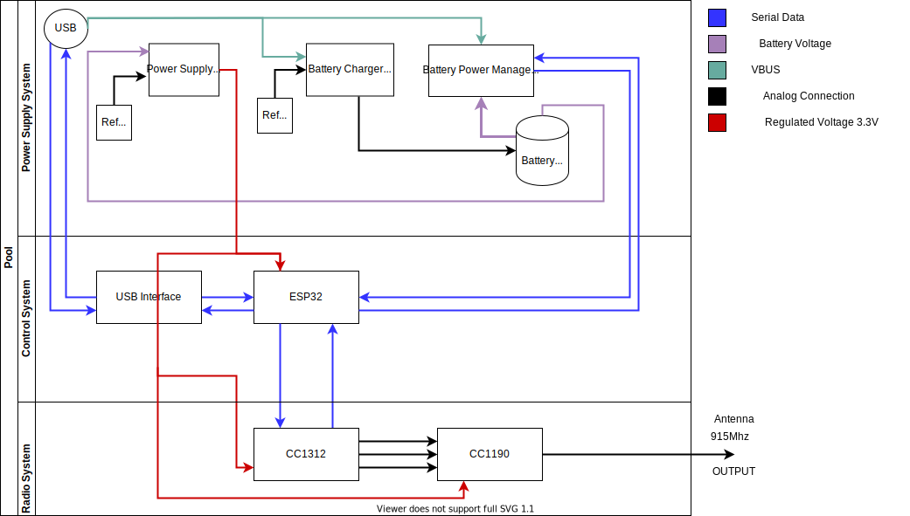

<br>
<h1 align="center">Capitulo 6</h1>
<br>

# 6. Seleccion del Hardware

En esta seccion se presenta los parametros que se usaron para la seleccion de los dispositivos de transmision y control que se estan utilizando actualmente en el proyecto.

## 6.1 Seleccion del modulo de radio frecuencia


Para la seleccion del modulo de radio el cual contiene el microcontrolador, la etapa de radio frecuencia y modulacion y todo lo necesario para transmitir en la frecuencia de 915Mhz se establecieron algunos parametros que se consideran importantes, los cuales son:
- Soporte del estandar IEEE 802.15.4.
- Al menos 2 puertos USART.
- De bajo costo.
- Facil de utilizar.
- Soporte para la banda del Subgigahercio a 915Mhz.

La tabla de la imagen muestra 3 familias de micrcontroladores con interface de radio frecuencia con los cuales se aplicaron los criterios basados en la necesidad actual y se eligio el ```cc1312r1``` como el modulo mas economico, robusto,con un amplio rango de covertura y de muy bajo consumo para desempenar la tarea que el ```turpial``` requiere como dispositivo transceptor.

La familia de microcontroladores ```cc135x``` tambien es un dispositivo que cumple ocn la mayoria de requerimientos, pero tiene mas funciones de las que se necesitan, asi que fue descartado, su precio tambien es mas elevado en consecuencia.

<br>
<br>

## 6.2 Seleccion de la fuente  de voltaje

En esta seccion se muestran algunas opciones a la hora de seleccionar el dispositivo que se encarga de regular la corriente proveniente de la bateria y que provee la corriente necesaria al Turpial, para funcionar de una manera optima, libre de ruidos y bajas de corriente que puedan afectar el funcionamiento del sistema completo.

<br>


Entre Los parametros mas importantes a tener en cuenta a la hora de seleccionar el dispositvo que alimenta al circuito tenemos:
- Corriente: La corriente del circuito debe ser mayor o igual a 2 Amperios.
- Voltaje: El dispositivo seleccionado debe ser capaz de entregar un voltaje estable de salida de 3.3 Voltios, sin inportar que la entrada que lo alimenta este por encima o por debajo del humbral requerido.
- ALta eficiencia: El dispositivo seleccionado debe ser eficiente en la transformacion de la energia, lo que se traduce en libre de sobre calentamientos extremos.
- Ruido: Este parametro es muy importante debido a que cualquier ruido en la senal de salida de voltaje, puede afectaral sistema completo.

Al realizar la ponderacion de los diferentes dispositivos se observa que el ```LTC3113``` tiene muy buenas prestaciones, es full bridge y entrega corrientes por encima de los 2.5 Amperios,pero se ha decidido utilizar el ```TPS63802``` debido a que es facil de conseguir economico y tiene las prestaciones requeridas para el proyecto, en cuanto al ```LTC3113```, es de muy buenas prestaciones pero su costo es realmemte elevado para utilizarlo en este proyecto.

<br>
<br>
<br>

## 6.3 Seleccion del cargador de Bateria


<br>

Para la seleccion del chip encargado de cargar la bateria de litio, exiten diversas familias de integrados que tienen muy buenas prestaciones y precios bajos, hemos decidido utilizar el chip de la familia ```BQ2407x```, el cual es de facil adquisicion y se ajusta a los requerimientos de carga lineal y durabilidad en las baterias, el cual es el objetivo principal al tener un sistema de carga robusto, como el que se presenta en el diseno del Turpial.

<br>
<br>
<br>
<br>
<br>
<br>
<br>
<br>
<br>

## 6.4 Seleccion del control de energia de la bateria


El control de energía, es el sistema que se encarga de leer variables relacionadas con la batería, como energía disponible, tiempo de carga, corriente suministrada etc.

A la hora de seleccionar el dispositivo que se encargara de dicha tarea, se tiene un requerimiento importante y es que tenga soporte para I2C, en la tabla se pueden apreciar dos diferentes dispositivos de dos fabricantes diferentes, los cuales tienen prestaciones similares, pero difieren mucho del costo por unidad, asi que se utiliza el BQ27441-G1 como dispositivo para la recolección de datos relacionados con la batería, para ser enviada a la unidad principal de control. 

<br>
<br>

## 6.5 Seleccion del microcontrolador (Interface)

Para la seleccion del microcontrolador, existen una serie de requisitos que al dia de hoy facilmente muchas familias de microcontroladores podria satisfacer, nos hemos centrado en la famila de microcontroladores de ```espressif```, debido a que esta es una marca que ofrece una gran variaded de dispositivos con increibles caracteristicas, como los es Bluetooth y WiFi a muy bajo costo, que dificilmente otra marca podria ofrecer.

Otra de las razones es la cantidad de informacion y ejemplos que se pueden encontrar en la web para este dispositivo

Facilmente se pueden listar algunas de las bondades de la familia ESP32:
- Economico.
- Bien documentado.
- Comunidad de desarrolladores en continuo crecimiento.
- Ejemplos en la plataforma de Arduino que facilmente se pueden portar al entorno de espressif.
- Bajo consumo.
- Incorpora BLE, el cual deja  a la mano un abanico de posibilidades.

Para este trabajo especificamente se trabaja con el ESP32 WROVER, el cual consta de:
- 4Mb Flash SPI.
- 8MB PSRAM.
- Frecuencia de 80Mhz a 240Mhz.
- WiFi.
- BlueTooth.
- USART x3.
- Dual core.
Este dispositivo es perfecto para el diseno del turpial, ya que cuenta con varios puertos USART, para poder comunicarnos con el modulo de radio y el Pc a traves del USB; Tambien cuenta con un adaptador de red el cual permite implementar un servidor Web, para servir la aplicacion de control y configuracion del Turpial.

## 6.6 Diagrama en bloques del hardware del Turpial



## 6.7 Diagrama en bloques de la aplicacion de control

## 6.8 Vision General del Turpial como dispositivo


La figura muestra el primer prototipo ....

