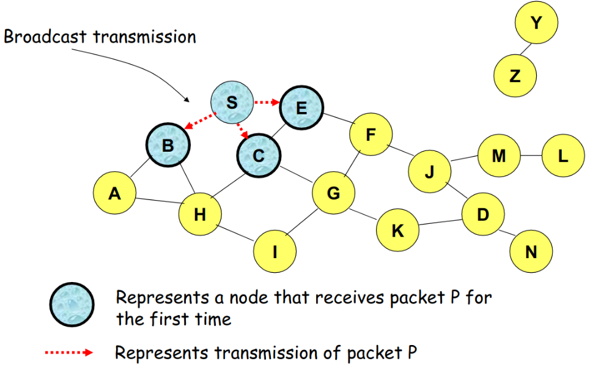

<h1 align="center">Capitulo 8</h1>
<br>

# 8. AODVv2

AODV es un protocolo de enrutamiento para redes móviles ad-hoc (MANETs) y redes ad-hoc inalámbricas. AODV es la evolución de su anterior protocolo llamado **DYMO**, que nació en Julio del 2005 y en el año 2013 adopta el nombre de **AODVv2**.

El AODV es uno de los protocolos más utilizados de los algoritmos reactivos, siendo ideal para las redes Ad-Hoc. Este protocolo intercambia mensajes cuando necesita establecer una comunicación, es decir, envía mensajes a los vecinos para calcular cada ruta. Gracias a las mejoras incorporadas en AODV se evita la problemática que tiene DYMO, pero por el contrario se incrementa la latencia en el primer paquete a enviar cada vez que se calcula la ruta.


En la siguiente figura podemos observar las diferentes versiones de AODVv2 y DYMO.


En este trabajo, nos centramos en la evolución del protocolo de enrutamiento (AODV) llamado protocolo de enrutamiento AODVv2, pero simplemente hablaremos de AODV para referirnos indistintivamente a la version mas actual del protocolo.

**AODV** es uno de los cuatro protocolos estandarizados por el grupo de trabajo **IETF MANET**. El protocolo encuentra rutas alternativas bajo demanda siempre que sea necesario, lo que significa que primero se pretende establecer una ruta entre un nodo de origen y un destino **(descubrimiento de ruta)**, y luego mantener una ruta entre los dos nodos durante los cambios de topología **(mantenimiento de la ruta)**.


## 8.1 Características

<h2>Las características del protocolo son:</h2>

<ol>
 <li>Señalización de control baja. </li>
 <li>Señalización de procesamiento mínima.</li>
 <li>Prevención de bucles.</li>
 <li>Funciona sólo con enlaces bidireccionales.</li>
</ol> 

Cada nodo tiene asociada una tabla de enrutamiento que utiliza para poder establecer enlaces con otros nodos. Estas tablas de enrutamiento contienen los siguientes campos: 

<ol>
 <li>Dirección IP Origen</li>
 <li>Tiempo de Vida (TTL) </li>
 <li>Dirección IP Destino</li>
 <li>Número secuencia Destino</li>
 <li>Contador de saltos (hop count)</li>
</ol>

Aparecen los campos de las direcciones IP de la fuente y de la IP del destino para saber en todo momento de donde vienen los paquetes y hacia donde se deben dirigir.

También aparece un campo con el número de secuencia del nodo destino que sirve para distinguir entre información nueva e información antigua y de esta forma evitar formación de bucles y transmisiones de rutas antiguas. 

Otro parámetro que se almacena en las tablas de encaminamiento es el tiempo de vida. Este sirve para evitar que viajen paquetes perdidos por la red y utilizar enlaces de los que no se conoce su estado desde hace mucho tiempo. 

Cuando a un destino le llegan dos paquetes desde la misma fuente por caminos distintos, el campo **hop count** muestra el número de saltos que han tenido que hacer para cada una de las rutas. De esta forma se sabe cual de ellas es la ruta más corta y la que tiene que seleccionarse para hacer el envío de información. 

Cada vez que se quiere comunicar una fuente con un destino, se inicia un proceso de descubrimiento de ruta, que finaliza cuando recibe un paquete con la ruta calculada.

Existe otro concepto conocido como mantenimiento de ruta, que sirve para actuar en caso de que se rompa un enlace a lo largo de una ruta. Esto se consigue dando tiempo de vida a las rutas descubiertas antes de considerarlas como invalidas.


## 8.2 Descubrimiento de Rutas 
Cuando un nodo quiere transmitir un paquete a un destino, lo primero que debe hacer es buscar en su tabla de encaminamiento a ver si existe una ruta hacia este destino previamente calculada. En el caso de encontrarla no iniciaría ningún proceso de descubrimiento de ruta, supondría que la que tiene almacenada en su tabla de encaminamiento es correcta y está actualizada. En el caso contrario, comenzará el proceso de descubrimiento para encontrar un camino válido. 

El proceso comienza con el envío de un paquete RREQ (Route Request) en modo broadcast. Este paquete llega a los nodos vecinos que se encuentran a un salto de distancia y estos a su vez lo reenvían a sus vecinos y así sucesivamente hasta llegar al destino. 

Cualquier nodo que durante el proceso de búsqueda conozca la ruta hacia el destino, puede contestar con un paquete de RREP al nodo origen indicando la ruta que necesita. Mientras se va realizando el proceso de búsqueda, todos los nodos van actualizando las tablas de encaminamiento.

En el formato del paquete RREQ del protocolo de encaminamiento AODV, nos encontramos los siguientes campos: 

<ol>
 <li>Dirección IP Origen.</li>
 <li>Número de Secuencia del Origen.</li>
 <li>Dirección IP del Destino.</li>
 <li>Número de Secuencia del Destino.</li>
 <li>RREQ Identificador.</li>
 <li>Contador de saltos (hop count).</li>
</ol>

Uno de los campos es el identificador que se va modificando cada vez que se genera un envío de RREQ. Esto sirve para que los nodos que lo vayan recibiendo (nodos intermedios) sepan si el paquete es idéntico al anterior (tiene el mismo identificador) y deben descartarlo, o por el contrario, si deben retransmitirlo (porque el identificador de paquetes es distinto). 

<p>

</p>

En esta figura podemos observar como el nodo **A** desea buscar una ruta hacia el nodo **I**, el primer paso sera buscar en su tabla de rutas y ver si tiene una ruta almacenada hacia el destino, de no ser así debe iniciar un proceso de descubrimiento de ruta, donde envía un mensaje multicast a todos sus vecinos al alcance de la señal de radiofrecuencia.

<br>
<br>
<br>
<br>
<br>
<br>
<br>
<p>


</p>
Este proceso comparándolo con la vida cotidiana es igual a cuando sales a la calle a buscar a tu hijo pero no lo ves, lo primero que haces es gritar, para esperar si responde, este grito representa un mensaje multicast que puede ser escuchado por tus vecinos, y si ellos saben donde esta tu hijo, pueden informarte con un nuevo mensaje el cual se asemeja a un mensaje de ```Route Reply``` RREP entregando una ruta hacia donde se encuentra tu hijo, pero si no saben donde esta este chico, podrían iniciar un nuevo grito a sus vecinos mas cercanos o mensaje de multicast, para ver si pueden ayudar en la búsqueda y asi sucesivamente hasta encontrar ese destino que buscas, que en este caso es tu hijo.


<br>
<br>

## 8.3 Describiendo el proceso de requerimiento de ruta en una red ad hoc.

<h2> Paso 1. </h2>

<p>

</p>

- El nodo **S** desea enviar un paquete con informacion hacia el nodo **D**,primero debe buscar en su tabla de rutas y confirmar si la ruta hacia el destino existe o no.

- Si la ruta hacia el destino existe no debera iniciar ningun proceso diferente a enviar el mensaje con la informacion del usuario de la aplicacion, pero si no se tiene una ruta hacia el destino, el nodo debe iniciar un proceso de busqueda de ruta. En este caso asumimos que no tenemos la ruta deseada hacia el destino

- Este tipo de mensaje, es un mensaje Multicast, el cual sera escuchado por todos sus vecinos dentro del radio de cobertura.


<h2> Paso 2. </h2>

<p>

</p>


- El nodo **S** envia un mensaje de requerimiento de ruta llamado RREQ a todos sus vecinos, los cuales son **B**, **C** y **E**. Como se puede ver en el grafico, los vecinos directos del nodo **S**, no tienen informacion de la ruta requerida, asi que deben inicar la retransmision del mensaje Route Request, a sus vecinos mas cercanos; Cabe aclarar que los nodos pueden recibir el mismo paquete de requerimiento de ruta desde diferentes nodos, como veremos a continucacion.

<br>
<br>
<br>

<h2> Paso 3. </h2>

<p>

</p>

- Como se puede observar en la imagen, el **nodo H** recibe el requerimiento de ruta de dos vecinos distintos. lo que podria dar lugar a una colision.

- AOdvv2 maneja una tabla de mensajes de ruta para verificar que no se ha regenerado antes un mensaje que proviene del mismo intento por conseguir una ruta en particular de un mismo origen hacia un mismo destino, com lo que se quiere decir que nunca un nodo recreara un mensaje de requerimiento de ruta que ya ha recreado antes, no importa de donde proviene.

<br>

<h2> Paso 4. </h2>

<p>

</p>

- Podemos apreciar graficamente como el **nodo C** recibe el mensaje de requerimeinto de ruta **RREQ** desde el ```nodo G``` y el ```nodo H```, pero no lo recrea, porque el **nodo C** ya ha recreado este mensaqje antes.
  
- La verificacion de si se ha recreado este mensaje antes se hace por medio de la tabla de mensajes de ruta, la cual debe ser interpolada cada que se recibe algun mensaje tipo **RREQ** o **RREP**.

<br>
<br>
<br>

<h2> Paso 5. </h2>

<p>

</p>

- En este caso ambos ```nodo J``` y ```nodo K``` retransmiten el paquete hacia el **nodo D**, debido a que estos nodos no conocen el uno del otro y sus transmisiones podrian colisionar. 

- Es posible que el paquete con el requerimiento de ruta RREQ no se entregue al nodo D, a pesar del uso de inundacion de mensajes en la red.


<br>
<br>
<br>
<br>

<h2> Paso 6. </h2>

<p>

</p>

- El **nodo D** no recrea el paquete debido a que es el destinatario del mensaje de solicitud de ruta.
- En el proceso descrito hasta aqui cada nodo intermedio deberia conocer la manera de regresar a su vecino que recreo el mensaje RREQ.
- Cabe destacar que cuando se ejecuta el proceso de requerimiento de ruta, cada nodo involucrado en el proceso esta aprendiendo una ruta inversa al nodo originador del mensaje de requerimiento de ruta.
- Cuando se empiezan a crear los mensajes de respuesta de ruta o comunmente llamados RREP, los nodos intermedioos aprenden una ruta inversa hacia el nodo originador del mensaje de ```RREP```, y de esta manera se podria establecer una ruta bidireccional entre los nodos **S** y **D**.

<h2> Paso 7. </h2>

<p>

</p>

- Hasta este punto, ya se a completado la inundacion del mensaje de requerimiento de ruta por toda la red.

- Los nodos que no estan en la ruta de **S** o aislados de la red no recibiran el paquete, por ejemplo el ```nodo Z```

- Nodos que pasan a traves del destinatario tampoco reciben el paquete, por ejemplo el ```nodo N```.

<br>

<br>
<br>
<br>

### 8.3.1 Ventajas de la busqueda de rutas por inundacion de la red

- simplicidad.
- Podria ser mas eficiente que muchos otros protocolos cuando la frecuencia de la transmision de informaicon es lo suficientemente baja.
- Confiable en la entrega de paquetes.
  - Porque los paquetes al destino podrian ser entregados por distintas rutas. 


### 8.3.2 Desventajas de la inundacion de mensajes en la red.

- Potencialmente, se pueden entregar paquetes de datos de sobrecarga muy altos a demasiados nodos que no necesitan recibirlos.

- En el ejemplo anterior, el ```nodoJ``` y el ```nodo K``` pueden transmitir al ```nodo D``` simultaneamente, resultando en la perdida del paquete.
  - En este caso el destinatario podria no recibir el paquete.

### 8.3.3 Entrada de ruta inversa

Una vez que un nodo intermedio recibe un mensaje de requerimiento de ruta ```RREQ``` el nodo debe configurar una entrada en una tabla de rutas local conteniendo la siguiente informacion:
  - Direccion Ip de la fuente del mensaje.
  - Numero de secuencia de la fuente.
  - Numero de saltos al nodo fuente.
  - Direccion IP del nodo del cual el RREQ fue recibido.  
  - Usando una ruta inversa un nodo puede enviar un RREP (Route Reply Packet) a la fuente.
  - Una entrada en la tabla de rutas tambien incluye un time to live o tiempo de vida de una ruta.

Cabe aclarar que estas rutas aprendidas por medio de los mensajes de requerimiento de ruta o RREQ, aun no se pueden confirmar como bidireccionales, son enlaces que de antemano se sabe son capaces de enviar mensajes , pero debemos asegurarnos de que puede recibir tambien, y esto se consigue por medio de los mensajes RREQ_ack o por medio del mismo mensaje RREP del cual hablaremos mas adelante.

## 8.4 Mantenimiento de Rutas 
El mantenimiento de las rutas de las tablas de enrutamiento es el proceso mediante el cual el algoritmo asegura que las rutas activas de la tabla de enrutamiento siguen siendo válidas. Para realizar esta tarea se utiliza los Route Error Message(RERR), estos mensajes de control los genera un router AODVv2 cuando quiere informar a uno o varios nodos de que una o varias rutas han dejado de ser válidas. Hay tres eventos que provocan él envió de un mensaje RERR:

- Cuando un nodo tiene que reenviar un paquete IP pero no existe una ruta válida en su tabla de enrutamiento. En este caso el nodo enviara un RERR a la fuente para informar que no existe una ruta hacia el destino.
- Cuando no se puede reenviar un mensaje RREP porque la ruta hacia el generador del RREQ no es válida. En este caso el nodo debe enviar en RERR hacia el generador del mensaje RREP para infórmale que la ruta hacia el origen del mensaje RREQ no es válida.
- Cuando un nodo detecta que uno de los enlaces de un vecino se ha roto, debe informar a todos los nodos que usan ese enlace de todas las rutas que han pasado a ser invalidas.


Cuando una ruta es encontrada se le da un tiempo de vida y se considera útil hasta que un temporizador asociado a esta ruta no expire. Esto se utiliza para no tener que iniciar un descubrimiento de ruta para cada mensaje de información que se quiere enviar. 

Durante una comunicación entre el nodo fuente y el destino pude ocurrir que alguno de los nodos modifique su posición. Esto puede dar lugar a que se rompa el enlace y que la ruta quede inutilizada. 

El nodo vecino al enlace roto debe ser el encargado de informar al resto de nodos sobre dicho suceso. Para ello se utiliza el envío del mensaje RERR (Route Error). 

El mensaje viene a ser igual que el mensaje RREP pero con un número de salto igual a infinito. Es decir, el nodo que detecta roto el enlace envía un RERR con valor de hop count hacia la fuente de valor infinito, lo que hace que cualquier otra ruta sea mejor y deban reencaminarse los paquetes por otro sitio. De esta manera, el nodo fuente decide si ha terminado la comunicación con el nodo destino o si por el contrario debe iniciar un nuevo proceso de descubrimiento de ruta.

AODV presenta una serie de opciones de optimización, como la posibilidad de reparar a nivel local un enlace roto que forma parte de una ruta activa. Cuando se rompe un enlace, en lugar de enviar un paquete de RERR a la fuente, el nodo que ha detectado la rotura puede intentar repararlo localmente enviando un RREQ con el número de secuencia del destino incrementado en uno hacia ese destino. 

Los paquetes de datos se quedan almacenados en este nodo esperando recibir un RREP con una nueva ruta disponible hacia el destino. Si este nuevo procedimiento de Descubrimiento de Ruta no tiene éxito y el RREP no llega, entonces sí que será necesario informar a la fuente acerca de la rotura del enlace enviándole un paquete RERR.

## 8.5 Tabla de rutas

En la seccion 8.3 se vio como un nodo inunda la red para encontrar a un destino, luego de que el mensaje de control RREQ llega al destino este debe responder con un mensaje de RREP, el cual es de tipo unicast , es decir un mensaje que va dirigido a un nodo especifico identificado con su direccion IP 

A continuacion se expone un ejemplo para ilustrar como deberia verse la tabla de rutas en cada nodo despues de un requerimiento de ruta a todos los nodos

La siguiente figura muestra una topologia de nodos basica y la tabla de rutas que es usada para encontrar a otros nodos.

<p>

</p>


<h3>Tabla de Rutas para nodo A</h3>

<div>
<table id="tblOne" style="width:100%; float:left">
 <tr>
    <th>Seq</th>
    <th>Dest</th>
    <th>Next</th>
    <th>Hop</th>
 </tr>
  <tr>
    <td>1</td>
    <td>B</td>
    <td>B</td>
    <td>1</td>
 </tr>
 <tr>
    <td>1</td>
    <td>E</td>
    <td>B</td>
    <td>2</td>
 </tr>
 <tr>
    <td>1</td>
    <td>H</td>
    <td>B</td>
    <td>3</td>
 </tr>
 <tr>
    <td>1</td>
    <td>J</td>
    <td>B</td>
    <td>4</td>
 </tr>

</table>
</div>


<h3>Tabla de Rutas para nodo B</h3>

<div>
<table id="tblOne" style="width:100%; float:left">
 <tr>
    <th>Seq</th>
    <th>Dest</th>
    <th>Next</th>
    <th>Hop</th>
 </tr>
  <tr>
    <td>1</td>
    <td>A</td>
    <td>A</td>
    <td>1</td>
 </tr>
 <tr>
    <td>1</td>
    <td>E</td>
    <td>E</td>
    <td>1</td>
 </tr>
 <tr>
    <td>1</td>
    <td>H</td>
    <td>E</td>
    <td>2</td>
 </tr>
 <tr>
    <td>1</td>
    <td>J</td>
    <td>E</td>
    <td>3</td>
 </tr>

</table>
</div>


<h3>Tabla de Rutas para nodo E</h3>

<div>
<table id="tblOne" style="width:100%; float:left">
 <tr>
    <th>Seq</th>
    <th>Dest</th>
    <th>Next</th>
    <th>Hop</th>
 </tr>
  <tr>
    <td>1</td>
    <td>B</td>
    <td>B</td>
    <td>1</td>
 </tr>
 <tr>
    <td>1</td>
    <td>A</td>
    <td>B</td>
    <td>2</td>
 </tr>
 <tr>
    <td>1</td>
    <td>H</td>
    <td>H</td>
    <td>1</td>
 </tr>
 <tr>
    <td>1</td>
    <td>J</td>
    <td>H</td>
    <td>2</td>
 </tr>

</table>
</div>


<h3>Tabla de Rutas para nodo H</h3>

<div>
<table id="tblOne" style="width:100%; float:left">
 <tr>
    <th>Seq</th>
    <th>Dest</th>
    <th>Next</th>
    <th>Hop</th>
 </tr>
  <tr>
    <td>1</td>
    <td>A</td>
    <td>E</td>
    <td>3</td>
 </tr>
 <tr>
    <td>1</td>
    <td>B</td>
    <td>E</td>
    <td>2</td>
 </tr>
 <tr>
    <td>1</td>
    <td>E</td>
    <td>E</td>
    <td>1</td>
 </tr>
 <tr>
    <td>1</td>
    <td>J</td>
    <td>J</td>
    <td>1</td>
 </tr>

</table>
</div>


<h3>Tabla de Rutas para nodo J</h3>

<div>
<table id="tblOne" style="width:100%; float:left">
 <tr>
    <th>Seq</th>
    <th>Dest</th>
    <th>Next</th>
    <th>Hop</th>
 </tr>
  <tr>
    <td>1</td>
    <td>A</td>
    <td>H</td>
    <td>4</td>
 </tr>
 <tr>
    <td>1</td>
    <td>B</td>
    <td>H</td>
    <td>3</td>
 </tr>
 <tr>
    <td>1</td>
    <td>E</td>
    <td>H</td>
    <td>2</td>
 </tr>
 <tr>
    <td>1</td>
    <td>H</td>
    <td>H</td>
    <td>1</td>
 </tr>

</table>
</div>
Hasta ahora se ha presentado una descripción general del funcionamiento del protocolo AODVv2. En los sucesivos apartados de este capítulo se entrará en profundidad en los procesos, estructura de datos y mensajes implementados y testados en escenarios reales. Estos procesos se enmarcan en el procedimiento de descubrimiento de la ruta. Dicha operación engloba varios procesos y hace uso de estructuras de datos para almacenar entre otras la información de las rutas.

## 8.7 Router Client Set
El Router Client Set es es una tabla conceptual en la cual almacenamos los clientes del router AODV, esto con el fin de limitar los mensajes de ruta que recrea el nodo (RREQ, RREP) a tan solo los clientes registrados en dicha tabla.

## 8.8 Neighbor Set
La tabla Neighbor Set contiene información relativa a los routers vecinos. Esta se actualiza a partir de los mensajes de control. También contiene información relativa a la bidireccionalidad del enlace, una ruta solo se considerará valida cuando se confirme que el enlace es bidireccional.

## 8.9 Sequence Number
Los números de secuencia permiten a los enrutadores AODVv2 determinar el orden temporal de los mensajes de descubrimiento de ruta, identificando la información de enrutamiento obsoleta para que pueda descartarse.Cada router AODVv2 debe mantener su propio Sequence Number, este se incluye en todos los mensajes RREQ y RREP creados por él.
Se debe Garantizar que el numero de secuencia crece de uno en uno cada que se crea un Route Request o un route Reply es creado, si el valor se desborda llegando a 65535, se debe resetear este valor a 1, el valor 0 esta reservado para indicar que el numero de secuencoa del nodo no se conoce.
Para determinar si un mensaje de ruta es obsoleto, se debe comparar el numero de secuencia adjunto en el mensaje con informacion existente sobre la misma ruta.

## 8.10 Local Route Set

Todos los routers AODVv2 deben mantener un conjunto de rutas locales, esta contiene información sobre las rutas aprendidas a partir de los mensajes de control. Cuando una ruta se considere válida se deberá añadir la entrada correspondiente en la tabla de rutas, y cuando una ruta pasa de válida a inválida se debe borrar la entrada correspondiente en la tabla de rutas.

## 8.11 Multicast Route Message Set

Los mensajes RREQ(Route Request) por defecto son multicast y estos pueden ser reenviados varias veces. El multicast route message set tiene como finalidad proporcionar información relativa a los mensajes RREQ y RREP que han sido recibidos previamente, y de esta manera poder compararlos con los mensajes de ruta recibidos y determinar si la información que contienen es antigua. Esto permite al router controlar el envío de tráfico redundante.

## 8.12 Mensajes

En este apartado se definen los mensajes de control que el protocolo utiliza para comunicar entre nodos información relativa a las rutas. AODVv2 define 4 tipos de mensajes de control:

- Route Request (RREQ).
- Route Reply (RREP).
- Route Reply Acknowledgement (RREP_Ack).
- Route Error(RERR). 

### 8.12.1 Contenido del mensaje de requerimiento de ruta RREQ

<p> 
 

- **msg_hop_limit**: Contiene un número entero que decrece en 1 cada salto que atraviesa el mensaje RREQ. El RREQ_Gen establece el número máximo de saltos que atravesará el mensaje RREQ.
- **AddressList**: Contiene OrigPrefix y TargPrefix.
- **PrefixLengthList** (Opcional): Contiene OrigPrefixLen, si se omite,la longitud del prefijo (en bits) es igual a la longitud de la dirección OrigAddr.
- **OrigSeqNum** :Número de secuencia de OrigPrefix, se incrementa como se indica [aqui](#79-Sequence-Number).
- **MetricType**: Tipo de métrica asociada con OrigMetric.
- **OrigMetric**: El valor de la métrica asociada a la ruta a OrigPrefix
</p>

<br></br>

### 8.12.2 Contenido del mensaje de respuesta de ruta RREP

<p> 
 

- **msg_hop_limit**: msg_hop_limit: Contiene un número entero que decrece en 1 cada salto que atraviesa el mensaje RREP.El RREP_Gen establece el número máximo de saltos que atravesaráel mensaje RREP.
- **AddressList**: Contiene OrigPrefix y TargPrefix.
- **PrefixLengthList** (Opcional): Contiene TargPrefixLen, si se omite,la longitud del prefijo (en bits) es igual a la longitud de la dirección TargAddr.
- **TargetSeqNum** :El número de secuencia asociado a TargPrefix.
- **MetricType**: El tipo de métrica asociada aTargMetric.
- **TargetMetric**: El valor de la métrica asociada con la ruta a TargPrefix.
</p>
<br></br>

### 8.12.3 Contenido del Mensaje RREP_Ack
<p> 
 

- **AckReq** (Opcional): Si se incluye, informa al receptor debe enviar un RREP_Ack response para confirmar la bidireccionalidad del enlace
</p>
<br>

## 8.13 Procesos involucrados en el protocolo AODvv2

A continuacion se dara un descripcion corta de cada uno los procesos involucrados en el protocolo.

### 8.13.1 Next Hop Monitoring

Este proceso tiene como finalidad asegurar que no se establecen rutas a través de enlaces unidireccionales, para ello los routers AODV2 deben verificar la bidireccionalidad del enlace con el siguiente salto antes de marcar una ruta como válida en el local route set.

- Para comprobar si un enlace es bidireccional con un router upstream se utiliza el mensaje de control Route Reply Acknowledgement (RREP_Ack). Al enviar un RREP_Ack, se espera un RREP_Ack como respuesta, si este llega en un tiempo menor a RREP_Ack_SENT_TIMEOUT demuestra que el enlace esbidireccional, en caso contrario el enlace se considera unidireccional.
- Para un router downstream,el hecho de recibir un mensaje RREP que contiene en el campo TargAddr la dirección destino de una solicitud de ruta, es una confirmación de que el enlace está activo y es bidireccional, ya que, un mensaje RREP requiere que un mensaje RREQ previamente haya recorrido el enlace en dirección contraria.

### 8.13.2 Neighbor Set Update

- Este proceso tiene como finalidad la de actualizar la tabla Neighbor Set. Cuando se recibe un mensaje de control se inicia el proceso para actualizar la tabla Neighbor Set, esto permite registrar los vecinos del router AODVv2 y establecer la relación que mantiene con cada una de ellos. 

- Cuando un router recibe un mensaje RREP y se esperaba su recepción,el enlace con el router que ha enviado el paquete es confirmado como bidireccional, y por lo tanto el estado de la entrada correspondiente de la NeighborSet cambia a Confirmed. 
- Cuando un router recibe un mensaje RREP_Ack y este es debido al envío de un RREP_Ack con AckReq. El enlace es confirmado como bidireccional y se tiene que actualizar la tabla Neighbor Set.

## 8.14 Procesado de la información de los mensajes de ruta

En todos los mensajes de ruta hay información sobre una ruta, los RREQ contienen la ruta hacia OrigPrefix, y los RREP hacia TargPrefix.Esta información se almacena en Local Route Set. 

Como paso previo al proceso de evaluación, se convierten las estructuras de los mensajes RREQ y RREP a una estructura tipo AdvRte,común para ambos, esto facilita el proceso de desarrollo reduciendo el número de funciones a implementar.


### 8.14.1 Evaluación de la información de ruta

Este proceso tiene como finalidad evaluar si la información de la ruta que contiene el AdvRte se utilizará para actualizar la tabla Local Route Set, para ello se compara el coste y el número de secuencia del AdvRte con la entrada correspondiente en la tabla Local Route Set.

### 8.14.2 Actualización de la información de las rutas

Después de determinar que el AdvRte se utilizará para actualizar Local Route Set, este proceso se encarga de añadir una nueva entrada en la Local Route Set o actualizar una existente.

### 8.14.3 Eliminación de los mensajes redundantes usando la Multicast Route Message Set

Cuando los mensajes de ruta inundan una MANET, un nodo podría recibir varias veces el mismo mensaje de ruta, si no se evita, parte de estos mensajes serán reenviados generando trafico innecesario.

Para solucionar este problema cada router AODVv2, almacena información de los mensajes de ruta que recibe en la tabla Multicast Route Message Set.

Cada vez que se recibe un mensaje RREQ o RREP,se consulta en la tabla Multicast Route Message Set, si la información que contiene el mensaje entrante es redundante o no.

A partir de esto se toma la decisión si el mensaje es reenviado o no.

### 8.14.4 Creación de mensajes RREQ
- Un mensaje RREQ se genera cuando un Client Router registrado en la tabla *Local Route Set* de un router AODVv2 quiere enviar un paquete IP y no existe una ruta hacia al destino en su tabla RIB. Tras configurar los parámetros descritos [aqui](#7121-Contenido-del-mensaje-de-requerimiento-de-ruta-RREQ), se procede a su envío. La dirección IP de destino del paquete que contiene el mensaje RREQ será la dirección *multicast* LL-MANET-Routers (`FF02:0:0:0:0:0:0:6D`) para IPV6 específicada por el [RFC 5498](https://tools.ietf.org/html/rfc5498).

- Antes de crear un RREQ, el enrutador DEBE verificar si recientemente se envió un RREQ para el destino solicitado. Si es así, y aún no se ha alcanzado el tiempo de espera para una respuesta, el enrutador DEBE continuar esperando una respuesta sin generar un nuevo RREQ. 

- Si se ha alcanzado el tiempo de espera, se PUEDE generar un nuevo RREQ. Si se configura el almacenamiento en búfer, el paquete IP entrante DEBE almacenarse en búfer hasta que se complete el descubrimiento de ruta.

- Si se ha alcanzado el límite permitido de mensajes de control AODVv2, NO DEBE generar ningún otro mensaje. 

- Si se acerca al límite, el mensaje debe enviarse si las prioridades en la Sección [7.5](https://datatracker.ietf.org/doc/draft-perkins-manet-aodvv2/?include_text=1) lo permiten.

- Este mensaje AODVv2 se usa para crear un mensaje [RFC5444] correspondiente (consulte la Sección [8](https://datatracker.ietf.org/doc/draft-perkins-manet-aodvv2/?include_text=1)), que se entrega al multiplexor RFC5444 para su posterior procesamiento.

- Por defecto, el multiplexor tiene instrucciones para el manejo de mensajes de multidifusion en **LL-MANET-Routers**


Para generar un mensaje Route Request (RREQ) el router AODV debe seguir estos pasos:

1. Set **msg_hop_limit** = MAX_HOPCOUNT
2. Set **msg_hop_count** = 0, if including it
3. Set **AddressList** = {OrigAddr, TargAddr}
4. Para PrefixLengthList:
 - Si **OrigAddr** es parte de un rango de direccioes configuradas como clinte del router, set 
 - PrefixLengthList = {OrigPrefixLen, null}.
 - en caso contrario omitir PrefixLengthList. 
5. Para OrigSeqNum:
 - Incrementar la secuencia de numero del router como se especific en la seccion [4.4](https://datatracker.ietf.org/doc/draft-perkins-manet-aodvv2/?include_text=1).
 - Set OrigSeqNum = SeqNum. 
6. Para TargSeqNum:
 - Si existe una ruta no válida que coincida con TargAddr utilizando la coincidencia de prefijo más larga y tenga un número de secuencia válido, establecer
 - TargSeqNum = numero de secuencia de la ruta almacenda.
 - Si no existen rutas invalidas que coincidancon la direccion de destino, o la ruta no tiene un numero de secuencia, se omite el TargetSeqNum. 
7. Incluya el elemento de datos MetricType y establezca el tipo acorde o comparable con metricType.
8. Establecer OrigMetric = Route[OrigAddr]. Metric, es decir **RouterClient.Cost**.
9. Incluir el elemento de datos **ValidityTime** si anuncia que la ruta a OrigAddr a través de este enrutador se ofrece por un tiempo limitado, y configure ValidityTime en consecuencia.

### 8.14.5 Recepción de mensajes RREQ
Este proceso se encarga de realizar las operaciones a efectuar cuando un router AODVv2 recibe un mensaje RREQ. Entre ellas: 
- Chequea el contenido de los campos para comprobar que son válidos.
- Actualiza las tablas Neighbor Set, Local Route Set y Multicast Route Message Set. 
- Por último si la solicitud de descubrimiento de ruta va dirigida a él, envía un mensaje RREP. Si no es así reenvía el mensaje RREQ.

### 8.14.6 Reenvío de mensajes RREQ
Un mensaje RREP se genera cuando un nodo recibe un RREQ y el campo AdressList.TargPrefix del mensaje coincide con una entrada de la tabla Router Client Set del router. Cuando esto sucede genera un mensaje RREP configurando los campos descritos [aqui](#7122-Contenido-del-mensaje-de-respuesta-de-ruta-RREP) lo envía en dirección al RREQ_Gen.

### 8.14.7 Recepción de mensajes RREP
Este proceso se encarga de realizar las operaciones a efectuar cuando un router AODVv2 recibe un mensaje RREP. Entre ellas chequea el contenido de los campos para comprobar que son válidos, actualiza las tablas Neighbor Set, Local Route Set y Multicast Route Message Set.Sí el destino final del mensaje es el propio router, y el mensaje contiene una ruta valida se da por finalizado el proceso de descubrimiento de ruta, añadiendo la entrada correspondiente a la tabla de enrutamiento.


### 8.14.8 Reenvío de mensajes RREP 
Este proceso tiene como finalidad el reenvío de los mensajes RREP, para ello comprobará si no se ha superado el número de saltos máximo, si es así reenvía el mensaje.

### 8.14.9 Generación de mensajes RREP_Ack Request
Un mensaje RREP_Ack será generado si un mensaje RREP se envía por un enlace del cual se desconoce si es bidireccional.El RREP_Ack Request se enviará a LocalRoute [OrigPrefix].NextHop a través de LocalRoute [OrigPrefix].NextHop Interface. La entrada para Local Route [OrigPrefix].NextHopen la tabla Neighbor Set se actualizará siguiendo el proceso definido [aqui](#7132-Neighbor-Set-Update)

### 8.14.10 Recepción de mensajes RREP_Ack
Cuando un router AODVv2 recibe un RREP_Ack, comprobará si el mensaje contiene un AckReq y si el mensaje era esperado o no.Sí el mensaje contiene
un AckReq iniciara el proceso para enviar un RREP_Ack Response, si no es así y el mensaje era esperado actualizará la tabla Neighbor Set para establecer el enlace con el emisor del RREP_Ack como bidireccional.

### 8.14.11 Generación de RREP_Ack Response
Un router AODvv2 generará un RREP_Ack Response cuando reciba un RREP_Ack que contenga un AckReq.

<br>
<h1 align="center">Capitulo 8</h1>
<br>
