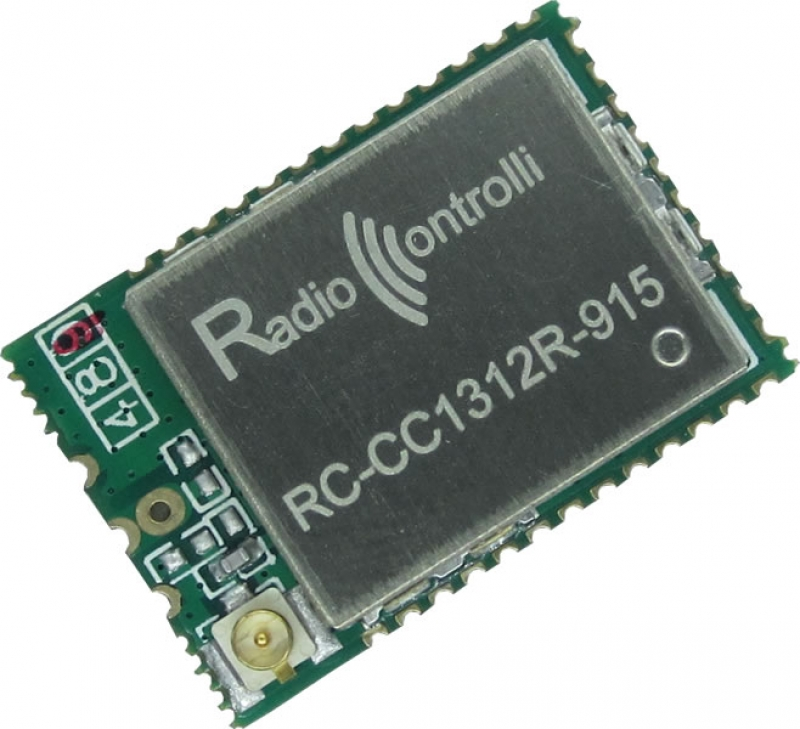
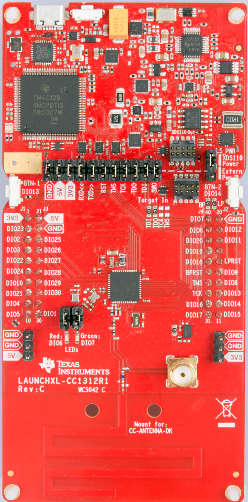
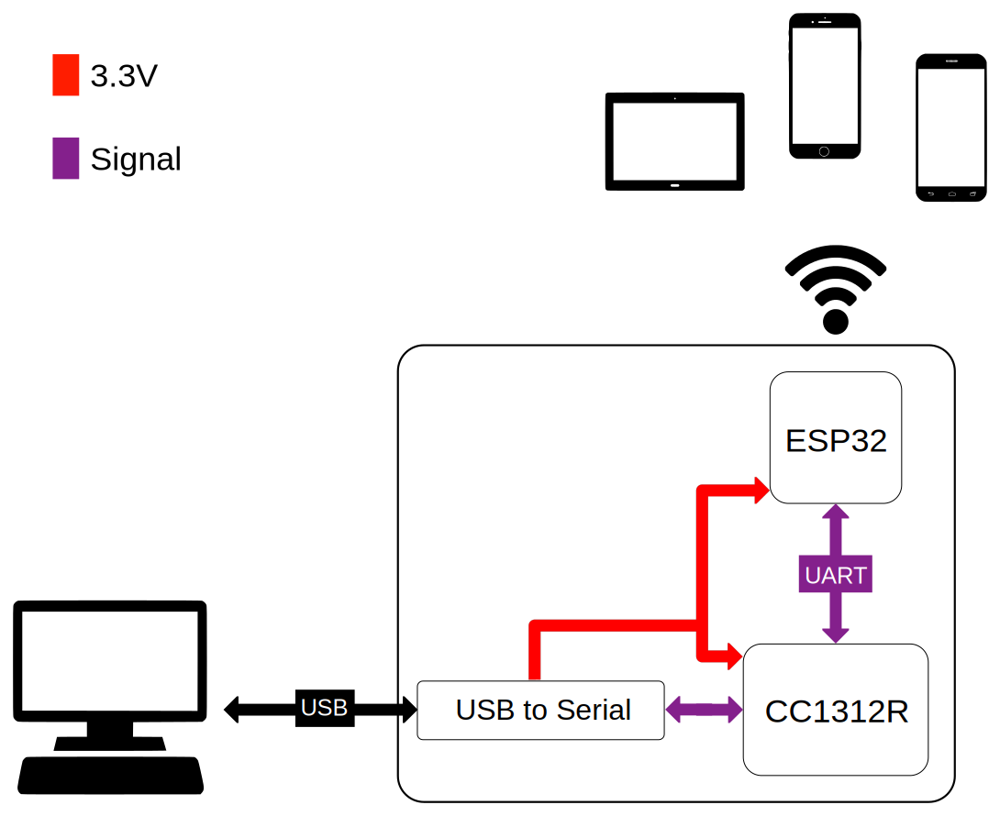

# DIY Hardware for Locha Mesh

We will try to describe the simplest and necessary piece of hardware to connect to Locha Mesh, using Turpial as base.

Turpial consist of a MCU with a integrated radio transceptor [_CC1312R_](https://www.ti.com/product/CC1312R), a WiFi module _ESP32_ and some complementary circuits such as _USB to Serial_ converter, power amplifier (PA) for the radio transceptor, power source and battery charger and some LEDs for a visual interpretation of the system status 

The basis of the entire system is the _CC1312R_, a small MCU with radio transceptor for Sub-1-GHz frequencies and a PA for TX output power up to **+14dBm**
 
Not many manufacturers are integrating the MCU descrived above, only the italian [Radiocontrolli](https://www.radiocontrolli.com/) develop modules and kits for evaluation.

<figure>
    
    <figcaption>RadioControlli cc1312r module </figcaption>
</figure>

Texas Instruments (TI) develops a ready-to-use development kit named [LAUNCXL-CC1312R1](https://www.ti.com/tool/LAUNCHXL-CC1312R1) with debugger, MCU, and power supply. this was our development platform for months previously to the first Turpial board.

<figure>
    
    <figcaption>Dev-kit launchxl-cc1312r </figcaption>
</figure>

Other compatible modules are _CC1352R_, _CC1352P_, both of TI and (not yet tested) _AT86RF2xx_ family from _Microchip_

## Hands to work

Depending of if we want a simple-client or multi-client system we need:

### For Single-Client 

A dev-kit as above described connected via USB port of our PC or credit card sized computer like Raspberry PI or similar.

### For multi-client

<figure style="align: center;">
    
    <figcaption>Simplified multi-client system</figcaption>
</figure>

