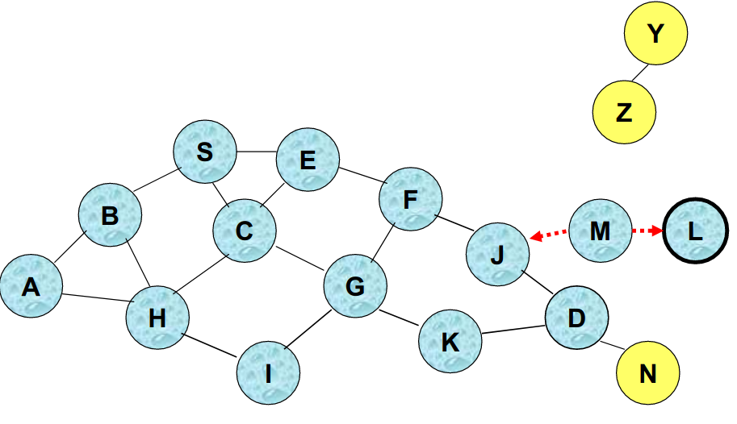
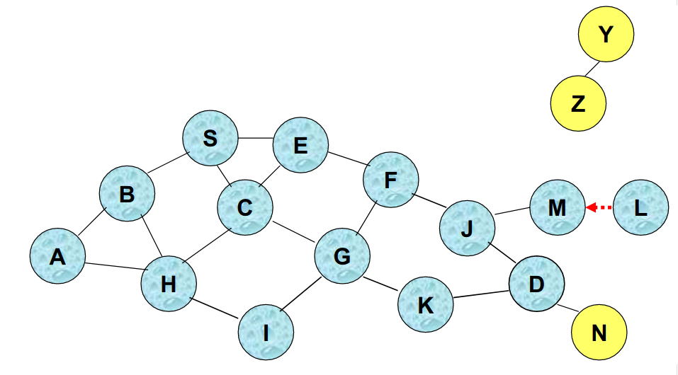

# 8. AODVv2.

[7,9] _AODV_ is a routing protocol for wireless mobile ad-hoc networks (MANETs). _AODV_ is the evolution of its previous protocol called _DYMO_ (2003), which later adopted the name of _AODVv2_ (2013).

_AODV_ is ideal for ad-Hoc networks. Exchange messages when you need to establish communication; that is, it sends messages to neighbors to calculate each route. _AODV_ avoids the problem that DYMO has, but on the contrary it increases the latency in the first packet to send every time the route is calculated.

In the following image [11] we can see the different versions of _AODVv2_ and _DYMO_.

At **Locha Mesh**, we focus on the evolution of _AODV_ called _AODVv2_, but we will simply talk about _AODV_ to refer to the most current version of the routing protocol.

_AODV_ is one of the four protocols standardized by the IETF MANET working group. The protocol finds alternative routes on demand whenever necessary, which means that it first establishes a route between a source node and a destination (route discovery), and then maintains a route between the two nodes during topology changes (maintenance of the route).

The latest versions aplly [13] more restrictions to update the routing table and to guarantee the freedom of the loop.
It holds a maximum of two routes for each destination: while one is invalid and the other is not confirmed.

To avoid loops in this version, an incoming route updates the existing route with the same status. The routing table always maintains the best routes for each state.

## 8.1 Features.

The characteristics of the protocol are:

<ol>
 <li>[7] Low control signaling. </li>
 <li>Minimum processing signaling.</li>
 <li>Loop prevention.</li>
 <li>It only works with bidirectional links.</li>
</ol> 

Each node has an associated routing table that it uses to link to other nodes. These routing tables contain the following fields: 

<ol>
 <li>Origin IP address.</li>
 <li>Time-to-live (TTL). </li>
 <li>Destination IP address.</li>
 <li>Destination sequence number.</li>
 <li>Hop counter (hop count).</li>
</ol>

The fields of the source and destination IP addresses appear to always know the origin of the packets and their destination.

A field with the sequence number of the destination node also appears, which is used to distinguish between new information and old information, thus avoiding the formation of loops and transmissions of old routes. 

Another parameter that is stored in tables is the lifetime. It is used to prevent lost packets from traveling over the network and to use links whose status has not been known for a long time. 

When two packets arrive at a destination from the same source through different paths, the _hop count_ field shows the number of hops they have had to make in each of the routes. In this way it is known which of them is the shortest route and therefore it has to be selected to send the information.

Every time you want to communicate a source with a destination, a route discovery process starts, which ends when you receive a packet with the calculated route.

There is another concept known as "route maintenance", which is used to act in the event that a link breaks along a route. This is accomplished by giving to the discovered paths time-to-live (TTL) before considering them invalid.

## 8.2 Discovery of routes. 
[7] When a node wants to transmit a packet to a destination, the first thing to do is search its route table and see if there is one to this destination, previously calculated. In case of finding it, it would not initiate any route discovery process, it would suppose that the one stored in its route table is correct and is updated. Otherwise, it will begin the process of discovery of  route to find a new valid path. 

The process begins with sending a _RREQ_ (Route Request) packet in _broadcast_ mode. This packet reaches the neighboring nodes that are a hop away and these in turn forward it to their neighbors and so on until they reach the destination.

Any node that knows the route to the destination during the search process, can reply with a _RREP_ (Route Reply) packet to the source node indicating the route it needs. While the search process is being carried out, all the nodes update the routing tables.

In the _RREQ_ package format of the _AODV_ protocol, we find the following fields:: 

<ol>
 <li>Origin IP address.</li>
 <li>Sequence number of the origin.</li>
 <li>Destination IP address.</li>
 <li>Sequence number of the destination.</li>
 <li>RREQ identifier.</li>
 <li>Hop counter (hop count).</li>
</ol>

One of the fields is the identifier that is modified every time an _RREQ_ shipment is generated. This is so that the nodes that receive it (intermediate nodes) know if the packet is identical to the previous one (it has the same identifier) ​​and they must discard it, or on the contrary, if they must retransmit it (because the packet identifier is different). 

In this figure we can see how node A wants to search for a route to node I. The first step will be to search its route table and see if it has a stored route to the destination. If not, you must start a route discovery process, where you send a _multicast_ message to all your neighbors within range of the radio signal.

 &nbsp; 
 &nbsp; 
 &nbsp; 
 &nbsp; 

Comparing this process with daily life would be like going out into the street to look for your child but you don't see it. The first thing you do is yell and wait for a response. This scream represents a _multicast_ message that can be heard by your neighbors. If they know where your child is, they can inform you with a new message (_RREP_), providing a route to where your child is. But if they don't know where it is, they could start a new cry to their closest neighbors (multicast), to see if they can help in the search and so on until they find the destination, in this case your son.

 &nbsp; 

## 8.3 Route request process in an ad-hoc network.

We will show [7] graphically how the network is flooded with route request messages, in order to find a destination node of which only the assigned IP address is known.

The _AODV_ protocol, being reactive, must wait for a node to try to send a message to another remote node. The following images represent the logical sequence until reaching the destination node.

 

<h2> Step 1. </h2>

- Node **S** wants to send a packet with information to node **D**.. 

- You must first search your route table and confirm whether the route to the destination exists or not.

- If the route to the destination exists, it will send the message with the information of the user of the application. But if it don't have a route, the node should start a route search process.

- This type of message (_multicast_) will be heard by all its neighbors inside the coverage.

 

<h2> Step 2. </h2>

- Node **S** sends an _RREQ_ (route request) message to all of its neighbors: **B**, **C**, and **E**. As it can be seen, the direct neighbors of node **S** do not have the required route information so they must start retransmission of the _RREQ_, to its closest neighbors. Nodes can receive the same route request package from different nodes.
 
 
 
 
 
 

<h2> Step 3. </h2>

- Node **H** receives the _RREQ_ message from two different neighbors, which could lead to a collision.

- _AODVv2_ handles a route message table [10] to verify that a node will never recreate a _RREQ_ message that it has already recreated before, no matter where it comes.

 
 
 
 
<h2> Step 4. </h2>

- Node **C** receives the _RREQ_ message from **G** and **H**, but does not recreate it, because node **C** has recreated this message before.
  
- Verification is done through the route message table, which must be interpolated every time a _RREQ_ or _RREP_ type message is received.

 
 
 
 
<h2> Step 5. </h2>

- In this case nodes **J** and **K** retransmit the packet to **D**, due to these nodes do not know each other and their transmissions could collide.

- The _RREQ_ package may not be delivered to node **D**, despite the flood of messages on the network.

 
 
 
 

<h2> Step 6. </h2>

- Node **D** does not recreate the package due to it is the recipient of the route request message.

- In the process, each intermediate node should know how to return to the node that recreated the _RREQ_ message. 

- By executing the _RREQ_ message, each node involved in the process is learning a reverse route to the originating node of the route request message. 

- When _RREP_ messages begin to be created, the intermediate nodes learn a reverse route to the origin node of the _RREP_ message, and in this way a two-way route could be established between the **S** and **D** nodes. 

 

<h2> Step 7. </h2>

- The flooding of the _RREQ_ message across the network is now complete.

- Nodes that are not in the path of **S** or are  isolated from the network will not receive the package, for example **Z**.

- The nodes that pass through the receiver also don´t receive the packet, for example **N**.

 
 
 

### 8.3.1 Advantages of search of routes by network flooding.

The advantages are:

- Simplicity.
- More efficient than other protocols when the transmission frequency is low enough.
- Trustworthy in package delivery. Packages to the destination could be delivered by different routes.

### 8.3.2 Disadvantages of search of routes by network flooding.

- Potentially, data packages can be delivered to too many nodes that do not need to receive them. 
- In the example above, **J** and **K** can transmit to **D** simultaneously, and in this case the receiver might not receive the package.

### 8.3.3 Reverse route entrance.

When an intermediate node receives an RREQ message, the node must configure an entry in a local route table with the following information:

  - IP address of the message source.
  - Sequence number of the source.
  - Number of hops to the source node.
  - IP address of the node from which the _RREQ_ was received. 
  - Using a reverse route a node can send a _RREP_ message to the source.
  - An entry in the route table also includes a time-to-live (TTL) of a route.

These routes learned through _RREQ_ messages can´t yet be confirmed as bidirectional. They are links that we know are capable of sending messages, but we must make sure that they can also receive, through the _RREQ_ack_ messages or the _RREP_ message itself, which we will talk about later.

 

## 8.4 Routes maintenance.
[8] Route routing table maintenance is the process by which the algorithm ensures that the active routes in the table remain valid. Route Error Messages (_RERR_) are used to perform this task. These control messages are generated by _AODVv2_ when you want to inform one or more nodes that one or more routes are no longer valid. There are three events that cause a _RERR_ message to be sent:

- When a node has to forward an IP package but there is no valid route in its routing table, the node will send a _RERR_ to the source to report that there is no route to the destination.

- When an _RREP_ message can´t be forwarded because the path to the _RREQ_ message generator is invalid. In this case the node must send the _RERR_ message to the _RREP_ message generator to report that the route to the origin of the _RREQ_ message is invalid.

- When a node detects that one of the links from a neighboring node has broken, it must inform all nodes using that link that all routes have become invalid.

When a route is found it is given a time-to-live (TTL) and it is considered useful until a timer associated with this route doesn´t expire. This is used so that you don´t have to initiate a route discovery for each information message you want to send. 

During a communication between the origin node and the destination node it could happen that one of the nodes changes its position. This can make the link to break out and the path unusable. The node neighboring the broken link must be in charge of inform the rest of the nodes about this event. The sending of the RERR message is used for this purpose.

The message is the same as the _RREP_ message but with a hop number equal to infinity. In other words, the node that detects the broken link sends an _RERR_ to the origin with a _hop-count_ value of infinite value, which makes any other route better and they must reroute the packages through other way. In this way, the origin node decides if communication with the destination node has ended or if it should start a new route discovery process instead.

_AODV_ presents a number of optimization options, such as the chance to locally repair a broken link that is part of an active route. 

When a link breaks, instead of sending a _RERR_ package to the origin, the node that has detected the break can try to repair it locally by sending a _RREQ_ message with the destination sequence number increased by one to that destination. 

The data packages remain stored on this node waiting to receive a _RREP_ message with a new available route to the destiny. If this new procedure isn´t successful and the _RREP_ message  doesn´t arrive, then it will be necessary to report about the broken link by sending it a _RERR_ package.

## 8.5 Routes table.

We also have an example to illustrate the route table at each node after a route request to all nodes.

The following figure shows a basic node topology and the route table that is used to find other nodes.

<h3>Routes table for node A</h3>

<table id="tblOne" style="width:100%; float:left">
 <tr>
    <th>Seq</th>
    <th>Dest</th>
    <th>Next</th>
    <th>Hop</th>
 </tr>
  <tr>
    <td>1</td>
    <td>B</td>
    <td>B</td>
    <td>1</td>
 </tr>
 <tr>
    <td>1</td>
    <td>E</td>
    <td>B</td>
    <td>2</td>
 </tr>
 <tr>
    <td>1</td>
    <td>H</td>
    <td>B</td>
    <td>3</td>
 </tr>
 <tr>
    <td>1</td>
    <td>J</td>
    <td>B</td>
    <td>4</td>
 </tr>

</table>

<h3>Routes table for node B</h3>

<table id="tblOne" style="width:100%; float:left">
 <tr>
    <th>Seq</th>
    <th>Dest</th>
    <th>Next</th>
    <th>Hop</th>
 </tr>
  <tr>
    <td>1</td>
    <td>A</td>
    <td>A</td>
    <td>1</td>
 </tr>
 <tr>
    <td>1</td>
    <td>E</td>
    <td>E</td>
    <td>1</td>
 </tr>
 <tr>
    <td>1</td>
    <td>H</td>
    <td>E</td>
    <td>2</td>
 </tr>
 <tr>
    <td>1</td>
    <td>J</td>
    <td>E</td>
    <td>3</td>
 </tr>

</table>

<h3>Routes table for node E</h3>

<table id="tblOne" style="width:100%; float:left">
 <tr>
    <th>Seq</th>
    <th>Dest</th>
    <th>Next</th>
    <th>Hop</th>
 </tr>
  <tr>
    <td>1</td>
    <td>B</td>
    <td>B</td>
    <td>1</td>
 </tr>
 <tr>
    <td>1</td>
    <td>A</td>
    <td>B</td>
    <td>2</td>
 </tr>
 <tr>
    <td>1</td>
    <td>H</td>
    <td>H</td>
    <td>1</td>
 </tr>
 <tr>
    <td>1</td>
    <td>J</td>
    <td>H</td>
    <td>2</td>
 </tr>

</table>

<h3>Routes table for node H</h3>

<table id="tblOne" style="width:100%; float:left">
 <tr>
    <th>Seq</th>
    <th>Dest</th>
    <th>Next</th>
    <th>Hop</th>
 </tr>
  <tr>
    <td>1</td>
    <td>A</td>
    <td>E</td>
    <td>3</td>
 </tr>
 <tr>
    <td>1</td>
    <td>B</td>
    <td>E</td>
    <td>2</td>
 </tr>
 <tr>
    <td>1</td>
    <td>E</td>
    <td>E</td>
    <td>1</td>
 </tr>
 <tr>
    <td>1</td>
    <td>J</td>
    <td>J</td>
    <td>1</td>
 </tr>

</table>

<h3>Routes table for node J</h3>

<table id="tblOne" style="width:100%; float:left">
 <tr>
    <th>Seq</th>
    <th>Dest</th>
    <th>Next</th>
    <th>Hop</th>
 </tr>
  <tr>
    <td>1</td>
    <td>A</td>
    <td>H</td>
    <td>4</td>
 </tr>
 <tr>
    <td>1</td>
    <td>B</td>
    <td>H</td>
    <td>3</td>
 </tr>
 <tr>
    <td>1</td>
    <td>E</td>
    <td>H</td>
    <td>2</td>
 </tr>
 <tr>
    <td>1</td>
    <td>H</td>
    <td>H</td>
    <td>1</td>
 </tr>

</table>

So far an overview of the AODVv2 protocol has been presented. Now we are going to detail the processes, data structures, implemented messages and tested in real scenarios.

## 8.6 Router Client Set.
The Router Client Set is a conceptual table in which we store the clients of the _AODV_ router, in order to limit the route messages recreated by the node (_RREQ_, _RREP_) only to the clients registered in that table.

## 8.7 Neighbor Set.
The Neighbor Set table contains information regarding neighboring routers. It´s updated from the control messages. It also contains information regarding the bidirectionality of the link: a route will only be considered valid when the link is confirmed to be bidirectional.

## 8.8 Sequence Number.
Sequence numbers allow _AODVv2_ routers to determine the time order of route discovery messages, identifying obsolete routing information so that it can be discarded. 
Each _AODVv2_ router must maintain its own _Sequence Number_, included in all _RREQ_ and _RREP_ messages created by it. It is necessary to ensure that the sequence number grows one by one for each _RREQ_ or _RREP_ message created. 
If the value reaches 65535, this value must be reset to 1, the value 0 is reserved to indicate that the node sequence number is unknown. 
To determine if a route message is obsolete, you must compare the sequence number attached to the message with the existing information about that route.

## 8.9 Local Route Set.

All _AODVv2_ routers must maintain a set of local routes, with information about the routes learned from the control messages. 
When a route is considered valid, the corresponding entry in the routes table must be added in the route table; and when a route changes from valid to invalid, the corresponding entry must be deleted in the route table.

## 8.10 Multicast Route Message Set.

RREQ messages, by default, are _multicast_ and can be forwarded multiple times. 
The purpose of the _multicast route message set_ is to provide information related to the _RREQ_ and _RREP_ messages previously received, so that they can be compared with the received route messages and determine if the information they contain is old. This allows the router to control the sending of redundant traffic.

## 8.11 Messages.

We are going to detail the control messages that the protocol uses to communicate routes information between nodes. _AODVv2_ defines 4 types of control messages:

- Route Request (_RREQ_).
- Route Reply (_RREP_).
- Route Reply Acknowledgement (_RREP_Ack_).
- Route Error (_RERR_). 

### 8.11.1 Contents of the RREQ route request message.

 
 

- **msg_hop_limit**: contains an integer that decreases by 1 each hop that goes through the _RREQ_ message. The _RREQ_Gen_ message sets the maximum number of hops that the _RREQ_ message will traverse.
- **AddressList**: contains _OrigPrefix_ y+and _TargPrefix_.
- **PrefixLengthList** (Optional): contains _OrigPrefixLen_, if omitted, the length of the prefix (in bits) is equal to the length of the _OrigAddr_.
- **OrigSeqNum** :_OrigPrefix_ sequence number, which is incremented as indicated here [aqui](#88-Sequence-Number).
- **MetricType**: type of metric associated with _OrigMetric_.
- **OrigMetric**: the value of the metric associated with the path to _OrigPrefix_.

  

### 8.11.2 Contents of the RREP route response message.

 
 

- **msg_hop_limit**: contains an integer that decreases its value by 1 for each hop that the _RREP_ message traverses. The _RREP_Gen_ messages sets the maximum number of hops that the _RREP_ message will traverse.
- **AddressList**: contains _OrigPrefix_ and _TargPrefix_.
- **PrefixLengthList** (Optional): contains _TargPrefixLen_, if omitted, the length of the prefix (in bits) is equal to the length of the_TargAddr_ adress.
- **TargetSeqNum** : the sequence number associated with _TargPrefix_.
- **MetricType**: the type of metric associated with _TargMetric_.
- **TargetMetric**: the value of the metric associated with the path to  _TargPrefix_.

  

### 8.11.3 RREP_Ack message content.

 
 

- **AckReq** (Optional): If included, informs the receiver that it must send an _RREP_Ack_ message to confirm the bidirectionality of the link.

 

### 8.11.4 RERR message content.

 
 

- **PktSource** (Optional :) represents the IP address of the packet that triggered the _RERR_.
- **AddressList**: the addresses of the routes that are not available.
- **PrefixLengthList**: the prefix size in bits, associated with unavailable paths or broken links.
- **SeqNumList**: the known number sequence of the broken link.
- **MetricTypeList**: the type of metrics associated with routes that are no longer available.

 
 

The Route Error (_RERR_) message is used to inform the nodes that doesn´t exist a route. This type of messages is part of the maintenance of routes and each node manages to update its route tables and eliminate obsolete routes or broken links, with the information of this type of messages.

 
 

## 8.12 AODVv2 protocol processes.

Let's see a description of each protocol process. 

### 8.12.1 Next Hop Monitoring.

The purpose of this process [10] is to ensure that routes are not established through unidirectional links. To do this, AODV2 routers must verify the bidirectionality of the link with the next hop before marking a route as valid in the Local Route Set.

- To check if a link is bidirectional with an upstream router, the _RREP_Ack_ control message is used. 
Upon submission, another _RREP_Ack_ is expected in response. 
If this message arrives in less time than _RREP_Ack_SENT_TIMEOUT_ it shows that the link is bidirectional, otherwise the link is considered unidirectional.
- For a downstream router, receiving an _RREP_ message that contains the destination address of a route request in the _TargAddr_ field is a confirmation that the link is active and is bidirectional, due to an _RREP_ message requires an _RREQ_ message, that previously have traveled the link in the opposite direction.

### 8.12.2 Neighbor Set Update.

The purpose of this process  [10] is to update the Neighbor Set table. When a control message is received, the process to update the Neighbor Set table starts. This allows registering the neighbors of the _AODVv2_ router and establishing the relationship that it maintains with each of them.

- When a router receives an _RREP_ message and its reception is expected, the link to the router that sent the package is confirmed as bidirectional, and therefore the corresponding entry state of the Neighbor Set changes to "Confirmed".

- When a router receives an _RREP_Ack_ message and it is due to sending an _RREP_Ack_ with AckReq, the link is confirmed as bidirectional and the Neighbor Set table has to be updated.

For a detailed description of the processes involved in route search and maintenance, you can refer to the most up-to-date protocol specifications[10].

## 8.13 Processing of route message information.

In all route messages [10] there is information: RREQs contain the route to OrigPrefix, and RREPs toward TargPrefix. This information is stored in the Local Route Set. 

As a previous step to the evaluation process, the structures of the _RREQ_ and _RREP_ messages are converted to an _AdvRte_ type structure, common to both. This facilitates the development process by reducing the number of functions to implement.

### 8.13.1 Evaluation of route information.

The purpose of this process [10] is to assess whether the route information contained in the _AdvRte_ will be used to update the Local Route Set table. To do this, the cost and the sequence number of the _AdvRte_ are compared with the corresponding entry in the Local Route Set table.

### 8.13.2 Update of route information.

After determining [10] that the _AdvRte_ will be used to update the Local Route Set table. This process is responsible for adding a new entry or updating an existing one.

### 8.13.3 Elimination of redundant messages using the Multicast Route Message Set.

When route messages flood a MANET, a node might receive the same route message multiple times. If not avoided, part of these messages will be forwarded generating unnecessary traffic.

To resolve this problem, each _AODVv2_ router stores information about the route messages it receives in the Multicast Route Message Set table.

Each time an _RREQ_ or _RREP_ message is received, the Multicast Route Message Set table is queried whether the information in the incoming message is redundant or not.

From this, the decision is made whether the message is forwarded or not.

### 8.13.4 Creation of RREQ messages.
- An _RREQ_ message is generated when a Client Router registered in the Local Route Set table of an _AODVv2_ router wants to send an IP package and there is no route to the destination in its RIB table.  After configuring the described parameters  [aquí](#8111-Contenido-del-mensaje-de-requerimiento-de-ruta-RREQ), it is sent. The destination IP address of the packet containing the RREQ message will be the LL-MANET-Routers (`FF02:0:0:0:0:0:0:6D`) for IPV6 specified by [RFC 5498](https://tools.ietf.org/html/rfc5498).

- Before creating an _RREQ_ message, the router must verify if an _RREQ_ was recently sent for the requested destination. If so, and the timeout for a response has not yet been reached, the router should continue waiting for a response without generating a new _RREQ_.

- If the timeout has been reached, it can generate a new _RREQ_. If buffering is configured, the incoming IP package must be buffered until route discovery is complete.

- If the allowed limit of _AODVv2_ control messages has been reached, it should not generate any other messages.

- If it´s near the limit, the message should be sent if the priorities in Section [7.5](https://datatracker.ietf.org/doc/draft-perkins-manet-aodvv2/?include_text=1) allow it.

- This message is used to create the corresponding message [RFC5444] (Sección[8](https://datatracker.ietf.org/doc/draft-perkins-manet-aodvv2/?include_text=1)), which is delivered to the RFC5444 multiplexer for further processing

- By default, the multiplexer has instructions for handling multicast messages on LL-MANET-Routers.

To generate an _RREQ_ message, the _AODVv2_ router must follow these steps:

1. Set **msg_hop_limit** = MAX_HOPCOUNT
2. Set **msg_hop_count** = 0, if including it
3. Set **AddressList** = {OrigAddr, TargAddr}
4. For PrefixLengthList:
 - If **OrigAddr** is part of a range of addresses configured as a client of the router, set

 - PrefixLengthList = {OrigPrefixLen, null}.
 - otherwise omit PrefixLengthList. 
5. For OrigSeqNum:
 - Increase the router number sequence as specified in section [4.4](https://datatracker.ietf.org/doc/draft-perkins-manet-aodvv2/?include_text=1).
 - Set OrigSeqNum = SeqNum. 
6. For TargSeqNum:
 - If there is an invalid path that matches TargAddr using the longest prefix match and has a valid sequence number, set TargSeqNum.
 - TargSeqNum = sequence number of the stored path.
 - If there are no invalid routes that match the destination address, or the route doesn´t have a sequence number, the TargetSeqNum is ignored. 
7. Include the MetricType data element and set the type to be chord or comparable to metricType.
8. Set OrigMetric = Route[OrigAddr]. Metric, i.e.  RouterClient.Cost.
9. Include the ValidityTime data item if it announce that the route to OrigAddr through this router is offered for a limited time, and configure ValidityTime accordingly.

### 8.13.5 Reception of RREQ messages.
This process is responsible for performing operations when an AODVv2 router receives an RREQ message. Between them:
- Checks that the contents of the fields are valid.
- Updates the Neighbor Set, Local Route Set, and Multicast Route Message Set tables.
- Finally, if the route discovery request is addressed to it, it sends an RREP message. If not, it forwards the RREQ message.

### 8.13.6 Forwarding RREQ messages.
An _RREP_ message is generated when a node receives an _RREQ_ and the AddressList field. The TargPrefix in the message matches an entry in the Router Client Set table of the router. When this happens, it generates an _RREP_ message configuring the fields described [aquí](#8112-Contenido-del-mensaje-de-respuesta-de-ruta-RREP) and sends it to the _RREQ_Gen_ with the content of the _RREQ_ route request message.

### 8.13.7 Reception of RREP messages.
This process is responsible for performing operations when an _AODVv2_ router receives an _RREP_ message. Between them, checks that the contents of the fields are valid, update the Neighbor Set, Local Route Set and Multicast Route Message Set tables. If the final destination of the message is the router itself, and the message contains a valid route, the route discovery process is terminated, adding the corresponding entry to the routing table.

### 8.13.8 RREP messages forwarding.
The purpose of this process is to forward _RREP_ messages. To do this, it will check if the maximum number of hops has not been exceeded. If so, it forward the message

### 8.13.9 Generation of RREP_Ack messages.
The route response acknowledgment is used as a request and as a response message to test the bidirectionality of a link through which the route response has also been sent.

### 8.13.10 Reception of RREP_Ack messages.
When an _AODVv2_ router receives an _RREP_Ack_ message, it will check if the message contains an _AckReq_ and if the message was expected or not. If the message contains an _AckReq_, it will start the process to send a response of type _RREP_Ack_. If not, and if the message was expected, it will update the Neighbor Set table to establish the link to the issuer of the _RREP_Ack_ as bidirectional.

### 8.13.11 Generation of RREP_Ack Response.
An _AODvv2_ router will generate an _RREP_Ack Response_ when it receives an _RREP_Ack_ that contains an _AckReq_.
