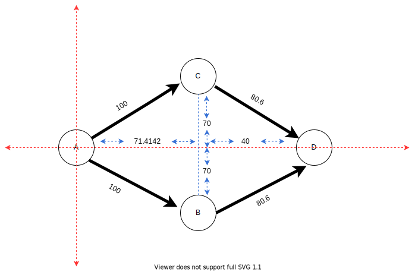

# X AODV simulation

## X.1 Performance Evaluation Result.
In this paper, we aims to explain and describe the necessary process to run the simulation and get information about the network status, round trip times measure, packet loss, based on different network configurations.

A performance evaluation of AODV routing protocol is carried out by varying network size, varying network traffic and varying mobility.

To do the test, Renode simulator was used due to is an open source development framework which accelerates IOT embedded systems development by letting you simulate physical hardware systems, including both the CPU, peripherals, sensors, environment and wired or wireless medium between nodes. 


## X.2 Simulation Stages Overview.
This is the first attempt to test AODV routing protocol C++ implementation by simulator in order to check the protocol behavior and performance. The information collected here help us to debug the firmware and speed up the development process. 

Different simulation stages has been considered to evaluate the parameters under consideration i.e. density, mobility, packets received/packets lost, throughput and delay. Implementation of AODV has been done using RIOT OS and renode development framework to expose the results.

## X.2.1 Network Size.
The network is varied from 3 nodes to 24 nodes in order to study the scalability of the routing protocol. It is extremely important for a routing protocol to perform well for large networks as well as for small networks. By varying the size, the aim is to study the scalability of the routing protocol in terms of how well it addresses the maintenance of a large number of nodes and routes. The selected area of simulation is 1000mx1000m, which provides sufficient space for nodes to be mobile and sufficiently placed apart to observe the impact of multihop routing. The network size is varied so that the behavior of the protocol scales with the network size. More importantly, as the network size increases, the link (and route breakage) probability increases. 

## X.2.2 Traffic Load.
To study the impact of traffic load on the performance of the protocols, the input traffic load is varied using icmp6 (ping6) messages while keeping other parameters such as Network Size and Mobility constant. The traffic load strains the network and creates additional load on the wireless network and therefor it give us a good idea of the performance of the protocol under heavy load conditions.The input load is varied because as the network load increases, the collisions on the wireless medium also increase along with packet losses. Thus, it is interesting to see the behavior of the two protocols as the network load increases. 

## X.2.3 Mobility.
Mobility has a significant impact on the performance of routing protocols because mobility causes changes in the topology of the network. More precisely, mobility causes route breakages and creation of new ones, which forces the routing protocol to converge again. This enables us to study how well the protocol performs in terms of dynamically evolving network conditions.


## X.3 Getting start with Nodes simulation tool.
In order to do the test, we need to configure some scripts to have renode device, ready to run the firmware.
Inside Radio firmware project there are two different files to setting up the platform and number of nodes to run in simulation space.

### X.3.1 Machine description.
To describe the platform machine we can use the below script for emulate __cc2538dk__ platform. for more information aboute renode machine description, you can visit https://renode.readthedocs.io/en/latest/basic/describing_platforms.html

```
logLevel 3
mach create $name
using sysbus
machine LoadPlatformDescription @platforms/cpus/cc2538.repl

connector Connect sysbus.radio wireless

machine PyDevFromFile @scripts/pydev/rolling-bit.py 0x400D2004 0x4 True "sysctrl"

# get an id value starting with 1
$id = `next_value 1`

macro reset
"""
    # set node address based on the $id variable. 0x00 0x12 0x4B is TI OUI
    sysbus WriteByte 0x00280028 $id
    sysbus WriteByte 0x0028002C 0x00
    sysbus WriteByte 0x00280030 0xAB
    sysbus WriteByte 0x00280034 0x89
    sysbus WriteByte 0x00280038 0x00
    sysbus WriteByte 0x0028003C 0x4B
    sysbus WriteByte 0x00280040 0x12
    sysbus WriteByte 0x00280044 0x00
    sysbus LoadBinary @http://antmicro.com/projects/renode/cc2538_rom_dump.bin-s_
                            524288-0c196cdc21b5397f82e0ff42b206d1cc4b6d7522 0x0
    sysbus LoadELF $image_file
    cpu VectorTableOffset 0x200000
"""

runMacro $reset
```

### X.3.1 Board description.
To describe a board and number of nodes inside simulation environment, we will need to use and edit the below script to modified different availables parameters in compiling time simulation.

To create more than 3 nodes just you'll need to copy and paste this next code and edit the machine's name.

##### One node representation.
```
######################### Machine 0 - begin #########################
$name="Node-A"
i $ORIGIN/machine.resc
wireless SetPosition radio 0 0 0
showAnalyzer sysbus.uart0
mach clear
start
########################## Machine 0 - end ##########################
```

##### Complete node network.
```
path add $CWD
emulation CreateWirelessMedium "wireless"

# The radio is using a range-based medium (with the `Range` set to `11`)
# If not set, the default SimpleMediumFunction will be used (where range is not relevant)
wireless SetRangeWirelessFunction 100

######################### Machine 0 - begin #########################
$name="Node-A"
i $ORIGIN/machine.resc
wireless SetPosition radio 0 0 0
showAnalyzer sysbus.uart0
mach clear
start
########################## Machine 0 - end ##########################

######################### Machine 1 - begin #########################
$name="Node-B"
i $ORIGIN/machine.resc
wireless SetPosition radio 100 0 0
showAnalyzer sysbus.uart0
mach clear
start
########################## Machine 1 - end ##########################

######################### Machine 2 - begin #########################
$name="Node-C"
i $ORIGIN/machine.resc
wireless SetPosition radio 200 0 0
showAnalyzer sysbus.uart0
mach clear
start
########################## Machine 2 - end ##########################

```

## X.4 First stage environment.

The experiment consider this stage environment  with up 3 nodes. Initially all routing tables and buffers are empty, the originator and the destination of the data packets are identified as nodes A, B, or C. The new data packets may arrive as depicted in below figure.

- In the first stage a packet from A to B is followed by a packet from A to C.

```cpp
        A                         B                      C        
-----------------         -----------------      -----------------
        |                         |                      |
    +-------+                 +-------+              +-------+    
    |       |                 |       |              |       |    
    +-------+                 +-------+              +-------+    
        |      newpkt[A][B]       |                      |        
        ------------------------->|                      |        
        |                         |                      |        
    +-------+                 +-------+              +-------+    
    |       |                 |       |              |       |    
    +-------+                 +-------+              +-------+    
        |       newpkt[A][C]      |                      |        
        ------------------------------------------------>|        
        |                         |                      |        
    +-------+                 +-------+              +-------+    
    |       |                 |       |              |       |    
    +-------+                 +-------+              +-------+    
        |                         |                      |        
-----------------         -----------------      -----------------
```

### X.4.1 Renode simulation
In the simulation we have 3 nodes with the following assigned IPs: 


##### Table 1 
<div>
<table id="tblOne" style="width:100%;" >
 <tr align="center">
    <th>Nodes</th>
    <th>Global IPV6</th>
    <th>Max range</th>
    <th>X</th>
    <th>Y</th>
    <th>Z</th>
 </tr>
  <tr align="left">
    <td>Node-A</td>
    <td> 2001::200:1:0:0 </td>
    <td> 100</td>
    <td>0</td>
    <td>0</td>
    <td>0</td>
 </tr>
 <tr align="left">
    <td>Node-B</td>
    <td> 2001::200:2:0:0 </td>
    <td> 100</td>
    <td>100</td>
    <td>0</td>
    <td>0</td>
 </tr>
 <tr align="left">
    <td>Node-C</td>
    <td> 2001::200:3:0:0 </td>
    <td> 100</td>
    <td>200</td>
    <td>0</td>
    <td>0</td>
 </tr>
</table>
</div>
<br>

In order to reach node B from A, we need to execute
- __ifconfig__ to now node's IP.
- We may check if we have got a route inside route information base table, executing __nib route__ command. the below image aims to show the executed commands and the output, in this point we don't have any route information to remote nodes.
- In this paper the maximum coverage range is 100  units for all nodes.


<br>
<br>

- Then execute ```find_route``` command, to get a new route for destinator address. The command format parameters are:
  - find_route **dest_address** **source_address**.
The below images can show the output RFC5444 format message and the incoming RFC format packet, after that we executed ```nib route``` to check the availables routes, then the table routes was updated in each node involved in the process.


<br>
<br>
In this point we are done, Node A is able to send packet to Node B through the new built path, then now each of both nodes can send packet in both directions.


### X.4.2 Testing the new Path
In order to test the new built path, we can use __UDP__ server and __UDP__ client to send and receive packets from each node.

- To run the UDP server from Node A:

__Node_A__
```
> udp
usage: udp [send|server]
> udp server start 80
Success: started UDP server on port 80
```

- To execute __UDP__ client from Node B

__Node_B__
```
udp send
usage: udp send <dest_addr> <src_addr> <port> <data> [<num>]

```

In the below image we can see the output information that correspond to the both nodes sending and receiving data.


This was the basic test between two nodes inside radio frequency coverage.\
Now we are going to try to reach a third node C without RF coverage  sending a route request and then sending a __UDP__ message to test the built route and demostrate the routing process between nodes with more than one hop between them.

When node A send a __RREQ__, node B get this one and recreate and forward a new RREQ, node C is the target then it will need  to reply with RREP message,Node B again receive a new message but in this case the message is from node C and is of type RREP message and it will need to reply by recreating RREP message to node A from node C ,  notice on every hop the __hop_limit__ is decreasing its value.


##### Table 2 

<div>
<table id="tblOne" style="width:100%;" >
 <tr align="center">
    <th>Nodes</th>
    <th>Message type:</th>
    <th>Message flags:</th>
    <th>Address length: </th>
    <th>Hop limit: </th>
 </tr>
  <tr align="center">
    <td>Node-A</td>
    <td> RREQ </td>
    <td> 0x40 </td>
    <td> 16</td>
    <td> 255 </td>
 </tr>
 <tr align="center">
    <td>Node-B</td>
    <td> RREQ </td>
    <td> 0x40 </td>
    <td> 16</td>
    <td> 254 </td>
 </tr>
 <tr align="center">
    <td>Node-C</td>
    <td> RREP </td>
    <td> 0x40 </td>
    <td> 16</td>
    <td> 253 </td>
 </tr>
  <tr align="center">
    <td>Node-B</td>
    <td> RREP </td>
    <td> 0x40 </td>
    <td> 16</td>
    <td> 252 </td>
 </tr>
  <tr align="center">
    <td>Node-A</td>
    <td> Receive the Requeste route </td>
    <td> 0x40 </td>
    <td> 16</td>
    <td> 252 </td>
 </tr>
</table>
</div>
<br>

The below image are showing again the updated table with availables routes to send packets.


At this point we are showing the routing protocolo behavior on a basic topology distribution, the next step, is to try to change this one and analyze the result when a target receive RREQ from more than one node. 


## X.5 Second stage environment

In this section we are going to show the protocol behavior when the number of nodes with up 4 ones. the following figure are showing the node's position over cartesian plane and this information will need to be added to renode's script.

In this point there aren't any address inside table route, we are going to find a route from node A to node D, then print the routing table available in each of thouse nodes. The below picture show the output after run __nib__ __route__. 

Node B table routes is showing the available forwarding paths, The below information means node B works as a bridge between node A and D.

In this stage we can realized node D doesn't stored information about Node C route; Here we can have many questions about what we could do with the new node C route, because node D can reach a stale RREQ from node C, but the route can help to avoid a new RREQ from node D to discover node C. maybe a local neighbor set could contain this stale information to be processed later.  

###### Nodes's distribution 


<br>

##### Table 3
<div>
<table id="tblOne" style="width:100%;" >
 <tr align="center">
    <th>Nodes</th>
    <th>Routes</th>
    <th>Command script</th>
    <th>X</th>
    <th>Y</th>
    <th>Z</th>
 </tr>
  <tr align="left">
    <td>Node-A</td>
    <td>
        <ul>
            <li>2001::200:1:0:0/128 dev #7</li>
            <li>2001::200:4:0:0/128 via fe80::200:2:0:0 dev #7</li>
        </ul> 
    </td>
   <td> wireless SetPosition radio 0 0 0 </td>
    <td>0</td>
    <td>0</td>
    <td>0</td>
 </tr>
 <tr align="left">
    <td>Node-B</td>
    <td>
        <ul>
            <li>2001::200:2:0:0/128 dev #7</li>
            <li>2001::200:1:0:0/128 via fe80::200:1:0:0 dev #7</li>
            <li>2001::200:4:0:0/128 via fe80::200:4:0:0 dev #7</li>
        </ul> 
    </td>
   <td> wireless SetPosition radio 70 -70 0 </td>
    <td>70</td>
    <td>-70</td>
    <td>0</td>
 </tr>
 <tr align="left">
    <td>Node-C</td>
   <td>
        <ul>
            <li>2001::200:3:0:0/128 dev #7</li>
            <li>2001::200:1:0:0/128 via fe80::200:1:0:0 dev #7</li>
        </ul> 
    </td>
   <td> wireless SetPosition radio 70 70 0 </td>
    <td>70</td>
    <td>70</td>
    <td>0</td>
 </tr>
  <tr align="left">
    <td>Node-D</td>
   <td>
        <ul>
            <li>2001::200:4:0:0/128 dev #7</li>
            <li>2001::200:1:0:0/128 via fe80::200:2:0:0 dev #7</li>
        </ul> 
    </td>
   <td> wireless SetPosition radio 110 0 0 </td>
    <td>110</td>
    <td>0</td>
    <td>0</td>
 </tr>
</table>
</div>
<br>

 
We can try to send a message from node B or C to node A and it can be success because both intermediate nodes have stored a reverse route back to the originator of the RREQ (node A).
The only thing we cannot forget is the route inside node C to reach node A is an unconfirmed as bidirectional path.


Now we can do a new route request from different node to test the RREQ and RREP messages and printout  the routes tables.
Lets try with route request from node B to node C and check the route tables.

After carry out the request the following picture show the content of route tables, and that information means node A is the bridge between node B and node C.This basic stage can help us to understand how many RREQ are flooding the network and how we can improve the system in order to process more information that can work as a second alternative when broken routes.


##### Table 4
<div>
<table id="tblOne" style="width:100%;" >
 <tr align="center">
    <th>Nodes</th>
    <th>Routes</th>
 </tr>
  <tr align="left">
    <td>Node-A</td>
    <td>
        <ul>
            <li>2001::200:1:0:0/128 dev #7</li>
            <li>2001::200:2:0:0/128 via fe80::200:2:0:0 dev #7</li>
            <li>2001::200:3:0:0/128 via fe80::200:3:0:0 dev #7</li>
        </ul> 
    </td>
 </tr>
 <tr align="left">
    <td>Node-B</td>
    <td>
        <ul>
            <li>2001::200:2:0:0/128 dev #7</li>
            <li>2001::200:3:0:0/128 via fe80::200:1:0:0 dev #7</li>
        </ul> 
    </td>
 </tr>
 <tr align="left">
    <td>Node-C</td>
   <td>
        <ul>
            <li>2001::200:3:0:0/128 dev #7</li>
            <li>2001::200:2:0:0/128 via fe80::200:1:0:0 dev #7</li>
        </ul> 
    </td>
 </tr>
  <tr align="left">
    <td>Node-D</td>
   <td>
        <ul>
            <li>2001::200:4:0:0/128 dev #7</li>
            <li>2001::200:2:0:0/128 via fe80::200:2:0:0 dev #7</li>
        </ul> 
    </td>
 </tr>
</table>
</div>

# X.6 third stage environment
henceforth we are going to avoid __find_route__, because the AODV firmaware was created to be reactive and this feature is triggered when any node try to send __UDP__ packets to any destination and not path are found inside the rote table.

The current firmware has implemented an __UDP__ server and client to listend and send packets to/from anywhere.\
When network stack is not able to resolve the remote address, __AODV__is triggered and  __find_route__ command is execute automatically.  


In this stage we are going to set up the staging environment with up 6 nodes. Initially all routing tables and buffers are empty, the originator and destination of the data packets are identified as nodes A, B, C, D, E and F.

To do the test, we are going to init a RREQ from node D to get information path from node C, in this scenario, there are 2 right paths to reach the destination node but node C takes the first one to arrive, the second one is listed as a stale route information.

There are some very important things to take in mind, the second alternative route is stale because it doesn't offer improvements over the first one, but this stale information gives to node the opportunitty to know about your neighbors environment to future transactions, The stale information could be useful as a second alternative when the main route is broken.

###### Node's distribution
In the below picture we can realized based on information in its route table that the traced path to reach node C from D is through node A and B.


##### Nodes's routes information

##### Table 5
<div>
<table id="tblOne" style="width:100%;" >
 <tr align="center">
    <th>Nodes</th>
    <th>Routes</th>
    <th>Command script</th>
    <th>X</th>
    <th>Y</th>
    <th>Z</th>
 </tr>
  <tr align="left">
    <td>Node-A</td>
    <td>
        <ul>
            <li>2001::200:1:0:0/128 dev #7</li>
            <li>2001::200:4:0:0/128 via fe80::200:4:0:0 dev #7</li>
            <li>2001::200:3:0:0/128 via fe80::200:2:0:0 dev #7</li>
        </ul> 
    </td>
    <td> wireless SetPosition radio 0 0 0 </td>
    <td>0</td>
    <td>0</td>
    <td>0</td>
 </tr>
 <tr align="left">
    <td>Node-B</td>
    <td>
        <ul>
            <li>2001::200:2:0:0/128 dev #7</li>
            <li>2001::200:4:0:0/128 via fe80::200:1:0:0 dev #7</li>
            <li>2001::200:3:0:0/128 via fe80::200:3:0:0 dev #7</li>
        </ul> 
    </td>
    <td> wireless SetPosition radio 70 70 0 </td>
    <td>70</td>
    <td>70</td>
    <td>0</td>
 </tr>
 <tr align="left">
    <td>Node-C</td>
   <td>
        <ul>
            <li>2001::200:3:0:0/128 dev #7</li>
            <li>2001::200:4:0:0/128 via fe80::200:2:0:0 dev #7</li>
        </ul> 
    </td>
      <td> wireless SetPosition radio 170 70 0 </td>
    <td>170</td>
    <td>70</td>
    <td>0</td>
 </tr>
  <tr align="left">
    <td>Node-D</td>
   <td>
        <ul>
            <li>2001::200:4:0:0/128 dev #7</li>
            <li>2001::200:3:0:0/128 via fe80::200:1:0:0 dev #7</li>
        </ul> 
    </td>
      <td> wireless SetPosition radio 70 -70 0 </td>
    <td>70</td>
    <td>-70</td>
    <td>0</td>
 </tr>
 <tr align="left">
    <td>Node-E</td>
   <td>
        <ul>
            <li>2001::200:5:0:0/128 dev #7</li>
            <li>2001::200:4:0:0/128 via fe80::200:4:0:0 dev #7</li>
        </ul> 
    </td>
      <td> wireless SetPosition radio 170 -70 0 </td>
    <td>170</td>
    <td>-70</td>
    <td>0</td>
 </tr>
 <tr align="left">
    <td>Node-F</td>
   <td>
        <ul>
            <li>2001::200:6:0:0/128 dev #7</li>
            <li>2001::200:4:0:0/128 via fe80::200:5:0:0 dev #7</li>
        </ul> 
    </td>
      <td> wireless SetPosition radio 210 0 0 </td>
    <td>210</td>
    <td>0</td>
    <td>0</td>
 </tr>
</table>
</div>
<br>

# X.7 fourth stage environment
This test offers the possibility of verifying the __route_message__ table because this diagram generates several retransmissions of obsolete route request, and could be the starter point to improve the algorithm behavior.

Each nodes maintains a sequence number, which saves a time stamp, and a routing table, which contains routes to destinations, Sequence numbers are used to determine the freshness of routes (the higher the number, the fresher the route, and the older one can be discarded). Each table entry contains the address of the next hop (next node to destination), a hop count (number of hops to destination), and a destination sequence number. Since this is an on demand distance vector schema, routers maintain information of thouse destinations only that they need to contact or relay information to. Each active route is associated with a lifetime stored in the table, after this time has passed route timeout is triggered, and the route is marked as a invalid and later on removed.


Here we are going to try to send a message from node F to node G, this latest one is a direct neighbor to F, but we can see the flooding process was able to reach all nodes in the network, but all the new learned routes are not confirmed as a bidirectional ones yet. Table 6 are showing all nodes inside the network has stored a route to node F `2001::200:6:0:0`, this latest include node A that isn't a direct neighbor to node F .
steps to execute the test is as follow:
- Run __UDP__ server from node G.
- Run __UDP__ client and setting up the client information from node F. 

###### Node G
```
udp server start 80
```

###### Node F
```
udp send 2001::200:7:0:0 2001::200:6:0:0 80 test_message
```

When the client try to send a message to destination, the reactive protocol is triggered and find_route function is executed, then __AODV__ process is started to find the route to destination.


Here we can realized node F is able to reach five nodes when carry out a RREQ, also node A has a path to node F through flooding carry out by nodes B and D .
Each node is able to drop a redundant messages, but take in mind each redundant message need to be processed before can be dropped, that's mean energy and processor consumption. This is a good point to figure out the best approach to process the incoming messages. 

##### Table 6
<div>
<table id="tblOne" style="width:100%;" >
 <tr align="center">
    <th>Nodes</th>
    <th>Routes</th>
    <th>Command script</th>
    <th>X</th>
    <th>Y</th>
    <th>Z</th>
 </tr>
  <tr align="left">
    <td>Node-A</td>
    <td>
        <ul>
            <li>2001::200:1:0:0/128 dev #7</li>
            <li>2001::200:6:0:0/128 via fe80::200:4:0:0 dev #7</li>
        </ul> 
    </td>
    <td> wireless SetPosition radio 0 0 0 </td>
    <td>0</td>
    <td>0</td>
    <td>0</td>
 </tr>
 <tr align="left">
    <td>Node-B</td>
    <td>
        <ul>
            <li>2001::200:2:0:0/128 dev #7</li>
            <li>2001::200:6:0:0/128 via fe80::200:6:0:0 dev #7</li>
        </ul> 
    </td>
    <td> wireless SetPosition radio 70 70 0 </td>
    <td>70</td>
    <td>70</td>
    <td>0</td>
 </tr>
 <tr align="left">
    <td>Node-C</td>
   <td>
        <ul>
            <li>2001::200:3:0:0/128 dev #7</li>
            <li>2001::200:6:0:0/128 via fe80::200:6:0:0 dev #7</li>
        </ul> 
    </td>
      <td> wireless SetPosition radio 170 70 0 </td>
    <td>170</td>
    <td>70</td>
    <td>0</td>
 </tr>
  <tr align="left">
    <td>Node-D</td>
   <td>
        <ul>
            <li>2001::200:4:0:0/128 dev #7</li>
            <li>2001::200:6:0:0/128 via fe80::200:6:0:0 dev #7</li>
        </ul> 
    </td>
      <td> wireless SetPosition radio 70 -70 0 </td>
    <td>70</td>
    <td>-70</td>
    <td>0</td>
 </tr>
 <tr align="left">
    <td>Node-E</td>
   <td>
        <ul>
            <li>2001::200:5:0:0/128 dev #7</li>
            <li>2001::200:6:0:0/128 via fe80::200:6:0:0 dev #7</li>
        </ul> 
    </td>
      <td> wireless SetPosition radio 170 -70 0 </td>
    <td>170</td>
    <td>-70</td>
    <td>0</td>
 </tr>
 <tr align="left">
    <td>Node-F</td>
   <td>
        <ul>
            <li>2001::200:6:0:0/128 dev #7</li>
            <li>2001::200:7:0:0/128 via fe80::200:7:0:0 dev #7</li>
        </ul> 
    </td>
      <td> wireless SetPosition radio 120 0 0 </td>
    <td>120</td>
    <td>0</td>
    <td>0</td>
 </tr>
  <tr align="left">
    <td>Node-G</td>
   <td>
        <ul>
            <li>2001::200:7:0:0/128 dev #7</li>
            <li>2001::200:6:0:0/128 via fe80::200:6:0:0 dev #7</li>
        </ul> 
    </td>
      <td> wireless SetPosition radio 210 0 0 </td>
    <td>210</td>
    <td>0</td>
    <td>0</td>
 </tr>
</table>
</div>
<br>


# X.8 Fifth staging environment
In this test the nodes's position are the same as showed in below image.

Each nodo can know about other ones as the rows connection between nodes are showing.
The main goal of the routing protocol is packet delivery, in the following image we can see there are more than one route to destination, for now we are just working with one route, but in the future new code will be created to ensure alternative paths and reliable ones
<br>


##### Table 6
<div>
<table id="tblOne" style="width:100%;" >
 <tr align="center">
    <th>Nodes</th>
    <th>Routes</th>
    <th>X</th>
    <th>Y</th>
    <th>Z</th>
    <th>IP</th>
 </tr>
  <tr align="left">
    <td>Node-A</td>
    <td>
        <ul>
            <li><code>2001::200:1:0:0/128 dev #7</code></li>
            <li><code>2001::200:10:0:0/128 via fe80::200:2:0:0 dev #7</code></li>
        </ul> 
    </td>
    <td>0</td>
    <td>0</td>
    <td>0</td>
    <td><code>2001::200:1:0:0</code></td>
 </tr>
 <tr align="left">
    <td>Node-B</td>
    <td>
        <ul>
            <li><code>2001::200:2:0:0/128 dev #7</code></li>
            <li><code>2001::200:1:0:0/128 via fe80::200:1:0:0 dev #7</code></li>
            <li><code>2001::200:10:0:0/128 via fe80::200:3:0:0 dev #7</code></li>
        </ul> 
    </td>
    <td>100</td>
    <td>0</td>
    <td>0</td>
    <td><code>2001::200:2:0:0</code></td>
 </tr>
 <tr align="left">
    <td>Node-C</td>
   <td>
        <ul>
            <li><code>2001::200:3:0:0/128 dev #7</code></li>
            <li><code>2001::200:1:0:0/128 via fe80::200:2:0:0 dev #7</code></li>
             <li><code>2001::200:10:0:0/128 via fe80::200:4:0:0 dev #7</code></li>
        </ul> 
    </td>
    <td>200</td>
    <td>0</td>
    <td>0</td>
    <td><code>2001::200:3:0:0</code></td>
 </tr>
  <tr align="left">
    <td>Node-D</td>
   <td>
        <ul>
            <li><code>2001::200:4:0:0/128 dev #7</code></li>
            <li><code>2001::200:1:0:0/128 via fe80::200:3:0:0 dev #7</code></li>
             <li><code>2001::200:10:0:0/128 via fe80::200:8:0:0 dev #7</code></li>
        </ul> 
    </td>
    <td>300</td>
    <td>0</td>
    <td>0</td>
    <td><code>2001::200:4:0:0</code></td>
 </tr>
 <tr align="left">
    <td>Node-E</td>
   <td>
        <ul>
            <li><code>2001::200:5:0:0/128 dev #7</code></li>
            <li><code>2001::200:1:0:0/128 via fe80::200:1:0:0 dev #7</code></li>
        </ul> 
    </td>
    <td>0</td>
    <td>-100</td>
    <td>0</td>
    <td><code>2001::200:5:0:0</code></td>
 </tr>
 <tr align="left">
    <td>Node-F</td>
   <td>
        <ul>
            <li><code>2001::200:6:0:0/128 dev #7</code></li>
            <li><code>2001::200:1:0:0/128 via fe80::200:5:0:0 dev #7</code></li>
        </ul> 
    </td>
    <td>100</td>
    <td>-100</td>
    <td>0</td>
    <td><code>2001::200:6:0:0</code></td>
 </tr>
  <tr align="left">
    <td>Node-G</td>
   <td>
        <ul>
            <li><code>2001::200:7:0:0/128 dev #7</code></li>
            <li><code>2001::200:1:0:0/128 via fe80::200:3:0:0 dev #7</code></li>
        </ul> 
    </td>
    <td>200</td>
    <td>-100</td>
    <td>0</td>
    <td><code>2001::200:7:0:0</code></td>
 </tr>
   <tr align="left">
    <td>Node-H</td>
   <td>
        <ul>
            <li><code>2001::200:8:0:0/128 dev #7</code></li>
            <li><code>2001::200:1:0:0/128 via fe80::200:4:0:0 dev #7</code></li>
             <li><code>2001::200:10:0:0/128 via fe80::200:c:0:0 dev #7</code></li>
        </ul> 
    </td>
    <td>300</td>
    <td>-100</td>
    <td>0</td>
    <td><code>2001::200:8:0:0</code></td>
 </tr>
   <tr align="left">
    <td>Node-I</td>
   <td>
        <ul>
            <li><code>2001::200:9:0:0/128 dev #7</code></li>
            <li><code>2001::200:1:0:0/128 via fe80::200:5:0:0 dev #7</code></li>
        </ul> 
    </td>
    <td>0</td>
    <td>-200</td>
    <td>0</td>
    <td><code>2001::200:9:0:0</code></td>
 </tr>
  <tr align="left">
    <td>Node-J</td>
   <td>
        <ul>
            <li><code>2001::200:a:0:0/128 dev #7</code></li>
            <li><code>2001::200:1:0:0/128 via fe80::200:9:0:0 dev #7</code></li>
        </ul> 
    </td>
    <td>100</td>
    <td>-200</td>
    <td>10</td>
    <td><code>2001::200:a:0:0</code></td>
 </tr>
  <tr align="left">
    <td>Node-K</td>
   <td>
        <ul>
            <li><code>2001::200:b:0:0/128 dev #7</code></li>
            <li><code>2001::200:1:0:0/128 via fe80::200:a:0:0 dev #7</code></li>
        </ul> 
    </td>
    <td>200</td>
    <td>-200</td>
    <td>0</td>
    <td><code>2001::200:b:0:0</code></td>
 </tr>
  <tr align="left">
    <td>Node-L</td>
   <td>
        <ul>
            <li><code>2001::200:c:0:0/128 dev #7</code></li>
            <li><code>2001::200:1:0:0/128 via fe80::200:8:0:0 dev #7</code></li>
            <li><code>2001::200:10:0:0/128 via fe80::200:10:0:0 dev #7</code></li>
        </ul> 
    </td>
    <td>300</td>
    <td>-200</td>
    <td>0</td>
    <td><code>2001::200:c:0:0</code></td>
 </tr>
  <tr align="left">
    <td>Node-M</td>
   <td>
        <ul>
            <li>2001::200:d:0:0/128 dev #7</li>
            <li>2001::200:1:0:0/128 via fe80::200:9:0:0 dev #7</li>
        </ul> 
    </td>
    <td>0</td>
    <td>-300</td>
    <td>0</td>
    <td><code>2001::200:d:0:0</code></td>
 </tr>
  <tr align="left">
    <td>Node-N</td>
   <td>
        <ul>
            <li><code>2001::200:e:0:0/128 dev #7</code></li>
            <li><code>2001::200:1:0:0/128 via fe80::200:d:0:0 dev #7</code></li>
        </ul> 
    </td>
    <td>100</td>
    <td>-300</td>
    <td>0</td>
    <td><code>2001::200:e:0:0</code></td>
 </tr>
  <tr align="left">
    <td>Node-O</td>
   <td>
        <ul>
            <li><code>2001::200:f:0:0/128 dev #7</code></li>
            <li><code>2001::200:1:0:0/128 via fe80::200:e:0:0 dev #7</code></li>
        </ul> 
    </td>
    <td>200</td>
    <td>-300</td>
    <td>0</td>
    <td><code>2001::200:f:0:0</code></td>
 </tr>
  <tr align="left">
    <td>Node-P</td>
   <td>
        <ul>
            <li><code>2001::200:10:0:0/128 dev #7</code></li>
            <li><code>2001::200:1:0:0/128 via fe80::200:c:0:0 dev #7</code></li>
        </ul> 
    </td>
    <td>300</td>
    <td>-300</td>
    <td>0</td>
    <td><code>2001::200:10:0:0</code></td>
 </tr>
</table>
</div>
<br>


## Experimental Results

We evaluated the efficiency of the AODV protocol via simulations in renode, As mentioned earlier, the overall number of control packets generated by __AODVV2__ is more higher than for standard __AODV__, due to in this latest version there aren't intermediate __RREP__ from nodes that know the path to the destination, this approach in order to avoid __loop_free__ generations and ensure reliable paths. 

In general the test carried out by simulation showed us we are almost there to get the protocol working with very high efficiency talking about delivery packets , security and low energy consumption. This is the first attemp to have running __AODV__ routing protocol on embedded platform device. The test was designed specifically to know the capacity to deliver packets and all the test to get any node were success in all.  


## Conclusions and Outlook

The aim of this ongoing work is to complement by simulation checking an algorithmic process description of WMN routing protocols AODV in particular. The used description of AODV described in draft-ietf-manet-aodvv2 was translate to C++ algorithms, more new code implementations need to be done, this is the starter point of a biggest project; There are many future work to improve the behavior of __AODV__ routing protocol,for instance now we can see when any node initialize the route request process, all nodes store the path to that node , and not ack messages have been required to test if the node is a bidirectional one, the next items are the ongoing work:    
- Neighbor set table.
- Time to live for routes.
- State of the neighbors.
- Update the local route set from neighbor table.
- Save more than one route to destination to improve the delivery of packets and reduce flooding over network.
- Better mechanism and tools to develop the staging environment to test the protocol.

Other important ongoing work is TSCH Time SLotted Channel Hopping to have more efficient communication and less packets collision , and low power consumption.
