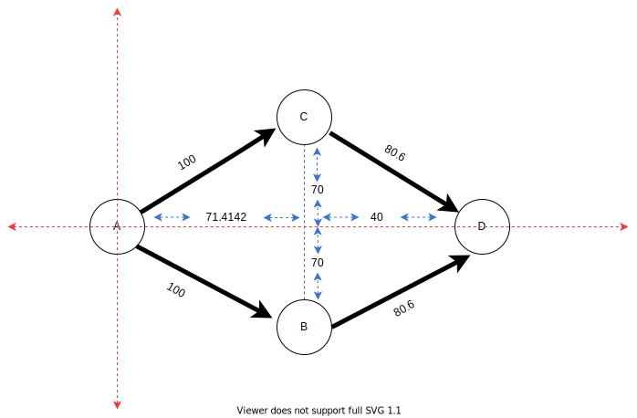

# X AODV simulation

## X.1 Performance Evaluation Result.
In this paper, we aims to explain and describe the necessary process to run the simulation and get information about the network status, round trip times measure, packet loss, based on different network configurations.

A performance evaluation of AODV routing protocol is carried out by varying network size, varying network traffic and varying mobility.

To do the test, Renode simulator was used due to is an open source development framework which accelerates IOT embedded systems development by letting you simulate physical hardware systems, including both the CPU, peripherals, sensors, environment and wired or wireless medium between nodes. 


## X.2 Simulation Scenarios Overview.
This is the first attempt to test AODV routing protocol C++ implementation by simulator in order to check the protocol behavior and performance. The information collected here help us to debug the firmware and speed up the development process. 

Different simulation scenarios has been considered to evaluate the parameters under consideration i.e. density, mobility, packets received/packets lost, throughput and delay. Implementation of AODV has been done using RIOT OS and renode development framework to show the results.

## X.2.1 Network Size.
The network is varied from 3 nodes to 24 nodes in order to study the scalability of the routing protocol. It is extremely important for a routing protocol to perform well for large networks as well as for small networks. By varying the size, the aim is to study the scalability of the routing protocol in terms of how well it addresses the maintenance of a large number of nodes and routes. The selected area of simulation is 1000mx1000m, which provides sufficient space for nodes to be mobile and sufficiently placed apart to observe the impact of multihop routing. The network size is varied so that the behavior of the protocol scales with the network size. More importantly, as the network size increases, the link (and route breakage) probability increases. 

## X.2.2 Traffic Load.
To study the impact of traffic load on the performance of the protocols, the input traffic load is varied using icmp6 (ping6) messages while keeping other parameters such as Network Size and Mobility constant. The traffic load strains the network and creates additional load on the wireless network and therefor it give us a good idea of the performance of the protocol under heavy load conditions.The input load is varied because as the network load increases, the collisions on the wireless medium also increase along with packet losses. Thus, it is interesting to see the behavior of the two protocols as the network load increases. 

## X.2.3 Mobility.
Mobility has a significant impact on the performance of routing protocols because mobility causes changes in the topology of the network. More precisely, mobility causes route breakages and creation of new ones, which forces the routing protocol to converge again. This enables us to study how well the protocol performs in terms of dynamically evolving network conditions.


## X.3 Getting start with Nodes simulation tool.
In order to do the test, we need to configure some scripts to have renode device, ready to run the firmware.
Inside Radiofirmwareprojectthere are two different files to setting up the platform and number of nodes to run in simulation space.

### X.3.1 Machine description.
To describe the platform machine we can use the below script for emulate __cc2538dk__ platform. for more information aboute renode machine description, you can visit https://renode.readthedocs.io/en/latest/basic/describing_platforms.html

```
logLevel 3
mach create $name
using sysbus
machine LoadPlatformDescription @platforms/cpus/cc2538.repl

connector Connect sysbus.radio wireless

machine PyDevFromFile @scripts/pydev/rolling-bit.py 0x400D2004 0x4 True "sysctrl"

# get an id value starting with 1
$id = `next_value 1`

macro reset
"""
    # set node address based on the $id variable. 0x00 0x12 0x4B is TI OUI
    sysbus WriteByte 0x00280028 $id
    sysbus WriteByte 0x0028002C 0x00
    sysbus WriteByte 0x00280030 0xAB
    sysbus WriteByte 0x00280034 0x89
    sysbus WriteByte 0x00280038 0x00
    sysbus WriteByte 0x0028003C 0x4B
    sysbus WriteByte 0x00280040 0x12
    sysbus WriteByte 0x00280044 0x00
    sysbus LoadBinary @http://antmicro.com/projects/renode/cc2538_rom_dump.bin-s_
                            524288-0c196cdc21b5397f82e0ff42b206d1cc4b6d7522 0x0
    sysbus LoadELF $image_file
    cpu VectorTableOffset 0x200000
"""

runMacro $reset
```

### X.3.1 Board description.
To describe a board and number of nodes inside simulation environment, we will need to use and edit the below script to modified different availables parameters in compiling time simulation.

To create more than 3 nodes just you'll need to copy and paste this next code and edit the machine's name.

##### One node representation.
```
######################### Machine 0 - begin #########################
$name="Node-A"
i $ORIGIN/machine.resc
wireless SetPosition radio 0 0 0
showAnalyzer sysbus.uart0
mach clear
start
########################## Machine 0 - end ##########################
```

##### Complete node network.
```
path add $CWD
emulation CreateWirelessMedium "wireless"

# The radio is using a range-based medium (with the `Range` set to `11`)
# If not set, the default SimpleMediumFunction will be used (where range is not relevant)
wireless SetRangeWirelessFunction 100

######################### Machine 0 - begin #########################
$name="Node-A"
i $ORIGIN/machine.resc
wireless SetPosition radio 0 0 0
showAnalyzer sysbus.uart0
mach clear
start
########################## Machine 0 - end ##########################

######################### Machine 1 - begin #########################
$name="Node-B"
i $ORIGIN/machine.resc
wireless SetPosition radio 100 0 0
showAnalyzer sysbus.uart0
mach clear
start
########################## Machine 1 - end ##########################

######################### Machine 2 - begin #########################
$name="Node-C"
i $ORIGIN/machine.resc
wireless SetPosition radio 200 0 0
showAnalyzer sysbus.uart0
mach clear
start
########################## Machine 2 - end ##########################

```

## X.4 First scenario and topology.

The experiment consider scenario with up 3 nodes. Initially all routing tables and buffers are empty, the originator and the destination of the data packets are identified as nodes A, B, or C. The new data packets may arrive as depicted in below figure.

- In the first scenario a packet from A to B is followed by a packet from A to C.

```cpp
        A                         B                      C        
-----------------         -----------------      -----------------
        |                         |                      |
    +-------+                 +-------+              +-------+    
    |       |                 |       |              |       |    
    +-------+                 +-------+              +-------+    
        |      newpkt[A][B]       |                      |        
        ------------------------->|                      |        
        |                         |                      |        
    +-------+                 +-------+              +-------+    
    |       |                 |       |              |       |    
    +-------+                 +-------+              +-------+    
        |       newpkt[A][C]      |                      |        
        ------------------------------------------------>|        
        |                         |                      |        
    +-------+                 +-------+              +-------+    
    |       |                 |       |              |       |    
    +-------+                 +-------+              +-------+    
        |                         |                      |        
-----------------         -----------------      -----------------
```

### X.4.1 Renode simulation
In the simulation we have 3 nodes with the following assigned IPs: 


##### Table 1 
<div>
<table id="tblOne" style="width:100%;" >
 <tr align="center">
    <th>Nodes</th>
    <th>Global IPV6</th>
    <th>Tx Power</th>
 </tr>
  <tr align="center">
    <td>Node-A</td>
    <td> 2001::200:1:0:0 </td>
    <td> 24dbm </td>
 </tr>
 <tr align="center">
    <td>Node-B</td>
    <td> 2001::200:2:0:0 </td>
    <td> 24dbm</td>
 </tr>
 <tr align="center">
    <td>Node-C</td>
    <td> 2001::200:3:0:0 </td>
    <td> 24dbm</td>
 </tr>
</table>
</div>
<br>

In order to reach node B from A, we need to execute
- __ifconfig__ to now node's IP.
- We may check if we have got a route inside route information base table, executing __nib route__ command. the below image aims to show the executed commands and the output, in this point we don't have any route information to remote nodes.


<br>
<br>

- Then execute ```find_route``` command, to get a new route for destinator address. The command format parameters are:
  - find_route **dest_address** **source_address**.
The below images can show the output RFC5444 format message and the incoming RFC format packet, after that we executed ```nib route``` to check the availables routes, then the table routes was updated in each node involved in the process.


<br>
<br>
In this point we are done, Node A is able to send packet to Node B through the new built path, then now each of both nodes can send packet in both directions.


### X.4.2 Testing the new Path
In order to test the new built path, we can use __UDP__ server and __UDP__ client to send and receive packets from each node.

- To run the UDP server from Node A:

__Node_A__
```
> udp
usage: udp [send|server]
> udp server start 80
Success: started UDP server on port 80
```

- To execute __UDP__ client from Node B

__Node_B__
```
udp send
usage: udp send <dest_addr> <src_addr> <port> <data> [<num>]

```

In the below image we can see the output information that correspond to the both nodes sending and receiving data.


This was the basic test between two nodes inside radio frequency coverage.\
Now we are going to try to reach a third node C without RF coverage  sending a route request and then sending a __UDP__ message to test the built route and demostrate the routing process between nodes with more than one hop between them.

When node A send a __RREQ__, node B get this one and recreate and forward a new RREQ, node C is the target then it will need  to reply with RREP message,Node B again receive a new message but in this case the message is from node C and is the type RREP and it will need to reply by recreating RREP message to node A from node C,  notice on every hop the __hop_limit__ is decreasing its value.


##### Table 2 

<div>
<table id="tblOne" style="width:100%;" >
 <tr align="center">
    <th>Nodes</th>
    <th>Message type:</th>
    <th>Message flags:</th>
    <th>Address length: </th>
    <th>Hop limit: </th>
 </tr>
  <tr align="center">
    <td>Node-A</td>
    <td> RREQ </td>
    <td> 0x40 </td>
    <td> 16</td>
    <td> 255 </td>
 </tr>
 <tr align="center">
    <td>Node-B</td>
    <td> RREQ </td>
    <td> 0x40 </td>
    <td> 16</td>
    <td> 254 </td>
 </tr>
 <tr align="center">
    <td>Node-C</td>
    <td> RREP </td>
    <td> 0x40 </td>
    <td> 16</td>
    <td> 253 </td>
 </tr>
  <tr align="center">
    <td>Node-B</td>
    <td> RREP </td>
    <td> 0x40 </td>
    <td> 16</td>
    <td> 252 </td>
 </tr>
  <tr align="center">
    <td>Node-A</td>
    <td> Receive the Requeste route </td>
    <td> 0x40 </td>
    <td> 16</td>
    <td> 252 </td>
 </tr>
</table>
</div>
<br>

The below image are showing again the updated table with availables routes to send packets.


AT this point we were showing the routing protocolo behavior on a basic topology distribution, the next step, is try to change this one and analyze the result when a target receive RREQ from more than one node. 


## X.5 Second scenario and topology

In this section we are going to show the protocol behavior when the number of nodes with up 4 ones. 




- In de second scenario a packet from B to A is followed by a packet from C to A.
- In the third scenario a packet from A to B is followed by a packet from B to C.
- In the fourth scenario a packet from A to B is followed by a packet from C to A. 

The originator of the first new packet initiates a route discovery process first, the originator of the second non-deterministically after the first.

Different scenarios are implemented by using renode development framework in order to execute the firmware with the AODV protocolo in each of thouse nodes and send/get information to/from the node through the serial terminal. 

```cpp
        A                         B                      C        
-----------------         -----------------      -----------------
        |                         |                      |
    +-------+                 +-------+              +-------+    
    |       |                 |       |              |       |    
    +-------+                 +-------+              +-------+    
        |      newpkt[A][B]       |                      |        
        ------------------------->|                      |        
        |                         |                      |        
    +-------+                 +-------+              +-------+    
    |       |                 |       |              |       |    
    +-------+                 +-------+              +-------+    
        |       newpkt[A][C]      |                      |        
        ------------------------------------------------>|        
        |                         |                      |        
    +-------+                 +-------+              +-------+    
    |       |                 |       |              |       |    
    +-------+                 +-------+              +-------+    
        |                         |                      |        
-----------------         -----------------      -----------------
```

```cpp
        A                         B                      C        
-----------------         -----------------      -----------------
        |                         |                      |
    +-------+                 +-------+              +-------+    
    |       |                 |       |              |       |    
    +-------+                 +-------+              +-------+    
        |      newpkt[B][A]       |                      |        
        <-------------------------|                      |        
        |                         |                      |        
    +-------+                 +-------+              +-------+    
    |       |                 |       |              |       |    
    +-------+                 +-------+              +-------+    
        |                         |     newpkt[C][A]     |        
        <------------------------------------------------|        
        |                         |                      |        
    +-------+                 +-------+              +-------+    
    |       |                 |       |              |       |    
    +-------+                 +-------+              +-------+    
        |                         |                      |        
-----------------         -----------------      -----------------
```

```cpp
        A                         B                      C        
-----------------         -----------------      -----------------
        |                         |                      |
    +-------+                 +-------+              +-------+    
    |       |                 |       |              |       |    
    +-------+                 +-------+              +-------+    
        |      newpkt[A][B]       |                      |        
        ------------------------->|                      |        
        |                         |                      |        
    +-------+                 +-------+              +-------+    
    |       |                 |       |              |       |    
    +-------+                 +-------+              +-------+    
        |                         |     newpkt[A][C]     |        
        |                         ---------------------->|        
        |                         |                      |        
    +-------+                 +-------+              +-------+    
    |       |                 |       |              |       |    
    +-------+                 +-------+              +-------+    
        |                         |                      |        
-----------------         -----------------      -----------------
```


```cpp
        A                         B                      C        
-----------------         -----------------      -----------------
        |                         |                      |
    +-------+                 +-------+              +-------+    
    |       |                 |       |              |       |    
    +-------+                 +-------+              +-------+    
        |      newpkt[C][A]       |                      |        
        |------------------------>|                      |        
        |                         |                      |        
    +-------+                 +-------+              +-------+    
    |       |                 |       |              |       |    
    +-------+                 +-------+              +-------+    
        |                         |     newpkt[A][B]     |        
        |<-----------------------------------------------|     
        |                         |                      |        
    +-------+                 +-------+              +-------+    
    |       |                 |       |              |       |    
    +-------+                 +-------+              +-------+    
        |                         |                      |        
-----------------         -----------------      -----------------
```


## Experimental Results


## Conclusions and Outlook

The aim of this ongoing work is to complement by simulation checking an algorithmic process description of WMN routing protocols AODV in particular. The used description of AODV described in draft-ietf-manet-aodvv2 was translate to C++ algorithms 


