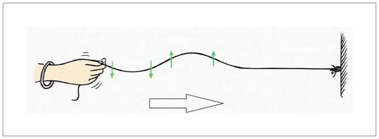
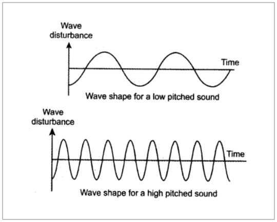
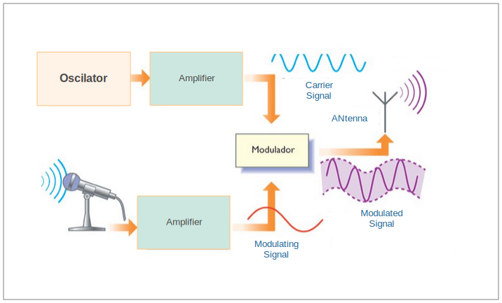

- [Chapter 1 Waves](#chapter-1-waves)
  - [1 Caracteristicas de una onda](#1-caracteristicas-de-una-onda)
    - [1.1.1 Amplitud (A)](#111-amplitud-a)
    - [1.1.2 Frecuencia (f)](#112-frecuencia-f)
    - [1.1.3 Periodo de tiempo (T)](#113-periodo-de-tiempo-t)
    - [1.1.4 Longitud de onda (λ)](#114-longitud-de-onda-%ce%bb)
    - [1.1.5 Velocidad (v)](#115-velocidad-v)
  - [2 Clasificación de las ondas](#2-clasificaci%c3%b3n-de-las-ondas)
    - [2.1 En función del medio en el que se propagan](#21-en-funci%c3%b3n-del-medio-en-el-que-se-propagan)
      - [2.1.1 Ondas mecánicas:](#211-ondas-mec%c3%a1nicas)
      - [2.1.2 Ondas electromagnéticas](#212-ondas-electromagn%c3%a9ticas)
      - [2.1.3 Ondas gravitacionales](#213-ondas-gravitacionales)
    - [2.2 En función de su dirección](#22-en-funci%c3%b3n-de-su-direcci%c3%b3n)
      - [2.2.1 Ondas unidimensionales](#221-ondas-unidimensionales)
      - [2.2.2 Ondas bidimensionales o superficiales](#222-ondas-bidimensionales-o-superficiales)
      - [2.2.3 Ondas tridimensionales o esféricas](#223-ondas-tridimensionales-o-esf%c3%a9ricas)
    - [2.3 En función del movimiento de sus partículas](#23-en-funci%c3%b3n-del-movimiento-de-sus-part%c3%adculas)
      - [2.3.1 Ondas longitudinales](#231-ondas-longitudinales)
      - [2.3.2 Ondas transversales](#232-ondas-transversales)
    - [2.4  En función de su periodicidad](#24-en-funci%c3%b3n-de-su-periodicidad)
      - [2.4.1 Ondas periódicas](#241-ondas-peri%c3%b3dicas)
      - [2.4.2 Ondas no periódicas](#242-ondas-no-peri%c3%b3dicas)
- [Capitulo 2 Moduladores y demoduladores](#capitulo-2-moduladores-y-demoduladores)
  - [2.1 Señal portadora](#21-se%c3%b1al-portadora)
  - [2.2 Señal moduladora](#22-se%c3%b1al-moduladora)
  - [2.3 Por que modular una señal?](#23-por-que-modular-una-se%c3%b1al)
  - [2.4 Técnicas de modulación empleadas](#24-t%c3%a9cnicas-de-modulaci%c3%b3n-empleadas)
  - [2.5 Tipos de moduladores](#25-tipos-de-moduladores)
    - [2.5.1 Modulación analógica:](#251-modulaci%c3%b3n-anal%c3%b3gica)
      - [2.5.1.1 Modulación de la amplitud.](#2511-modulaci%c3%b3n-de-la-amplitud)
      - [2.5.1.2 Modulación de la frecuencia.](#2512-modulaci%c3%b3n-de-la-frecuencia)
      - [2.5.1.3 Modulación de la fase.](#2513-modulaci%c3%b3n-de-la-fase)
    - [2.5.2 Modulación digital](#252-modulaci%c3%b3n-digital)
      - [2.5.2.1 Modulación por desplazamiento de amplitud (**ASK, Amplitude Shift Keying**)](#2521-modulaci%c3%b3n-por-desplazamiento-de-amplitud-ask-amplitude-shift-keying)
      - [2.5.2.2 Modulación por desplazamiento de frecuencia (**FSK,Frecuency Shift Keying**)](#2522-modulaci%c3%b3n-por-desplazamiento-de-frecuencia-fskfrecuency-shift-keying)
        - [2.5.2.2.1 Multiplexacion de 2 diferentes frecuencias.</h4>](#25221-multiplexacion-de-2-diferentes-frecuenciash4)
        - [2.5.2.2.2 Oscilador controlado por tensión (VCO).](#25222-oscilador-controlado-por-tensi%c3%b3n-vco)
      - [2.5.2.3 Modulación por desplazamiento de frecuencia Gausiana (GFSK)](#2523-modulaci%c3%b3n-por-desplazamiento-de-frecuencia-gausiana-gfsk)
      - [2.5.2.4 Modulación por desplazamiento de fase (**PSK, Phase Shift Keying**)](#2524-modulaci%c3%b3n-por-desplazamiento-de-fase-psk-phase-shift-keying)
- [Capitulo 3 Filtros](#capitulo-3-filtros)
  - [3.1 ¿Qué es un filtro de frecuencia?](#31-%c2%bfqu%c3%a9-es-un-filtro-de-frecuencia)
  - [3.2 Clasificación de los filtros](#32-clasificaci%c3%b3n-de-los-filtros)
    - [3.2.1 Respuesta en frecuencia](#321-respuesta-en-frecuencia)
- [Capitulo 4 Demodulador FSK](#capitulo-4-demodulador-fsk)


# Modulators and signals theory

This paper aims to explain the principles and fundamental concepts that make possible the wireless interconnection between nodes, irradiating signals and receiving it, by applying techniques described in this section.

# Chapter 1: Waves

Waves are disturbances which propagate (move) through a medium, Light is a special case, it exhibits wave like properties but does not require a medium through which to Propagate. Waves occur frequently in nature. The most obvious examples are waves in water, other different mediums are:

- Density.
- Pressure.
- Electric field.
- Magnetic field.

Implying an energy transport without matter transport. The disturbed space can contain matter (air, water, etc) or not.




The example in the figure transverse waves generation on a rope, it can be appreciate the deformity of the medium in which its represented the energy transport without having to transport the matter itself.

## 1. Wave characteristics


<figure>




</figure>


A wave can be described in five characterictics: amplitude, frequency, time, wavelenght, and speed.


### 1.1.1 Amplitude (A)

Vertical distance between a crest and the medium point of the wave.
### 1.1.2 Frequency (F)

The number of vibrations (full cycle) produced in a second is called wave frequency (F). The frequency unit in the International System (SI) its s^-1 or Hertz (Hz). 

```
f = 1/T

```

 
### 1.1.3 Time period (T)

The time required to produced a full cycle its called time period of the wave (T). In __SI__ the Time period is denoted as  seconds (s). The frequency and the time period are reciprocal between them. 

```
T = 1/f
```

### 1.1.4 Wavelenght (λ)

The minimum distance in which a wave repeats its called wavelength. In a wave, the distance between the center of two consecutive compressions or two rarefactions are also denominated as wavelength (λ, Lambda). The IS unit is the meter (m).

 
### 1.1.5 Speed (c)

The distance traveled by the wave in a second it's called propagation speed. The unit in the IS for this is m/s.

```
V = 1/T
```


## 2. Type of waves 

### 2.1 Propagation medium

#### 2.1.1 Mechanical waves

These waves need an elastic material medium (solid, liquid, or gas) to propagate. the particles in the medium oscillate around a fixed point, by which neat transport of the matter through the medium doesn't occur. In this type we can find the elastic waves, water surface waves or waves in a controlled explosion, sound waves and gravitational waves.

#### 2.1.2 Electromagnetic waves

The electromagnetic waves propagate through the space vacuum withot a material medium. This is due by the oscilations of the electric field in relation with the magnetic field. The electromagnetic waves travel in an approximate speed of 300,000 Km/s, depending on the speed it can be grouped in frequency. This ordering is known as electromagnetic spectrum, it measures the waves frequency. The X-rays, visible light or ultraviolet rays belong in this type.
  
#### 2.1.3 Gravitational wave 
The gravitational waves are disturbances altering the geometry of spacetime, it's commonly represented traveling through space although technically we can say that they're moving through space but that they are disturbances of the spacetime itself.

###  2.2 Radiation
***********
#### 2.2.1 Unidimensional wave 
These waves propagate through space in one direction, as the waves in docks or in strings. If a wave propagtes in only a direction, its wavefronts are plane and parallel.
    
#### 2.2.2 Two-dimensional or surface wave 
The two-dimensional wave propagates in two directions. They can travel in any surface, this is why they can also be called surface wave, like the waves produced in a liquid surface at rest when a rock is let drop in it.


#### 2.2.3 Three-dimensional o esféricas
Son ondas que se propagan en tres direcciones. Las ondas tridimensionales se conocen también como ondas esféricas, porque sus frentes de ondas son esferas concéntricas que salen de la fuente de perturbación expandiéndose en todas direcciones. El sonido es una onda tridimensional. Son ondas tridimensionales las ondas sonoras (mecánicas) y las ondas electromagnéticas.
**********

### 2.3 Particles movement

#### 2.3.1  Longitudinal waves
In this type of wave the particles vibrate parallel to the propagation of the wave. For example, the seismic waves, sound waves and compressiong an elastic spring results in a longitudinal wave. 

#### 2.3.2 Transverse waves
In the transverse waves the particles vibrate perpendicularly to the propagation of the wave. Like the sea waves, waves in a string, and seismic waves.

### 2.4 Periodicity

#### 2.4.1 Periodic wave
The local disturbance that originates this type of waves it's produced in repetitive cicles, e.g. a sine wave.

#### 2.4.2 Aperiodic Non-periodic wave 

The disturbance that originates them are isolated, or in case it repeats, the following disturbances have different characteristics. These isolated waves are known as pulse wave.


# Chapter 2 Modulators and demodulators

Information signals are rarely in an appropriate state for transmission, so that signals must be carry between the transmisor and the receiver on some medium for transmission.

Modulation is the process of transforming the information from its original form to a more appropriate one for transmission. 

Demodulation is the reverse process, turning the modulated wave to its original form. Modulation its done in transmitter side, specifically in the modulator, and  demodulation is in the receiver side on a circuit called demodulator or detector.

## 2.1 Carrier wave

A carrier wave is an electric wave that can be altered in some of its parameters for the information signal (sound, image or data) to obtain a modulated signal and be transported on a communication channel.

The use of a carrier wave helps solve many circuit, antenna, propagation and noise problems. That's why a practical antenna must have an approximate size to the lenght of the electromagnetic wave to be transmitted. If soundwaves diffused directly in the form of electromagnetic signals, the antenna would have the height of more than 1 Km. By using frequencies much more higher for the carrier, the size of the antenna its reduced drastically because higher frequencies have shorter wavelenght. 

## 2.2 Modulated signal

A modulated signal can be a signal of audio, video, or data. Any of these signals mixed with the carrier generate the modulated signal transmitted through the antenna. 


## 2.3 Why modulate a signal?

For different reasons:

**a**. If all users transmit to the same frequency of the original signal (modulated), it won't be possible to recognize the information contained in it, due to jamming between the signals transmitted from different users.

**b**. There is more efficiency in the transmission at higher frequencies.

**c**. It's possible to take advantage of the electromagnetic spectrum because it allows frequency multiplexing. 

**d**. In case of wireless transmission, the antennas have more reasonable sizes. 

In brief, modulation allows to take advantage of the communication channel, by making possible the transmission of more data simultaneously over the same channel and protect the data from possible interferences or noises.


## 2.4 Modulation techniques

One of the goals of communications is to use a carrier frequency as base frequency of communication, modulating it to encode the information on the carrier wave.

Basic form of modulating are:

- Amplitude
  -  Amplitude Modulation - Double side band with carrier - AM.
  -  Double side band without carrier - DSB-SC.
  -  Single-sideband modulation - SSB.

- Angle
  - Frequency Modulation - FM.
  - Phase Modulation - PM.

## 2.5 Types of modulation


### 2.5.1 Analog Modulation: 


#### 2.5.1.1 Amplitude Modulation
<br>



With this technique the output is the carrier wave altered in amplitude, propportional to the amplitude of the modutated signal, in this case the signal coming from the microphone. This signal is the responsible of altering the signal of high frequency.

<br>
<br>
<br>
<br>

#### 2.5.1.2 Frequency modulation


<br>
<br>


Here the modulated signal has a constant amplitude but the frequency varies, which is used to alter the frequency of the carrier.

#### 2.5.1.3 Phase modulation.


This is also a modulation case where the transmission signals are analog, its an exponential modulation just like frecuency modulation. In this case the parameter of the carrier signal will vary according to the modulated signal. Phase modulation (PM) is not commonly used due it requires more complex reception equipment than FM and can present ambiguity problems to determine if a signal has a phase of 0º or 180º. 

The form of the frequency modulation signals and phase modulation are very much alike. In fact, it's impossible to distinguish one or another without prior knowledge of the modulation function. 

Most communication systems use one of these techniques or a combination of all three. The radios are based in AM and FM, being FM of better quality due to its advantage on handling higher frequencies and bandwidth improving the perception of the transmitted content.

### 2.5.2 Digital modulation 

#### 2.5.2.1 Amplitude Shift Keying (ASK)

ASK its a modulation form in which the data is represented as variations of the carrier amplitude to transmit.

The amplitude of an analog carrier signal varies according to the bit (signal modulation), keeping constant the frequency and the phase.The level of the amplitude can be represented by 0 and 1. We can think of the carrier like a on/off switch (OOK).

In the modulated signal, the logic value 0 its represented by the absence of a carrier, so it switches on/off the pulse, hence the name. This type of modulation is used for Morse code transmission by radiorequency, known as continous wave (CW).

As the AM modulation, ASK is also linear and sensitive to atmospheric noise, distortions, and propagation conditions in different routes on PSTN, among other factors. This requires an excessive bandwidth and it is therefore an energy expense. As the ASK modulation process like the demodulation process are both low consuming. 

The ASK technique its commonly used to transmit digital data over optic fiber. For LED transmissors, binary 1 activates a light pulse, while binary 0 doesn't emits light pulses. Laser transmissors usually have a current tendency that makes the device emit a low light level. This low level represents the 0 value, while a luminous wave of higher amolitude represents the value 1. 


#### 2.5.2.2 Frecuency Shift Keying (FSK)

FSK is a modulation technique for digital data transmission using two or more different frequencies for each symbol. The modulated signal only varies between two values 1 (mark,) 0 (space).

In digital modulation, the input to the modulator its called bit-rate, and represented by the unit bit per second (bps). The output of the modulator its called baud-rate, this is the speed or amount of symbols per second.

For instance, in FSK bit-rate = baud-rate, so a binary 0 its represented by f1 and the binary 1 be f2.


In this modulation form the sine carrier takes two frequency values directly determined by the binary data signal. The modulation can be done in different methods.  


##### 2.5.2.2.1 Multiplexing of 2 different frequencies</h4>

On the next figure we have two carriers with different frequencies to represent the different symbols inside the message, in this case 0 and 1. The frequency of the oscillator 1 must be different to the oscillator 2 but keeping in mind that the difference can't be too big.

These two frequencies act like two phase digital switch controlled by a digital signal, in this case a digital message which generates an output shown in the switch.

This technique has a drawback in which abrupt changes take place while switching the frequencies, such changes generate undesirable harmonics (sine wave) increasing the bandwidth, which is not desirable in signal modulation.


##### 2.5.2.2.2 Voltage Controlled Oscillator (VCO)

<h3>VCO</h3>

Instant frequency of the oscillator output its controlled by the input voltage. This kind of oscillator can produced a high frequency output on a wide range (few Hertz, or houndreds of Giga Hertz) depending on the DC input voltage asigned. 

This type of oscillators doesn't presents any input voltage so it must oscillate in frequency called **suppressed oscillation frequency** _[needs reference]_ and by increasing the input voltage, the output signal will be altered in its frequency, linear growing regarding the input voltage.

In this particular case in which we want to modulate a digital signal (pulse generation), we can observe two differents voltage to controll the VCO: when the data signal is on a high level or logic 1, its equivalent to having a voltage different from zero, and when the logic 0 is the current state is like having the VCO in the suppressed oscillation frequency for which it has been designed.

This modulation technique, like the previous one, handles a different frequency for each symbol. The difference is the VCO deletes the abrupt changes in the frequency due it doesn't needs to multiplex between different frequency generators, it consists in controlling the the frequency coming from the generator.


#### 2.5.2.3 Gaussian Frequency Shift Keying (GFSK)


This technique is similar to the FSK, previously described, with an improvement on the signal bandwidth.

The technique consists on soften the pulse generation (data or modulated signal), as we know such pulse generation represents a square wave which stands for abrupt changes when it passes from logic 0 to logic 1, increasing the bandwidth of the signal spectrum.

Al pasar la señal moduladora (Data) a través de un filtro Gaussiano la salida es muy similar a una onda senoidal la cual presenta transiciones suaves de cero a uno.

As the modulated signal (data) travels through a Gaussian filter to the output it's very similar to a sine wave which presents soft transitions from 0 to 1.

We can observe that:

```GFSK modulation = Gaussian filter + FSK```

We said before that, having these abrupt changes from 0 to 1 in the modulated signal increases the bandwidth. We conclude that the improvement that this type of filter provides in FSK modulation is the decrease of the spectrum bandwidth in the output signal.

#### 2.5.2.4 Phase Shift Keying (PSK)

This is a modulation characterized by how the phase of the carrier wave varies directly proportional to the modulated signal. The phase modulation is not commonly used due it requieres more complex reception equipment and it also presents ambiguity problems to determine if a signal has a phase of 0º or 180º.


# Chapter 3 Filters

## 3.1 What is a frequency filter?

The analysis on stable networks subdued to sinusoidal stimuli allows to study frequent problems in the generation, transmission, distribution and use of the energy.

A frequency filter is a circuit that uses electrical and electronics components to attenuate, correct or reject a frequency range on any kind of signal. This range can be different in every occasion as filters are very flexible and there are many types of it.

## 3.2 Filter types ***

By their functionality:
- Digital filters: Process discrete signals, this kind of filter is software based.
  - Low-pass.
  - High-pass.
  - Band-pass.
- Analog filter: Process continous signals based on analog components.
  - Passive:  Based on capacitors, coils, and resistances. It presents attenuation losses.
   - Low-pass.
   - High-pass.
   - Band-pass.
  - Active: Based on IC, capacitors, coils and resistances. These offer amplitude.
   - Low-pass.
   - High-pass.
   - Band-pass.

### 3.2.1 Frequency response 


# Chapter 4 FSK Demodulator 

This chapter shows some insight in the process involved in the reception of a signal modulated on FSK, emitted by a node. To receive the original data without the carrier some process must be done, for this goal we will use low-pass filters, which allow filtering the modulated signal removing its high frequency components, leaving just the original message, this process is known as demodulation.

When demodulating FSK signals two methods can be used:
- Synchronous detection
- Envelope detection.
