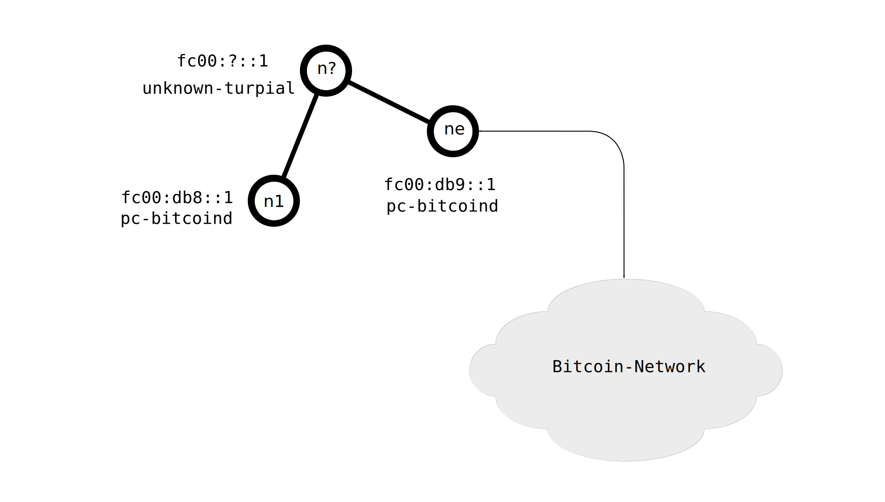

# Using Bitcoin daemons in Locha Mesh

The main purpose of this demostration is to perform a stress test. Two [Bitcoin] nodes are talking and sharing blocks, trying to update their blockchains 

The next figure represents the used environment:

| node | address     | connections           | Description                                             |
|:----:|-------------|-----------------------|---------------------------------------------------------|
| n1   | fc00:db8::1 | Locha Mesh            | pc running bitcoind with no-syncronized blockchain       |
| n?   | fc00:?::1   | Locha Mesh            | 2 Turpial nodes that transmit data packets if necessary |
| ne   | fc00:db9::1 | Locha Mesh & Internet | pc running bitcoind with a synchronized blockchain      |

## Requirements

There are no special setups or requirements to run this test, you only need a synchronized Bitcoin daemon and a functional Locha Mesh network.

## Procedure

1. The **ne** node needs to be running and synchronized, connected via Turpial or _a compatible interface_ to the Locha Mesh and the Internet at the same time.

2. Start `bitcoind` on **n1**, using the Locha Mesh address of **ne** as parameter.

3. In a few seconds, in the terminal we can see both demons doing a handshake, after that, the demons will start sharing blocks data and latest transactions.

[Bitcoin]: https://bitcoin.org
