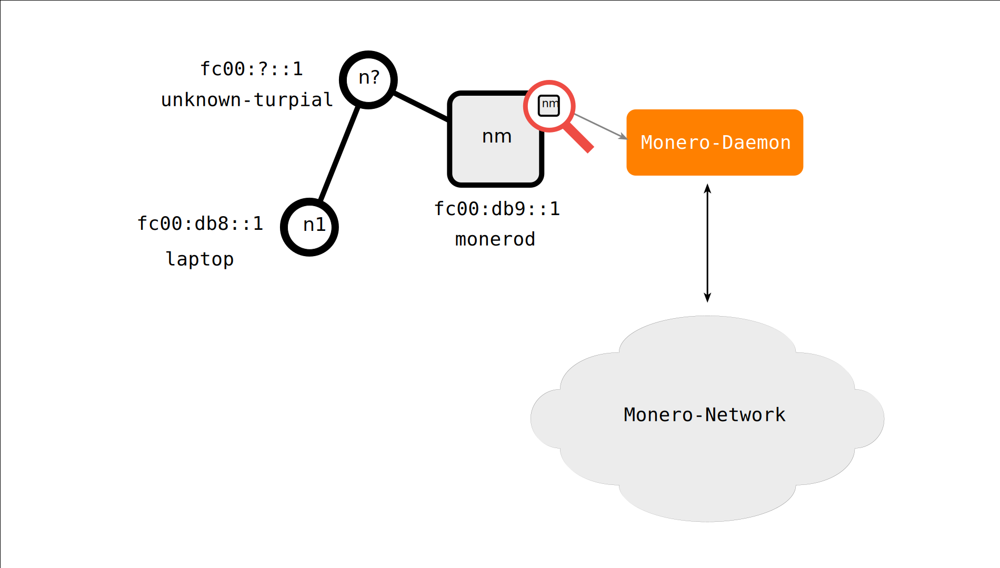
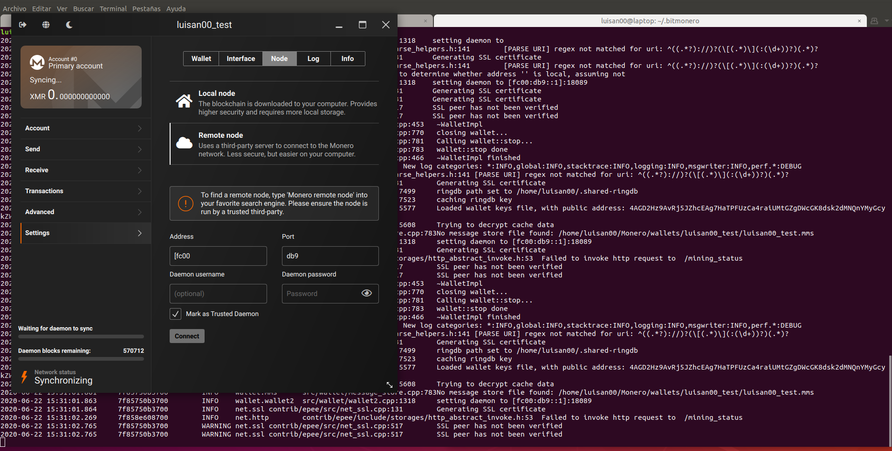

# Monero GUI through Locha Mesh

Using in a node the [Monero] GUI and other node with the Monero daemon, we can send and receive transactions over Locha Mesh. The next figure represents the setup for this specific application:

| Address     | Connections | Description                                            |
|-------------|-------------|--------------------------------------------------------|
| fc00:db8::1 | Locha Mesh  | Laptop as Client running the GUI                       |
| fc00:?::1   | Locha Mesh  |2 Turpial nodes that transmit data packets if necessary |
| fc00:db8::1 | Locha Mesh & Internet | Server running Monero daemon                 |

## Requirements

No special setup or requirements for run this test, only a updated daemon and a functional Locha Mesh network.

## Procedure

1. Synchronize the wallet

   

   **Note:** A small bug was detected when a IPV6 is used in address/port fields under `Settings > Node`, it was [reported] and [PR] was open.

2. Receiving and sending a transaction

   A video is available of the whole proccess including a quick setup and the node sync.

   

[Monero]: https://web.getmonero.org/
[reported]: https://github.com/monero-project/monero-gui/issues/2971
[PR]: https://github.com/monero-project/monero-gui/pull/2973