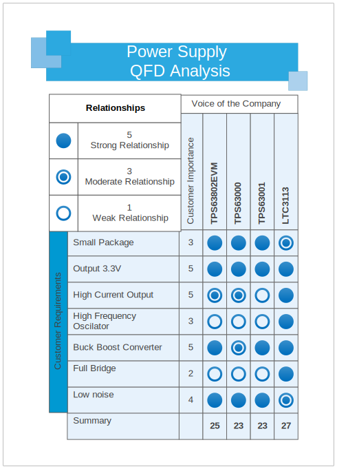
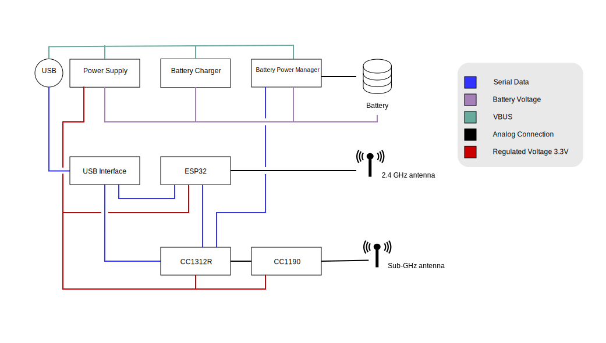

# 6. Hardware de Locha Mesh

En esta sección se presentan los parámetros que se usaron para la elección de los dispositivos de transmisión y control actualmente utilizandos en Locha Mesh.

## 6.1 Módulo de radio frecuencia

<figure>

</figure>

Para elegir el módulo de radio que contiene el microcontrolador (MCU), la RF y modulación necesaria para transmitir en la frecuencia 915 MHz, se establecieron algunos parámetros:

- Soporte del estándar IEEE 802.15.4.
- Al menos 2 puertos USART.
- De bajo costo.
- Fácil de utilizar.
- Soporte para la banda del Subgigahercio a 915 MHz.

La tabla muestra tres familias de MCU con interface de RF de acuerdo con los criterios basados en la necesidad actual, elegiendo el `CC1312R1` como el módulo más económico, robusto, amplio rango de cobertura y de bajo consumo para desempeñar la tarea que el `Turpial` requiere como dispositivo transceptor.

La familia de MCUs `CC135x` cumplen con la mayoría de requerimientos, sin embargo provee más funciones de las que se necesitan encareciendo su valor y en consecuencia, descartado.

<br/>

## 6.2 Fuente de voltaje

Para que el Turpial de Locha Mesh funcione de forma óptima, se debe seleccionar cuidadosamente el dispositivo que regulará la corriente proveniente de la batería y alimentará al dispositivo.

<br/>

<br/>

Los parámetros a tomar en cuenta para la elección del dispositvo que alimenta al circuito:
- Corriente: La corriente del circuito debe ser mayor o igual a 2 Amperios (A).
- Voltaje: El dispositivo debe ser capaz de entregar un voltaje estable de salida de 3.3 Voltios, sin importar que la entrada que lo alimenta este por encima o por debajo del umbral requerido.
- Alta eficiencia: Debe ser eficiente en la transformación de la energía, lo que se traduce en libre de sobrecalentamientos extremos.
- Ruido: Cualquier ruido en la señal de salida de voltaje puede afectar todo el sistema.

Al realizar la ponderación de los diferentes dispositivos se observa que el ```LTC3113``` tiene buenas prestaciones, es full bridge y entrega corrientes por encima de los 2.5 A, pero su coste es elevado. Hemos decidido utilizar el ```TPS63802``` dado que provee las prestaciones requeridas para cumplir los objetivos del proyecto, cuenta con amplia disponibilidad en el mercado y precio accesible.
<br/>

## 6.3 Cargador de batería


<br/>

Para la carga de la batería de litio hemos decidido utilizar el chip de la familia ```BQ2407x```, el cual es de fácil adquisicion y se ajusta a los requerimientos de carga lineal y durabilidad en las baterías al tener un sistema de carga robusto, como el que se presenta en el diseño del Turpial.

<br/>

## 6.4 Control de energía de la batería


El control de energía es el sistema que se encarga de leer variables relacionadas con la batería como energía disponible, tiempo de carga, corriente suministrada, etc.

A la hora de seleccionar el dispositivo que se encargará de dicha tarea, este debe tener soporte para I2C; en la tabla se pueden apreciar dos diferentes dispositivos de dos fabricantes diferentes los cuales tienen prestaciones similares, pero difieren mucho del costo por unidad, así que se utilizará el BQ27441-G1 como dispositivo para la recolección de datos relacionados con la batería para ser enviada a la unidad principal de control. 
<br/>

## 6.5 Microcontrolador (Interface)

Para la seleccion del microcontrolador (MCU), nos hemos centrado en la famila de microcontroladores de ```espressif```, ya que esta es una marca que ofrece una gran variaded de dispositivos con increíbles características como los es Bluetooth y WiFi a muy bajo costo, que difícilmente otra marca podría ofrecer además de la amplia documentación que existe para este dispositivo.

Bondades de la familia ESP32:
- Económico.
- Amplia documentación disponible.
- Comunidad de desarrolladores en continuo crecimiento.
- Ejemplos en la plataforma de Arduino que se pueden portar al entorno de espressif sin mucha dificultad.
- Bajo consumo.
- Incorpora BLE, lo cual habilita un abanico de posibilidades.

Locha Mesh específicamente trabaja con el ESP32 WROVER, el cual consta de:
- 4 Mb Flash SPI.
- 8 Mb PSRAM.
- Frecuencia de 80 MHz a 240 MHz.
- WiFi.
- BlueTooth.
- USART x3.
- Dual core.
Resulta perfecto para el Turpial, ya que cuenta con varios puertos USART, que permiten comunicarnos con el módulo de radio y el PC _[necesita aclaración]_ a tráves del USB; también cuenta con un adaptador de red que permite implementar un servidor web, para la aplicación de control y configuración del mismo.

## 6.6 Diagrama en bloques del hardware del Turpial



## 6.7 Diagrama en bloques de la aplicación de control

## 6.8 Visión General del Turpial como dispositivo


La figura muestra el primer prototipo actualmente en desarrollo.
