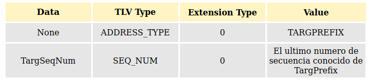

# 9. Formato de paquetes para redes MANET.

_AODVv2_ especifica que los mensajes de control tienen que mapearse en un contenedor llamado Generalized Mobile Ad Hoc Network (_MANET_) Packet/Message Format [RFC5444]. Este formato de paquete proporciona un encapsulado único para múltiples protocolos de enrutamiento Ad Hoc.

El _RFC5444_ dota de una mayor eficiencia a las trasmisiones de los mensajes de control, estructura el contenido  reduciendo el número de bytes a transmitir.

El formato _RFC5444_ define los siguientes elementos:
- Paquete: Es la entidad de mayor nivel. Un paquete contiene una cabecera y cero o más mensajes.
- Mensaje: Es la entidad que transporta la información del protocolo. Un mensaje está formado por una cabecera, un bloque TLV (type-length-value) y un bloque de direcciones.
- Bloque de direcciones: Está formado por una o más direcciones, y un bloque de atributos.
- Bloque TLV: Está formado por uno o más TLV.
- TLV: Es una estructura donde:
  - Type: Es el identificador del tipo de dato que viene a continuación.
  - Length: Este campo indica cuantos bytes ocupa el campo value.
  - Value: Es el valor concreto del objeto al que se refiere.

En la siguiente imagen se representa la estructura de un paquete RFC544 y sus dependencias.

 

Cada tipo de mensaje de control se tiene que adaptar al formato del paquete _RFC5444_.

_AODVv2_ no requiere acceso al encabezado del paquete [RFC5444].

En el encabezado del paquete AODVv2 usa:
- **msg-type**.
- **msg-hop-limit**.
- **msg-addr-length**.

**msg-addr-length** indica el tamano de la direccion en el mensaje, cuyo valor corresponde a ```addr_length en octetos -1```, por ejemplo para IPV4 seria 3 y para IPV6 seria igual 15.

 Para esto primero vamos a revisar cuales son los campos de cabecera del paquete _RFC5444_ que utiliza _AODVv2_.

## 9.1 Información del paquete.
Esta sección del mensaje permite conocer rápidamente información como:
 - Versión del paquete.
-  Número de secuencia.
- _Flags_ que permiten conocer si los _TLV_ están en el paquete sin deserializar el mismo.

### 9.1.1 pkt-header.

Lo definimos como sigue:

**version**: Es un campo que contiene un entero sin signo de 4 bits y especifica la versión en la cual el paquete y el contenido del mensaje ha sido construido.

**pkt-flag**: Es un campo de 4 bits que especifica la interpretación del resto del encabezado del paquete:
- **bit 0** (_phaseseqnum_) si está indicado uno('1'), entonces significa que el **pkt-seq--num** está incluido en el **pkt-header**. En caso contrario, no lo está.
- **bit 1**(_phastlv_): Si está indicado uno('1'), significa que el **tlv-block** está incluido en el **pkt-header**. En caso contrario, no lo está.
- **bit 2-3**: Están reservados y deberían ser limpiados en cada transmisión y deben ser ignorados en cada recepción.

**pkt-seq-num**: Es omitido si el _phaseseqnum flag_ está establecido a cero('0'). En caso contrario, es un entero sin signo de 16 bits, especificando el número de secuencia de un paquete.

**tlv*block**: Es omitido si el _phastlv  flag_ esta establecido a cero('0'). En caso contrario, se define en [RFC4544 seccion 5.4](https://tools.ietf.org/html/rfc5444#section-5.2)

## 9.2 Mensajes.
Los paquetes pueden contener el encabezado del paquete, y uno o más mensajes. Los mensajes contienen:

- Un mensaje header
- Un bloque de mensaje _TLV_ que contiene cero o más _TLVs_, asociados con el mensaje completo.
- Cero o más bloques de direcciones, cada bloque conteniendo uno o más objetos de direcciones.
- Un bloque _TLV_ de bloque de dirección, que contiene cero o más _TLVs_.

```
 <message> = <msg-header>
 <tlv-block>
 (<addr-block><tlv-block>)*

 <msg-header> = <msg-type>
 <msg-flags>
 <msg-addr-length>
 <msg-size>
 <msg-orig-addr>?
 <msg-hop-limit>?
 <msg-hop-count>?
 <msg-seq-num>?
```

### 9.2.1 msg-header.

**msg-type**: Es un campo que aloja un entero sin signo de 8 bits, especificando el tipo de mensaje.

**msg-flags**: Es un campo de 4 bits que especifica la interpretación del resto del encabezado del mensaje:
- **bit 0** (_mhasorig_): Si está establecido en uno ('1') significa que **msg-orig-addr** será incluido en **msg-header**. En caso contrario, no.
- **bit 1** (_mhashoplimit_): Si está establecido en uno ('1'), significa que **msg-hop-limit** será incluido en **msg-header**. En caso contrario, no.
- **bit 2** (_mhashopcount_): Si está establecido en uno ('1'), significa que  **msg-hop-count** será incluido en **msg-header**. En caso contrario, no.
- **bit 3** (_mhaseqnum_): Si está establecido en uno ('1'), entonces significa que **msg-seq-num** será incluido en **msg-header**. En caso contrario, no.

### 9.2.2 msg-header-length

**No revisar aun EN PROCESO DE DESARROLLO**
Es un campo que contiene un entero sin signo de 8 bits

AODVv2 utilza los siguientes campos del mensaje Header RFC5444


<br>

### El address block esta formado por


<h3> El TLV para OrigPrefix estará formado por:</h3>


<h3>El TLV para TargPrefix estará formado por:</h3>




## 9.3 oonf_api.
Para el encapsulado del paquete _AODVv2_ dentro del contenedor de paquete _RFC5444_, se hace uso de la API llamada [oon_api](https://github.com/benpicco/oonf_api), la cual facilita la lectura y escritura de dicho paquete dentro del contenedor.
