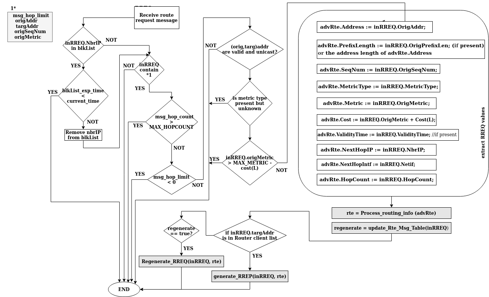

# 13. Generación y procesamiento de mensajes.

El procesamiento de mensajes tiene este esquema general:
- Recibir mensajes entrantes de ruta.
- Actualizar tablas de rutas según corresponda.
- Responder según sea necesario, a menudo regenerando el mensaje entrante con información actualizada.

Después de procesar un mensaje, la información se almacena en la tabla de rutas. Por este motivo es apropiado establecer valores en los campos de mensajes salientes, utilizando la información de la tabla de rutas o los campos del mensaje entrante.


## 13.1 build_rfc_5444_message_header.

```cpp
/* This pseudocode shows possible RFC 5444 actions, and would not 
 be performed by the AODVv2 implementation. It is shown only to 
 provide more understanding about the AODVv2 message that will be 
 constructed by RFC 5444.
 MAL = Message Address Length
 MF = Message Flags
 Size = number of octets in MsgHdr, AddrBlk, AddrTLVs */

build_rfc_5444_message_header (msgType, Flags, AddrFamily, Size, 
 hopLimit, hopCount, tlvLength)
{
 /* Build RFC 5444 message header fields */
 msg-type = msgType;
 MF = Flags;
 MAL = 3 or 15; // for IPv4 or IPv6
 msg-size = Size;
 msg-hop-limit = hopLimit;
 if (hopCount != 0) /* if hopCount is 0, do not include */
 msg-hop-count = hopCount;
 msg.tlvs-length = tlvLength;
}
```

## 13.2 receive_RREQ.

```cpp
/* Process a RREQ received on link L */

receive_RREQ (inRREQ, L)
{
 if (inRREQ.NbrIP present in blacklist) 
 {
 if (blacklist_expiration_time < CurrentTime)
 return; // don't process or regenerate RREQ
 else
 remove nbrIP from blacklist;
 }
 if (inRREQ does not contain msg_hop_limit, OrigAddr,
 TargAddr, OrigSeqNum, OrigMetric)
 return;
 if (msg_hop_count > MAX_HOPCOUNT)
 return;
 if (msg_hop_limit < 0)
 return;
 if (inRREQ.OrigAddr and inRREQ.TargAddr are not valid routable 
 and unicast addresses)
 return;
 if (inRREQ.MetricType is present but an unknown value)
 return;
 if (inRREQ.OrigMetric > MAX_METRIC[inRREQ.MetricType] - Cost(L))
 return;

 /* Extract inRREQ values */
 advRte.Address = inRREQ.OrigAddr;
 advRte.PrefixLength = inRREQ.OrigPrefixLen; (if present)
 or the address length of advRte.Address;
 advRte.SeqNum = inRREQ.OrigSeqNum;
 advRte.MetricType = inRREQ.MetricType;
 advRte.Metric = inRREQ.OrigMetric;
 advRte.Cost = inRREQ.OrigMetric + Cost(L);
 //according to the indicated MetricType
 advRte.ValidityTime = inRREQ.ValidityTime; //if present
 advRte.NextHopIP = inRREQ.NbrIP;
 advRte.NextHopIntf = inRREQ.Netif;
 advRte.HopCount = inRREQ.HopCount;
 advRte.HopLimit = inRREQ.HopLimit;

 rte = process_routing_info (advRte);

 /* Update the RteMsgTable and determine if the RREQ needs
 to be regenerated */
 regenerate = Update_Rte_Msg_Table(inRREQ); 

 if (inRREQ.TargAddr is in Router Client list)
 generate_RREP(inRREQ, rte);
 else if (regenerate)
 regenerate_RREQ(inRREQ, rte);
}
```





## 13.3 generate_rreq.

```cpp
/* Generate a route request message to find a route from OrigAddr
 to TargAddr using the given MetricType
 origAddr = IP address of Router Client which generated the 
 packet to be forwarded
 origPrefix = prefix length associated with the Router Client
 targAddr = destination IP address in the packet to be forwarded
 targSeqNum = sequence number in existing route to targAddr
 mType = metric type for the requested route */

generate_RREQ(origAddr, origPrefix, targAddr, targSeqNum, mType)
{
 /* Increment sequence number in nonvolatile storage */
 mySeqNum = (1 + mySeqNum);

 /* Marshall parameters */
 outRREQ.HopLimit = MAX_HOPCOUNT;
 outRREQ.HopCount = 0; // if included 
 outRREQ.MetricType = mType; //include if not DEFAULT_METRIC_TYPE
 outRREQ.OrigAddr = origAddr; 
 outRREQ.TargAddr = targAddr;
 outRREQ.OrigPrefixLen = origPrefix; //include if not address length
 outRREQ.OrigSeqNum = mySeqNum;
 outRREQ.TargSeqNum = targSeqNum; //included if available
 outRREQ.OrigMetric = Route[OrigAddr].Metric; //zero by default
 outRREQ.ValidityTime = limit for route to OrigAddr; //if required 

 /* Build Address Blk using prefix length information from 
 outRREQ.OrigPrefixLen if necessary */
 AddrBlk = {outRREQ.OrigAddr, outRREQ.TargAddr};

 /* Include sequence numbers in appropriate Address Block TLVs */
 /* OrigSeqNum Address Block TLV */
 origSeqNumAddrBlkTlv.value = outRREQ.OrigSeqNum;
 /* TargSeqNum Address Block TLV */
 if (outRREQ.TargSeqNum is known)
 targSeqNumAddrBlkTlv.value = outRREQ.TargSeqNum;

 /* Build Metric Address Block TLV, include Metric AddrBlkTlv 
 Extension type if a non-default metric */
 metricAddrBlkTlv.value = outRREQ.OrigMetric;
 if (outRREQ.MetricType != DEFAULT_METRIC_TYPE)
 metricAddrBlkTlv.typeExtension = outRREQ.MetricType;
 
 if (outRREQ.ValidityTime is required)
 {
 /* Build VALIDITY_TIME Address Block TLV */
 VALIDITY_TIMEAddrBlkTlv.value = outRREQ.ValidityTime;
 }

 build_rfc_5444_message_header (RREQ, 4, IPv6, NN,
 outRREQ.HopLimit, outRREQ.HopCount, tlvLength);

 /* multicast RFC 5444 message to LL-MANET-Routers */
}

```

## 13.4 regenerate_RREQ.

```cpp
/* Called from receive_RREQ() 
 rte = the route to OrigAddr */

regenerate_RREQ (inRREQ, rte) 
{
 outRREQ.HopLimit = inRREQ.HopLimit - 1;
 if (outRREQ.HopLimit == 0)
 return; // don't regenerate

 if (inRREQ.HopCount exists)
 {
 if (inRREQ.HopCount >= MAX_HOPCOUNT)
 return; // don't regenerate
 outRREQ.HopCount = inRREQ.HopCount + 1;
 }

 /* Marshall parameters */
 outRREQ.MetricType = rte.MetricType;
 outRREQ.OrigAddr = rte.Address;
 outRREQ.TargAddr = inRREQ.TargAddr;
 /* include prefix length if not equal to address length */
 outRREQ.OrigPrefixLen = rte.PrefixLength; 
 outRREQ.OrigSeqNum = rte.SeqNum;
 outRREQ.TargSeqNum = inRREQ.TargSeqNum; // if present
 outRREQ.OrigMetric = rte.Metric;
 outRREQ.ValidityTime = rte.ValidityTime;
 or the time limit this router wishes to put on 
 route to OrigAddr

 /* Build Address Block using prefix length information from 
 outRREQ.OrigPrefixLen if necessary */
 AddrBlk = {outRREQ.OrigAddr, outRREQ.TargAddr};
 
 /* Include sequence numbers in appropriate Address Block TLVs */
 /* OrigSeqNum Address Block TLV */
 origSeqNumAddrBlkTlv.value = outRREQ.OrigSeqNum;
 /* TargSeqNum Address Block TLV */
 if (outRREQ.TargSeqNum is known) 
 targSeqNumAddrBlkTlv.value = outRREQ.TargSeqNum;

 /* Build Metric Address Block TLV, include Metric AddrBlkTlv 
 Extension type if a non-default metric */
 metricAddrBlkTlv.value = outRREQ.OrigMetric;
 if (outRREQ.MetricType != DEFAULT_METRIC_TYPE)
 metricAddrBlkTlv.typeExtension = outRREQ.MetricType;

 if (outRREQ.ValidityTime is required)
 {
 /* Build VALIDITY_TIME Address Block TLV */
 VALIDITY_TIMEAddrBlkTlv.value = outRREQ.ValidityTime;
 }
 build_rfc_5444_message_header (RREQ, 4, IPv4 or IPv6, NN,
 outRREQ.HopLimit, outRREQ.HopCount, tlvLength);

 /* Multicast RFC 5444 message to LL-MANET-Routers, or if
 inRREQ was unicast, the message can be unicast to the next
 hop on the route to TargAddr, if known */
}
```

## 13.5 generate_rrep.
```cpp
generate_rrep(inRREQ, rte)
{
 /* Increment sequence number in nonvolatile storage */
 mySeqNum = (1 + mySeqNum);

 /* Marshall parameters */
 outRREP.HopLimit = inRREQ.HopCount;
 outRREP.HopCount = 0;
 /* Include the AckReq when:
 - previous RREP does not seem to enable any data flow, OR
 - when RREQ is received from same OrigAddr after RREP was
 unicast to rte.NextHop */
 outRREP.AckReq = TRUE or FALSE; //TRUE if acknowledgement required
 /* if included, set timeout RREP_Ack_SENT_TIMEOUT */

 if (rte.MetricType != DEFAULT_METRIC_TYPE)
 outRREP.MetricType = rte.MetricType;
 outRREP.OrigAddr = inRREQ.Address;
 outRREP.TargAddr = rte.TargAddr;
 outRREP.TargPrefixLen = rte.PrefixLength; //if not address length
 outRREP.TargSeqNum = mySeqNum;
 outRREP.TargMetric = rte.Metric; 
 outRREP.ValidityTime = limit for route to TargAddr; //if required

 if (outRREP.AckReq == TRUE)
 /* include AckReq Message TLV */

 /* Build Address Block using prefix length information from 
 outRREP.TargPrefixLen if necessary */
 AddrBlk = {outRREP.OrigAddr, outRREP.TargAddr};

 /* TargSeqNum Address Block TLV */
 targSeqNumAddrBlkTlv.value = outRREP.TargSeqNum;

 /* Build Metric Address Block TLV include Metric AddrBlkTlv 
 Extension type if a non-default metric */
 metricAddrBlkTlv.value = outRREP.TargMetric;
 if (outRREP.MetricType != DEFAULT_METRIC_TYPE)
 metricAddrBlkTlv.typeExtension = outRREP.MetricType;

 if (outRREP.ValidityTime is required)
 {
 /* Build VALIDITY_TIME Address Block TLV */
 VALIDITY_TIMEAddrBlkTlv.value = outRREP.ValidityTime;
 }

 Build_RFC_5444_Message_Header (RREP, 4, IPv4 or IPv6, NN,
 outRREP.HopLimit, outRREQ.HopCount, tlvLength);

 /* unicast RFC 5444 message to rte[OrigAddr].NextHop */
}
```

## 13.6 receive_rrep.

```cpp
/* Process a RREP received on link L */

Receive_RREP (inRREP, L)
{
 if (inRREP.NbrIP present in blacklist)
 {
 if (blacklist_expiration_time < CurrentTime)
 return; // don't process or regenerate RREP
 else
 remove NbrIP from blacklist;
 }

 if (inRREP does not contain msg_hop_limit, OrigAddr,
 TargAddr, TargSeqNum, TargMetric)
 return;
 if (msg_hop_count > MAX_HOPCOUNT)
 return;
 if (msg_hop_limit < 0)
 return;
 if (inRREP.OrigAddr and inRREQ.TargAddr are not
 valid routable and unicast addresses)
 return;
 if (inRREP.MetricType is present but an unknown value)
 return;
 if (inRREP.TargMetric > MAX_METRIC[inRREP.MetricType])
 return;

 /* Extract inRREP values */
 advRte.Address = inRREP.TargAddr;
 advRte.PrefixLength = inRREP.TargPrefixLen; //if present
 or the address length of advRte.Address;
 advRte.SeqNum = inRREP.TargSeqNum;
 advRte.MetricType = inRREP.MetricType;
 advRte.Metric = inRREP.TargMetric;
 advRte.Cost = inRREP.TargMetric + Cost(L);
 //according to the indicated MetricType
 advRte.ValidityTime = inRREP.ValidityTime; //if present
 advRte.NextHopIP = inRREP.NbrIP;
 advRte.NextHopIntf = inRREP.Netif;
 advRte.HopCount = inRREP.HopCount;
 advRte.HopLimit = inRREP.HopLimit; //if included

 rte = Process_Routing_Info (advRte);

` if (inRREP includes AckReq data element)
 Generate_RREP_Ack(inRREP);

 /* Update the RteMsgTable and determine if the RREP needs
 to be regenerated */
 regenerate = Update_Rte_Msg_Table(inRREP);

 if (inRREP.TargAddr is in the Router Client list)
 send_buffered_packets(rte); /* start to use the route */
 else if (regenerate)
 Regenerate_RREP(inRREP, rte);
}
```

## 13.7 regenerate_rrep.

```cpp
Regenerate_RREP(inRREP, rte)
{
 if (rte does not exist)
 {
 Generate_RERR(inRREP);
 return;
 }

 outRREP.HopLimit = inRREP.HopLimit - 1;
 if (outRREP.HopLimit == 0) /* don't regenerate */
 return;

 if (inRREP.HopCount exists)
 {
 if (inRREP.HopCount >= MAX_HOPCOUNT)
 return; // don't regenerate the RREP
 outRREP.HopCount = inRREP.HopCount + 1;
 }

 /* Marshall parameters */
 /* Include the AckReq when:
 - previous unicast RREP seems not to enable data flow, OR
 - when RREQ is received from same OrigAddr after RREP
 was unicast to rte.NextHop */
 outRREP.AckReq = TRUE or FALSE; //TRUE if acknowledgement required
 /* if included, set timeout RREP_Ack_SENT_TIMEOUT */

 if (rte.MetricType != DEFAULT_METRIC_TYPE)
 outRREP.MetricType = rte.MetricType;
 outRREP.OrigAddr = inRREP.OrigAddr;
 outRREP.TargAddr = rte.Address;
 outRREP.TargPrefixLen = rte.PrefixLength; //if not address length
 outRREP.TargSeqNum = rte.SeqNum;
 outRREP.TargMetric = rte.Metric;
 outRREP.ValidityTime = limit for route to TargAddr; //if required
 outRREP.NextHop = rte.NextHop

 if (outRREP.AckReq == TRUE)
 /* include AckReq Message TLV */

 /* Build Address Block using prefix length information from
 outRREP.TargPrefixLen if necessary */
 AddrBlk = {outRREP.OrigAddr, outRREP.TargAddr}; 

 /* TargSeqNum Address Block TLV */
 targSeqNumAddrBlkTlv.value = outRREP.TargSeqNum;

 /* Build Metric Address Block TLV include Metric AddrBlkTlv 
 Extension type if a non-default metric */
 metricAddrBlkTlv.value = outRREP.TargMetric;
 if (outRREP.MetricType != DEFAULT_METRIC_TYPE)
 metricAddrBlkTlv.typeExtension = outRREP.MetricType;

 if (outRREP.ValidityTime is required)
 {
 /* Build VALIDITY_TIME Address Block TLV */
 VALIDITY_TIMEAddrBlkTlv.value = outRREP.ValidityTime;
 }

 Build_RFC_5444_Message_Header (RREP, 4, IPv4 or IPv6, NN,
 outRREP.HopLimit, 0, tlvLength);
 
 /* unicast RFC 5444 message to rte[OrigAddr].NextHop */ 
}


```

