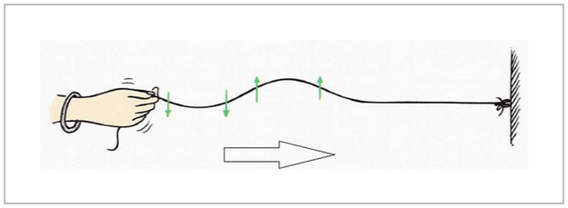
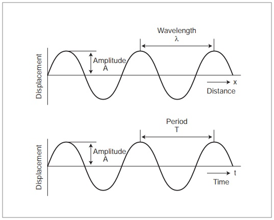
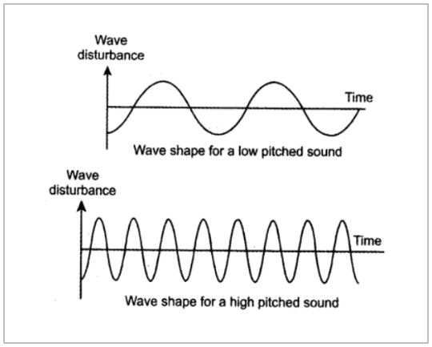
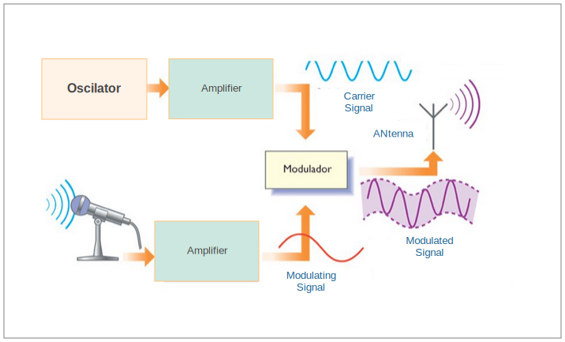
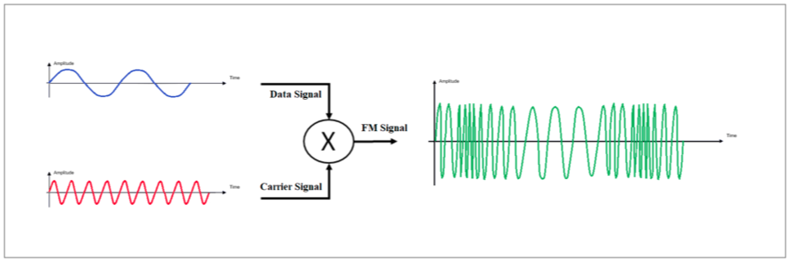
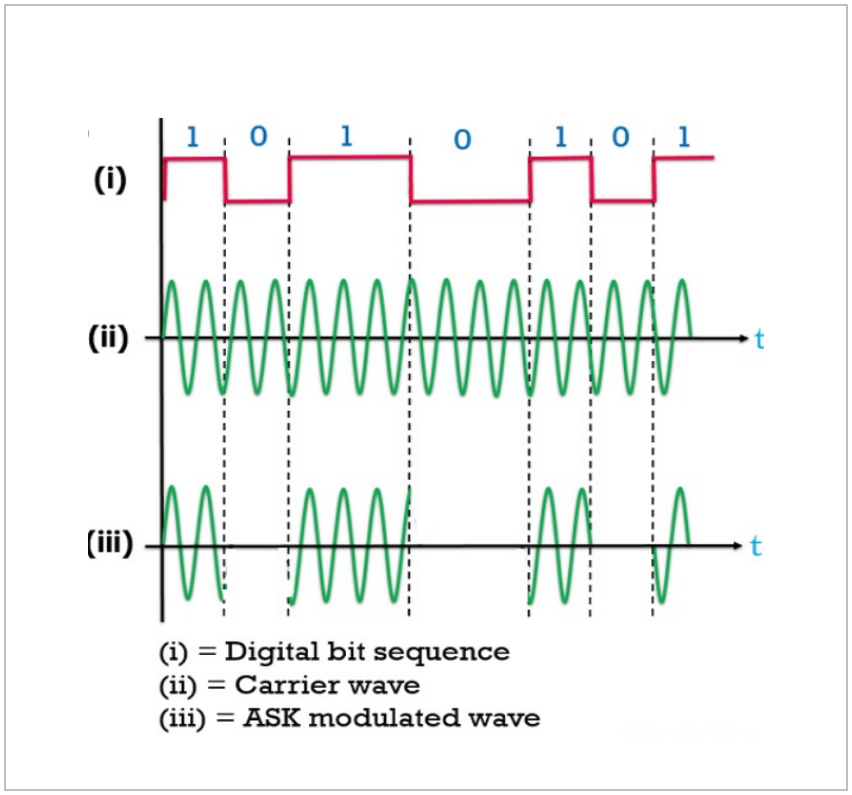
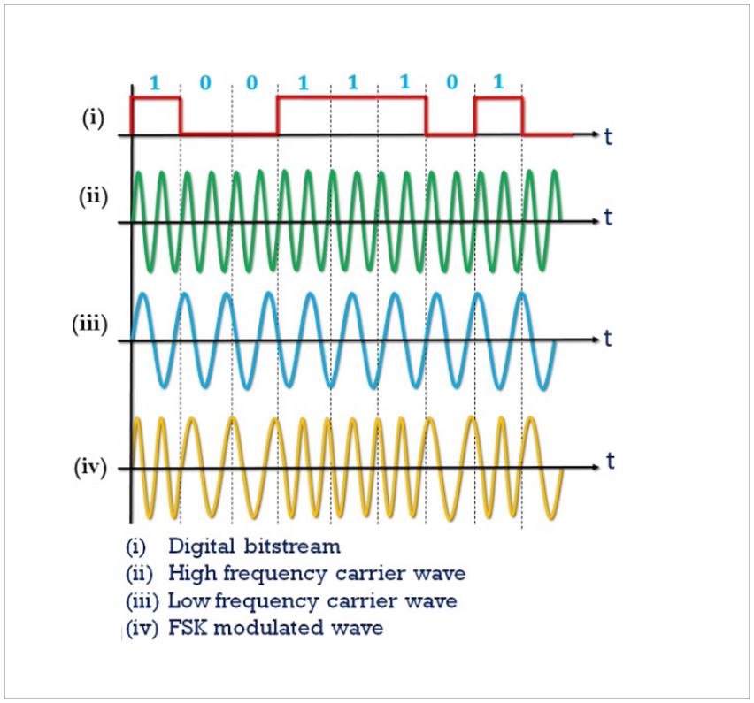

- [Capitulo 1 Ondas](#capitulo-1-ondas)
  - [1 Caracteristicas de una onda](#1-caracteristicas-de-una-onda)
    - [1.1.1 Amplitud (A)](#111-amplitud-a)
    - [1.1.2 Frecuencia (f)](#112-frecuencia-f)
    - [1.1.3 Periodo de tiempo (T)](#113-periodo-de-tiempo-t)
    - [1.1.4 Longitud de onda (λ)](#114-longitud-de-onda-%ce%bb)
    - [1.1.5 Velocidad (v)](#115-velocidad-v)
  - [2 Clasificación de las ondas](#2-clasificaci%c3%b3n-de-las-ondas)
    - [2.1 En función del medio en el que se propagan](#21-en-funci%c3%b3n-del-medio-en-el-que-se-propagan)
      - [2.1.1 Ondas mecánicas:](#211-ondas-mec%c3%a1nicas)
      - [2.1.2 Ondas electromagnéticas](#212-ondas-electromagn%c3%a9ticas)
      - [2.1.3 Ondas gravitacionales](#213-ondas-gravitacionales)
    - [2.2 En función de su dirección](#22-en-funci%c3%b3n-de-su-direcci%c3%b3n)
      - [2.2.1 Ondas unidimensionales](#221-ondas-unidimensionales)
      - [2.2.2 Ondas bidimensionales o superficiales](#222-ondas-bidimensionales-o-superficiales)
      - [2.2.3 Ondas tridimensionales o esféricas](#223-ondas-tridimensionales-o-esf%c3%a9ricas)
    - [2.3 En función del movimiento de sus partículas](#23-en-funci%c3%b3n-del-movimiento-de-sus-part%c3%adculas)
      - [2.3.1 Ondas longitudinales](#231-ondas-longitudinales)
      - [2.3.2 Ondas transversales](#232-ondas-transversales)
    - [2.4  En función de su periodicidad](#24-en-funci%c3%b3n-de-su-periodicidad)
      - [2.4.1 Ondas periódicas](#241-ondas-peri%c3%b3dicas)
      - [2.4.2 Ondas no periódicas](#242-ondas-no-peri%c3%b3dicas)
- [Capitulo 2 Moduladores y demoduladores](#capitulo-2-moduladores-y-demoduladores)
  - [2.1 Señal portadora](#21-se%c3%b1al-portadora)
  - [2.2 Señal moduladora](#22-se%c3%b1al-moduladora)
  - [2.3 Por que modular una señal?](#23-por-que-modular-una-se%c3%b1al)
  - [2.4 Técnicas de modulación empleadas](#24-t%c3%a9cnicas-de-modulaci%c3%b3n-empleadas)
  - [2.5 Tipos de moduladores](#25-tipos-de-moduladores)
    - [2.5.1 Modulación analógica:](#251-modulaci%c3%b3n-anal%c3%b3gica)
      - [2.5.1.1 Modulación de la amplitud.](#2511-modulaci%c3%b3n-de-la-amplitud)
      - [2.5.1.2 Modulación de la frecuencia.](#2512-modulaci%c3%b3n-de-la-frecuencia)
      - [2.5.1.3 Modulación de la fase.](#2513-modulaci%c3%b3n-de-la-fase)
    - [2.5.2 Modulación digital](#252-modulaci%c3%b3n-digital)
      - [2.5.2.1 Modulación por desplazamiento de amplitud (**ASK, Amplitude Shift Keying**)](#2521-modulaci%c3%b3n-por-desplazamiento-de-amplitud-ask-amplitude-shift-keying)
      - [2.5.2.2 Modulación por desplazamiento de frecuencia (**FSK,Frecuency Shift Keying**)](#2522-modulaci%c3%b3n-por-desplazamiento-de-frecuencia-fskfrecuency-shift-keying)
        - [2.5.2.2.1 Multiplexacion de 2 diferentes frecuencias.</h4>](#25221-multiplexacion-de-2-diferentes-frecuenciash4)
        - [2.5.2.2.2 Oscilador controlado por tensión (VCO).](#25222-oscilador-controlado-por-tensi%c3%b3n-vco)
      - [2.5.2.3 Modulación por desplazamiento de frecuencia Gausiana (GFSK)](#2523-modulaci%c3%b3n-por-desplazamiento-de-frecuencia-gausiana-gfsk)
      - [2.5.2.4 Modulación por desplazamiento de fase (**PSK, Phase Shift Keying**)](#2524-modulaci%c3%b3n-por-desplazamiento-de-fase-psk-phase-shift-keying)
- [Capitulo 3 Filtros](#capitulo-3-filtros)
  - [3.1 ¿Qué es un filtro de frecuencia?](#31-%c2%bfqu%c3%a9-es-un-filtro-de-frecuencia)
  - [3.2 Clasificación de los filtros](#32-clasificaci%c3%b3n-de-los-filtros)
    - [3.2.1 Respuesta en frecuencia](#321-respuesta-en-frecuencia)
- [Capitulo 4 Demodulador FSK](#capitulo-4-demodulador-fsk)


<h1> Teoria de señales y moduladores</h1>

En este documento se pretende mostrar los principios y conceptos fundamentales que hacen posible
interconectar nodos de manera inalambrica sin necesidad de cables,irradiando señales por medio de técnicas descritas mas adelante, y recibiendo estas mismas señales del lado de un receptor aplicando técnicas que igualmente se describen en este documento.

# Capitulo 1 Ondas
Una onda consiste en la propagación de una perturbación de alguna propiedad del espacio, por ejemplo:
- Densidad.
- Presión.
- Campo eléctrico.
- Campo magnético.

Implicando un transporte de energía sin transporte de materia.El espacio perturbado puede contener materia (aire, agua, etc) o no (vació).




En el ejemplo de la imagen generando una onda con una cuerda, se puede apreciar la deformación del medio el cual representa el transporte de energía, sin transportar la materia misma.

## 1 Caracteristicas de una onda


<figure>




</figure>

Una onda puede ser completamente descrita por 5 características llamadas amplitud, frecuencia, periodo, longitud de onda y velocidad.


### 1.1.1 Amplitud (A)

Es la distancia vertical entre una cresta y el punto medio de la onda.
### 1.1.2 Frecuencia (f)

El número de vibraciones (ondas completas o ciclos) producidas en un segundo se llama frecuencia de la onda. Se denota como f. La unidad de frecuencia SI(Sistema Internacional) es s^-1 (o) hertz (Hz).

```
f = 1/T

```

 
### 1.1.3 Periodo de tiempo (T)

El tiempo requerido para producir una vibración completa (onda o ciclo) se llama período de tiempo de la onda. Se denota como T. La unidad SI del período de tiempo es el segundo (s). La frecuencia y el período de tiempo son recíprocos entre sí.

```
T = 1/f
```

### 1.1.4 Longitud de onda (λ)

La distancia mínima en la que se repite una onda de sonido se denomina longitud de onda. En una onda de sonido, la distancia entre los centros de dos compresiones consecutivas o dos rarefacciones consecutivas también se llama longitud de onda. La longitud de onda generalmente se denota como λ (letra griega lambda). La unidad SI de longitud de onda es metro (m).

 
### 1.1.5 Velocidad (v)

La distancia recorrida por la onda de sonido en un segundo se llama velocidad de propagación La unidad SI de velocidad de propagación es m /s.

```
V = 1/T
```


## 2 Clasificación de las ondas 

### 2.1 En función del medio en el que se propagan

#### 2.1.1 Ondas mecánicas: 
Las ondas mecánicas necesitan un medio material elástico (sólido, líquido o gaseoso) para propagarse. Las partículas del medio oscilan alrededor de un punto fijo, por lo que no existe transporte neto de materia a través del medio.  Dentro de las ondas mecánicas tenemos las ondas elásticas, las ondas que se propagan en la superficie del agua o en una explosión controlada, las ondas sonoras y las ondas de gravedad.

#### 2.1.2 Ondas electromagnéticas 
las ondas electromagnéticas se propagan por el espacio sin necesidad de un medio material, pudiendo por lo tanto propagarse en el vacío. Esto es debido a que las ondas electromagnéticas son producidas por las oscilaciones de un campo eléctrico, en relación con un campo magnético asociado. Las ondas electromagnéticas viajan aproximadamente a una velocidad de 300000 km/s, de acuerdo a la velocidad puede ser agrupado en rango de frecuencia. Este ordenamiento es conocido como Espectro Electromagnético, objeto que mide la frecuencia de las ondas. Los rayos X, la luz visible o los rayos ultravioleta son ejemplos de ondas electromagnéticas.
  
#### 2.1.3 Ondas gravitacionales 
las ondas gravitacionales son perturbaciones que alteran la geometría misma del espacio-tiempo y aunque es común representarlas viajando en el vacío, técnicamente no podemos afirmar que se desplacen por ningún espacio, sino que en sí mismas son alteraciones del espacio-tiempo.

###  2.2 En función de su dirección

#### 2.2.1 Ondas unidimensionales 
Las ondas unidimensionales son aquellas que se propagan a lo largo de una sola dirección del espacio, como las ondas en los muelles o en las cuerdas. Si la onda se propaga en una dirección única, sus frentes de onda son planos y paralelos.
    
#### 2.2.2 Ondas bidimensionales o superficiales 
Son ondas que se propagan en dos direcciones. Pueden propagarse, en cualquiera de las direcciones de una superficie, por ello, se denominan también ondas superficiales. Un ejemplo son las ondas que se producen en una superficie líquida en reposo cuando, por ejemplo, se deja caer una piedra en ella.

#### 2.2.3 Ondas tridimensionales o esféricas
Son ondas que se propagan en tres direcciones. Las ondas tridimensionales se conocen también como ondas esféricas, porque sus frentes de ondas son esferas concéntricas que salen de la fuente de perturbación expandiéndose en todas direcciones. El sonido es una onda tridimensional. Son ondas tridimensionales las ondas sonoras (mecánicas) y las ondas electromagnéticas.


### 2.3 En función del movimiento de sus partículas

#### 2.3.1 Ondas longitudinales 
Son aquellas que se caracterizan porque las partículas del medio se mueven o vibran paralelamente a la dirección de propagación de la onda. Por ejemplo, las ondas sísmicas, las ondas sonoras y un muelle que se comprime dan lugar a una onda longitudinal.

#### 2.3.2 Ondas transversales
on aquellas que se caracterizan porque las partículas del medio vibran perpendicularmente a la dirección de propagación de la onda. Por ejemplo, las olas del mar, las ondas que se propagan en una cuerda y las ondas sísmicas.

### 2.4  En función de su periodicidad

#### 2.4.1 Ondas periódicas
La perturbación local que las origina se produce en ciclos repetitivos por ejemplo una onda senoidal.

#### 2.4.2 Ondas no periódicas 
La perturbación que las origina se da aisladamente o, en el caso de que se repita, las perturbaciones sucesivas tienen características diferentes. Las ondas aisladas también se denominan pulsos.


# Capitulo 2 Moduladores y demoduladores

En este capitulo se pretende hacer una introducción a los sistemas de modulación y técnicas existentes para hacer posible la radiación de señales electromagnéticas con información adherida a ella.

Las señales de información pocas veces encuentran una forma adecuada para la transmisión, por lo que las señales deben ser transportadas entre el transmisor y el receptor,sobre alguna forma o medio de transmisión.

La modulación se define como el proceso de transformar información de su forma original a una forma más adecuada para la transmisión.

La Demodulación es el proceso inverso(es decir,la onda modulada se convierte nuevamente a su forma original).La modulación se realiza en el transmisor en un circuito llamado modulador,y la demodulación se realiza en el receptor en un circuito llamado demodulador o detector.

## 2.1 Señal portadora

Una señal portadora es una onda eléctrica que puede ser modificada en alguno de sus parámetros por la señal de información (sonido, imagen o datos) para obtener una señal modulada y que se transporta por el canal de comunicaciones


El uso de una onda portadora también soluciona muchos problemas de circuito, antena, propagación y ruido. Por ello, una antena práctica debe tener un tamaño aproximado al de la longitud de onda de la onda electromagnética de la señal que se va a transmitir. Si las ondas de sonido se difundieran directamente en forma de señales electromagnéticas ,la antena tendría que tener más de un kilómetro de altura. Usando frecuencias mucho más altas para la portadora, el tamaño de la antena se reduce significativamente porque las frecuencias más altas tienen longitudes de ondas más cortas.

## 2.2 Señal moduladora

Como se dijo antes una señal moduladora , puede ser una señal de audio, video, o datos, cualquier señal de estas al ser mezclada con la portadora generan la señal modulada que se transmite a través de la antena.


## 2.3 Por que modular una señal?

Es necesario modular las señales por diferentes razones:

**a**. Si todos los usuarios transmiten a la frecuencia de la señal original o moduladora, no será posible reconocer la información inteligente contenida en dicha señal, debido a la interferencia entre las señales transmitidas por diferentes usuarios.

**b**. A altas frecuencias se tiene mayor eficiencia en la transmisión, de acuerdo al medio que se emplee.

**c**. Se aprovecha mejor el espectro electromagnético, ya que permite la multiplexación por frecuencias.

**d**. En caso de transmisión inalámbrica, las antenas tienen medidas más razonables.

En resumen, la modulación permite aprovechar mejor el canal de comunicación ya que posibilita transmitir más información en forma simultánea por un mismo canal y/o proteger la información de posibles interferencias y ruidos.


## 2.4 Técnicas de modulación empleadas

Uno de los objetivos de las comunicaciones es utilizar una frecuencia portadora como frecuencia básica de una comunicación, pero modificándola siguiendo un proceso denominado modulación para codificar la información en la onda portadora.

Las formas básicas de Modulación son:

- Amplitud
  -  Modulación en Amplitud - Doble banda lateral con portadora - AM.
  -  Doble banda lateral sin portadora - DBL-SP.
  -  Banda lateral única - BLU.

- Angular
  - Modulación en Frecuencia - FM.
  - Modulación en Fase - PM.

## 2.5 Tipos de moduladores


### 2.5.1 Modulación analógica: 
Las tres técnicas de modulación analógica son:

#### 2.5.1.1 Modulación de la amplitud.
<br>


En este tipo de técnica, lo que se obtiene a la salida es la señal portadora o carrier alterada en amplitud, proporcional a la amplitud d ela señal moduladora o en este caso la señal proveniente del micrófono. Dicha señal es la responsable de alterar la señal de alta frecuencia.

<br>
<br>
<br>
<br>

#### 2.5.1.2 Modulación de la frecuencia.


<br>
<br>

En este tipo de modulación, la señal moduladora tiene una amplitud constante pero varia la frecuencia, la cual es utilizada para alterar la frecuencia de la señal portadora o carrier.

#### 2.5.1.3 Modulación de la fase.

Este también es un caso de modulación donde las señales de transmisión como las señales de datos son analógicas y es un tipo de modulación exponencial al igual que la modulación de frecuencia. En este caso el parámetro de la señal portadora que variará de acuerdo a la señal moduladora es la fase. La modulación de fase (PM) no es muy utilizada principalmente por que se requiere de equipos de recepción más complejos que en FM y puede presentar problemas de ambigüedad para determinar por ejemplo si una señal tiene una fase de 0º o 180º.

La forma de las señales de modulación de frecuencia y modulación de fase son muy parecidas. De hecho, es imposible diferenciarlas sin tener un conocimiento previo de la función de modulación.

La mayoría de los sistemas de comunicación utilizan alguna de estas tres técnicas de modulación básicas, o una combinación de ellas. Las Radios están basadas en AM y FM siendo la FM la de mejor calidad debido a la ventaja que tiene por manejar mayores frecuencias y mayores anchos de banda que mejoran la percepción por el contenido que se puede transmitir. 

### 2.5.2 Modulación digital 
Los siguientes son algunos casos extremos de estas técnicas

#### 2.5.2.1 Modulación por desplazamiento de amplitud (**ASK, Amplitude Shift Keying**)

La modulación por desplazamiento de amplitud, en inglés Amplitude-shift keying (ASK), es una forma de modulación en la cual se representan los datos digitales como variaciones de amplitud de la onda portadora en función de los datos a enviar.

La amplitud de una señal portadora analógica varía conforme a la corriente de bit (modulando la señal), manteniendo la frecuencia y la fase constante. El nivel de amplitud puede ser usado para representar los valores binarios 0 y 1. Podemos pensar en la señal portadora como un interruptor ON/OFF. 

En la señal modulada, el valor lógico 0 es representado por la ausencia de una portadora, así que da ON/OFF la operación de pulsación y de ahí el nombre dado.

Como la modulación AM, ASK es también lineal y sensible al ruido atmosférico, distorsiones, condiciones de propagación en rutas diferentes en la PSTN, entre otros factores. Esto requiere una amplitud de banda excesiva y es por lo tanto un gasto de energía. Tanto los procesos de modulación ASK como los procesos de demodulación son relativamente baratos. 

La forma más simple y común de ASK funciona como un interruptor que apaga/enciende la portadora, de tal forma que la presencia de portadora indica un 1 binario y su ausencia un 0. Este tipo de modulación por desplazamiento on-off es el utilizado para la transmisión de código Morse por radiofrecuencia, siendo conocido el método como operación en onda continua. 

La técnica ASK también es usada comúnmente para transmitir datos digitales sobre la fibra óptica. Para los transmisores LED, el valor binario 1 es representado por un pulso corto de luz y el valor binario 0 por la ausencia de luz. Los transmisores de láser normalmente tienen una corriente "de tendencia" fija que hace que el dispositivo emita un nivel bajo de luz. Este nivel bajo representa el valor 0, mientras una onda luminosa de amplitud más alta representa el valor binario 1.




#### 2.5.2.2 Modulación por desplazamiento de frecuencia (**FSK,Frecuency Shift Keying**)

La modulación por desplazamiento de frecuencia o FSK del inglés Frequency Shift Keying es una técnica de modulación para la transmisión digital de información utilizando dos o más frecuencias diferentes para cada símbolo.​ La señal moduladora solo varía entre dos valores de tensión discretos formando un tren de pulsos donde uno representa un "1" o "marca" y el otro representa el "0" o "espacio".

En la modulación digital, a la relación de cambio a la entrada del modulador se le llama bit-rate y tiene como unidad el bit por segundo (bps).

A la relación de cambio a la salida del modulador se le llama baud-rate. En esencia el baud-rate es la velocidad o cantidad de símbolos por segundo.

En FSK, el bit rate = baud rate. Así, por ejemplo, un 0 binario se puede representar con una frecuencia f1, y el 1 binario se representa con una frecuencia distinta f2. 



En esta forma de modulación la portadora sinusoidal toma dos valores de frecuencia, determinados directamente  por la señal de datos binaria. El modulador puede realizarse en varios modos, los cuales se describen a continuación.


##### 2.5.2.2.1 Multiplexacion de 2 diferentes frecuencias.</h4>

En la siguiente figura tenemos dos portadoras con diferente frecuencia, para representar los diferentes símbolos dentro del mensaje, en este caso cero(0) y uno(lógico), la frecuencia del oscilador 1 debe ser diferente a la del oscilador 2 pero teniendo en cuanta que la diferencia no debe ser muy grande.

Estas dos frecuencias se hacen pasar por un interruptor digital de dos estados controlado por una señal digital, en este caso el mensaje digital y el cual genera la salida mostrada en la salida del interruptor.

Esta técnica tiene el inconveniente de que se generan cambios de fase abruptos al pasar de una frecuencia a otra, dichos cambios abruptos generan armónicos indeseables los cuales aumentan el ancho de banda , algo que es indeseable en la modulación de señales 


##### 2.5.2.2.2 Oscilador controlado por tensión (VCO).

<h3>VCO</h3>

La frecuencia instantánea de salida del oscilador es controlada por el voltaje de entrada. Es un tipo de oscilador que puede producir una frecuencia de señal de salida en un amplio rango (pocos Hertz-cientos de Giga Hertz) dependiendo de la tensión de entrada de corriente continua que se le haya asignado.

Este tipo de osciladores al no presentar voltaje en su entrada o lo que es igual a 0 voltios, debe oscilar en una frecuencia llamada frecuencia libre de oscilación, y al empezar a incrementar el voltaje de entrada , la señal de salida se ve alterada en su frecuencia creciendo de forma lineal respecto al voltaje de entrada.

en este caso particular donde queremos modular una señal digital o lo que es equivalente a un tren de pulsos, podemos observar que tenemos dos diferentes voltajes para controlar el VCO: Cuando la señal de datos esta en un nivel alto o 1 lógico, es equivalente a tener un voltaje diferente de cero, y cuando tenemos el estado cero lógico de la señal de datos es como tener el VCO en su estado de oscilación libre a la frecuencia para la que haya sido diseñado.

Esta técnica de modulación al igual que la anterior por multiplexacion de frecuencias  maneja una frecuencia diferente por cada símbolo, con la diferencia de que el VCO elimina los cambios abruptos en el cambio de frecuencia ya que no necesita multiplexar entre diferentes fuentes generadoras de frecuencia, simplemente consiste en controlar la frecuencia de una misma fuente generadora.


#### 2.5.2.3 Modulación por desplazamiento de frecuencia Gausiana (GFSK)


Esta técnica es similar a la técnica de FSK descrita en el apartado anterior, con una pequeña mejora en el ancho de banda de la señal.

Esta técnica consiste en suavizar el tren de pulsos (datos o señal moduladora), como sabemos dicho tren de pulsos representa una onda cuadrada la cual presenta cambios abruptos cuando pasa de cero lógico a uno lógico, aumentando el ancho de banda del espectro de señal.

Al pasar la señal moduladora (Data) a través de un filtro Gaussiano la salida es muy similar a una onda senoidal la cual presenta transiciones suaves de cero a uno.

Con esto observamos que:

```modulacion GFSK = filtro Gaussiano + FSK```

Habíamos dicho antes que tener estos cambios abruptos de cero a uno en la señal moduladora aumenta el ancho de banda, fácilmente concluimos que la mejora que aplica este tipo de filtro en la modulación FSK es disminuir el ancho de banda en el espectro de la señal de salida. 

#### 2.5.2.4 Modulación por desplazamiento de fase (**PSK, Phase Shift Keying**)
Es una modulación que se caracteriza porque la fase de la onda portadora varía en forma directamente proporcional de acuerdo con la señal moduladora. La modulación de fase no suele ser muy utilizada porque se requieren equipos de recepción más complejos que los de frecuencia modulada. Además puede presentar problemas de ambigüedad para determinar si una señal tiene una fase de 0º o 180º. 


# Capitulo 3 Filtros 


## 3.1 ¿Qué es un filtro de frecuencia?

El análisis de redes sometidas a una excitación sinusoidal en estado estacionario permite estudiar problemas que  ocurren frecuentemente en la generación, transmisión, distribución y utilización de la energía eléctrica.

Un filtro de frecuencia es un circuito que utiliza componentes eléctricos y/o electrónicos para poder atenuar, corregir o rechazar un rango de frecuencias dentro de cualquier tipo de señal. Este rango pude ser distinto en cada ocasión ya que los filtros son muy flexibles y existen diferentes tipos.

## 3.2 Clasificación de los filtros

Existen diferentes tipos de filtros clasificados por su funcionalidad:
- Filtros Digitales: Procesa Señales discretas, este tipo de filtro es basado en software.
  - Pasa bajos.
  - Pasa altos.
  - Pasa banda.
- Filtros Análogos: Procesa señales continuas, basado en componentes electrónicos análogos.
  - Pasivos: Basado en Condensadores, Bobinas y Resistencias, presenta perdidas por atenuación .
    - Pasa bajos.
    - Pasa altos.
    - Pasa banda.
  - Activos: Basado en Circuitos integrados, Condensadores, Bobinas y Resistencias, ofrecen amplificación.
    - Pasa bajos.
    - Pasa altos.
    - Pasa banda.

### 3.2.1 Respuesta en frecuencia 


# Capitulo 4 Demodulador FSK

En este capitulo se intenta mostrar los procesos involucrados para poder recibir una señal emitida por un nodo emisor la cual esta modulada en FSK y se deben realizar algunos procesos para poder obtener la información original sin la portadora, para esto vamos a hacer uso de  filtros pasa bajo, los cuales permiten que filtremos la señal modulada eliminando sus componentes de alta frecuencia y dejando tan solo el mensaje original; Proceso conocido como demodulacion. 

En la demodulación de señales FSK se utilizan dos métodos y estos son: 
- Detección síncrona. 
- Detección de envolvente.


