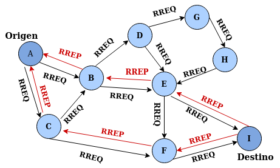
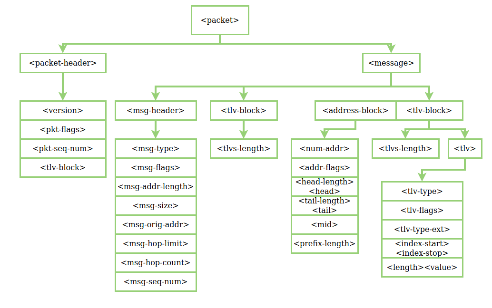
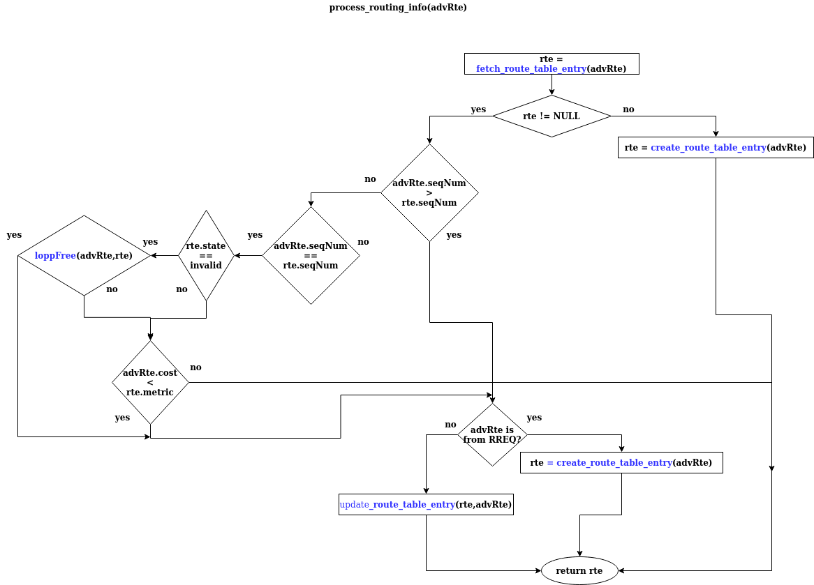
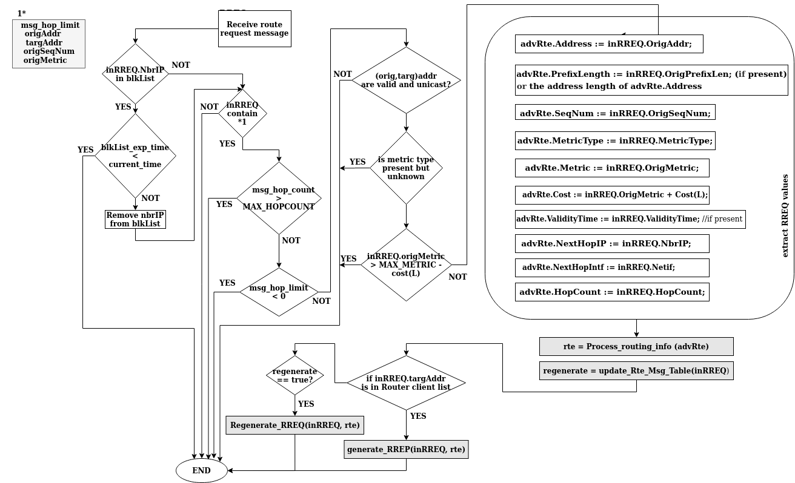

<p align="center">
 <a href="https://locha.io/">
 
 </a>
 <br/>
 <a href="https://travis-ci.com/btcven/radio-firmware">
 
 </a>
</p>

<p align="center">
 <a href="https://locha.io/">Project Website</a> |
 <a href="https://locha.io/donate">Donate</a> |
 <a href="https://github.com/sponsors/rdymac">Sponsor</a> |
 <a href="https://locha.io/buy">Buy</a>
</p>

<h1 align="center">Implementación del protocolo de enrutamiento AODVv2 </h1>

# Tabla de contenido
- [Tabla de contenido](#tabla-de-contenido)
- [Introducción](#introducci%c3%b3n)
- [Motivación](#motivaci%c3%b3n)
- [Trabajo propuesto](#trabajo-propuesto)
- [Modificaciones propuestas](#modificaciones-propuestas)
- [Estructura de descomposición del proyecto](#estructura-de-descomposici%c3%b3n-del-proyecto)
- [Base Teórica](#base-te%c3%b3rica)
  - [Protocolos de Enrutamiento](#protocolos-de-enrutamiento)
  - [Clasificación de los protocolos según su funcionamiento.](#clasificaci%c3%b3n-de-los-protocolos-seg%c3%ban-su-funcionamiento)
    - [Protocolos Proactivos](#protocolos-proactivos)
    - [Protocolos Reactivos](#protocolos-reactivos)
    - [Protocolos Híbridos](#protocolos-h%c3%adbridos)
- [AODVv2](#aodvv2)
  - [Características](#caracter%c3%adsticas)
  - [Descubrimiento de Rutas](#descubrimiento-de-rutas)
  - [Tabla de rutas](#tabla-de-rutas)
  - [Establecimiento de rutas inversas](#establecimiento-de-rutas-inversas)
  - [Router Client Set](#router-client-set)
  - [Neighbor Set](#neighbor-set)
  - [Sequence Number](#sequence-number)
  - [Local Route Set](#local-route-set)
  - [Multicast Route Message Set](#multicast-route-message-set)
  - [Mensajes](#mensajes)
    - [Contenido del mensaje de requerimiento de ruta RREQ](#contenido-del-mensaje-de-requerimiento-de-ruta-rreq)
    - [Contenido del mensaje de respuesta de ruta RREP](#contenido-del-mensaje-de-respuesta-de-ruta-rrep)
    - [Contenido del Mensaje RREP_Ack](#contenido-del-mensaje-rrepack)
  - [Procesos involucrados en el protocolo AODvv2](#procesos-involucrados-en-el-protocolo-aodvv2)
    - [Next Hop Monitoring](#next-hop-monitoring)
    - [Neighbor Set Update](#neighbor-set-update)
  - [Procesado de la información de los mensajes de ruta](#procesado-de-la-informaci%c3%b3n-de-los-mensajes-de-ruta)
    - [Evaluación de la información de ruta](#evaluaci%c3%b3n-de-la-informaci%c3%b3n-de-ruta)
    - [Actualización de la información de las rutas](#actualizaci%c3%b3n-de-la-informaci%c3%b3n-de-las-rutas)
    - [Eliminación de los mensajes redundantes usando la Multicast Route Message Set](#eliminaci%c3%b3n-de-los-mensajes-redundantes-usando-la-multicast-route-message-set)
    - [Creación de mensajes RREQ](#creaci%c3%b3n-de-mensajes-rreq)
    - [Recepción de mensajes RREQ](#recepci%c3%b3n-de-mensajes-rreq)
    - [Reenvío de mensajes RREQ](#reenv%c3%ado-de-mensajes-rreq)
    - [Recepción de mensajes RREP](#recepci%c3%b3n-de-mensajes-rrep)
    - [Reenvío de mensajes RREP](#reenv%c3%ado-de-mensajes-rrep)
    - [Generación de mensajes RREP_Ack Request](#generaci%c3%b3n-de-mensajes-rrepack-request)
    - [Recepción de mensajes RREP_Ack](#recepci%c3%b3n-de-mensajes-rrepack)
    - [Generación de RREP_Ack Response](#generaci%c3%b3n-de-rrepack-response)
- [Formato de paquetes para redes MANET](#formato-de-paquetes-para-redes-manet)
  - [Paquetes](#paquetes)
    - [pkt-header](#pkt-header)
  - [Mensajes](#mensajes-1)
    - [msg-header](#msg-header)
    - [msg-header-length](#msg-header-length)
  - [oonf_api](#oonfapi)
- [Modelado de AODVv2](#modelado-de-aodvv2)
  - [Estructuras de datos](#estructuras-de-datos)
  - [Mensajes](#mensajes-2)
  - [Estado Inicial](#estado-inicial)
  - [Acciones del protocolo](#acciones-del-protocolo)
  - [**Modelo para crear un Route Request**](#modelo-para-crear-un-route-request)
  - [**Modelo para recibir un Route Request**](#modelo-para-recibir-un-route-request)
  - [**Modelo para recibir un Route Reply**](#modelo-para-recibir-un-route-reply)
  - [**Modelo para recibir un Route Error**](#modelo-para-recibir-un-route-error)
  - [**Modelo para remover un link**](#modelo-para-remover-un-link)
- [Operaciones generales del protocolo AODVv2](#operaciones-generales-del-protocolo-aodvv2)
  - [Operaciones de ruteo](#operaciones-de-ruteo)
  - [Process_Routing_Info](#processroutinginfo)
  - [Create_Route_Table_Entry](#createroutetableentry)
  - [update_route_table_entry](#updateroutetableentry)
  - [fetch_route_table_entry](#fetchroutetableentry)
  - [loop_free](#loopfree)
  - [check_route_state](#checkroutestate)
- [Tabla de operaciones para los mensajes de ruta multicast](#tabla-de-operaciones-para-los-mensajes-de-ruta-multicast)
  - [fetch_rte_msg_table_entry](#fetchrtemsgtableentry)
  - [update_rte_msg_table](#updatertemsgtable)
- [Generación y procesamiento de mensajes](#generaci%c3%b3n-y-procesamiento-de-mensajes)
  - [build_rfc_5444_message_header](#buildrfc5444messageheader)
  - [receive_RREQ](#receiverreq)
  - [generate_rreq](#generaterreq)
  - [regenerate_RREQ](#regeneraterreq)
  - [generate_rrep](#generaterrep)
  - [receive_rrep](#receiverrep)
  - [regenerate_rrep](#regeneraterrep)

# Introducción
El objetivo de este proyecto es la implementación del protocolo **AODVv2**, el cual se enmarca en uno de mayor envergadura que comprende las siguientes fases.

1. Implementación del protocolo **AODVv2** en un entorno basado en un sistema operativo embebido, en este caso [RIOT-OS](https://www.riot-os.org/).
2. Verificar el rendimiento del protocolo **AODVv2** en escenarios reales y contrastarlo con lo previsto por el marco teórico desarrollado con anterioridad.
3. Desarrollo del driver necesario para la integracion con el sistema operativo.
4. cálculo y establecimiento de valores de constantes para el funcionamiento de la red.


El protocolo AODVv2 enfrenta algunos desafíos para poder trabajar de manera optima en las areas de aplicación provistas para este tipo de redes, como lo son:

<ul class="w3-ul w3-border">
 <li><h4>Topología dinámica.</h4></li>
 <li><h4>Restricciones de recursos(hardware).</h4></li>
 <li><h4>Heterogeneidad entre nodos(diferencias en el hardware).</h4></li>
</ul>


**LOCHA-MESH** es un intento para reunir gente interesada en redes y comunicaciones inalámbricas, es un proyecto **open source** en el cual se intenta construir una red de datos libre, para así contar con un nuevo medio de comunicación abierto, libre y resiliente . Una red, en este caso inalámbrica, creada, administrada y gestionada por los propios usuarios. Una red libre mesh es distribuida, no pertenece a nadie en particular pero nos pertenece a todos. Una red libre mesh ofrece acceso libre y gratuito a la propia red. Por acceso libre se entiende que cualquier persona puede acceder a la red en cualquier momento y puede llegar hasta cualquier parte de la red.


Los conceptos de red inalámbrica de tipo malla o Ad-hoc, han sido estudiados a lo largo del tiempo, estableciendo diversos protocolos que con mayor o menor éxito lidian con uno de sus mayores enemigos; “single-hop” (único salto) o ¿Hay vida más allá de mis vecinos?.

Hoy día, su uso se ha popularizado y ha dado pie a un campo emergente, el cual ofrece una gran cantidad de aplicaciones en las que impera la necesidad de mantener dispositivos interconectados sin desplegar una red cableada y que estos interactúen con la mayor eficiencia sin renunciar a la seguridad en la comunicación.


<< Sin embargo, este tipo de redes también pueden proporcionar un medio de comunicación fiable y seguro, donde ninguna persona, empresa o administración, aún siendo partícipe activo de la misma, pueda vetar, censurar o acceder a cualquier información, a menos que de forma expresa, sea el destinatario. Otro interesante campo de aplicación es en zonas afectadas por catástrofes naturales, pobre infraestructura, aquellas que han sufrido los efectos de conflictos bélicos o políticos, o simplemente personas que valoran su anonimato >>

# Motivación

Las redes inalámbricas conectadas en topología mesh(malla) tienen varias características únicas como bajo costo, facilidad de implementación rápida, auto configuración, auto reparación y sin infraestructura (infrastructure-less) bondades de las redes mesh. Estas características únicas fomentan el uso efectivo de la red malla o red mesh como es comúnmente conocida. 
Sabemos que las redes inalámbricas son vitales en situaciones de emergencia por tal motivo las redes deben ser robustas, contar con la menor intervención humana y poder adaptarse rápidamente a las configuraciones cambiantes debido a su naturaleza de red móvil.


# Trabajo propuesto

En el presente trabajo se pretende como objetivo principal desarrollar un dispositivo electrónico capaz de comportarse como un nodo de de la red LOCHA-MESH, dotado con un módulo de radiofrecuencia que puede interconectar nodos lejanos con distancias alrededor de los 6 Km, el dispositivo también posee un módulo wifi que puede comportarse como un modem wifi, servidor web, cliente web, servidor de websockets, cliente websocket entre otras bondades que lo hacen perfecto para este proyecto.
Como segundo objetivo implemnetar AODVv2, para que se adecue a las necesidades de la red Locha y pensando siempre en la seguridad y privacidad de la información que fluye por la red.
El dispositivo debe ser capaz de comportarse como un cliente y un servidor de la red, debe ser capaz de comportarse como un router y conocer muy bien información relevante de los nodos vecinos que conforman la red.


# Modificaciones propuestas

En el actual trabajo se pretende utilizar el protocolo de ruteo AODVv2 como punto de partida para hacer los test iniciales funcionando desde el dispositivo embebido basado en microcontrolador.

Una de las principales ventajas de reemplazar IPv4 a IPv6 es habilitar un espacio de IPs muy amplio debido a que se incrementa de 32 bits a 128 bits el espacio de direcciones, con 128 bits hay aproximadamente 10 exp 38 direcciones posibles.

Otro cambio interesante es el uso de módulos de radiofrecuencia en el rango del sub-gigahercio.


# Estructura de descomposición del proyecto

La estructura de descomposición del trabajo o EDT, agrupa y define el trabajo que se realizará en el proyecto. A continuación se presenta la lista de tareas necesarias para alcanzar los objetivos:

**Formación**: La formación para desarrollar el proyecto, se parte en dos:
- RIOT OS: El sistema operativo en el que se basa la aplicación que se implementara.
- El lenguaje de programación que se usará para desarrollar el proyecto.

**Diseño**: Grupo de tareas necesarias para llevar a cabo el diseño de la aplicación.

**Implementación**: Partes que habrá que implementar para llevar a cabo el proyecto, tales como la gestión de los módulos de radio, la simulación del movimiento de los nodos, del consumo de la batería y la implementación de estados.

**Gestion**: Procesos técnicos del proyecto.

**Planificación**: Definir los pasos a seguir para llevar a cabo el proyecto.

**Seguimiento y control**: Seguimiento del proyecto.

**Reuniones**: Reuniones realizadas con el director del proyecto.

**Documentación**: Documentación recogiendo todo lo trabajado en el proyecto. 


# Base Teórica

## Protocolos de Enrutamiento

Como bien sabemos en la actualidad existe un gran numero de protocolos usados para el manejo de la información, pero no todos los protocolos existentes son aplicables a las RIS(Red inalambrica de sensores) ya que el medio en el que se emplean es totalmente diferente. En las redes cableadas la pérdida de información se debe a la gran cantidad de tráfico que corre por el medio, mientras que en las RIS el medio usado para la comunicación es más hostil, el aire, donde los dispositivos y las transmisiones están expuestas a las implicaciones medioambientales,al ruido y todo tipo de inconveniente que se pueda dar en el medio, todo esto sin mencionar que los dispositivos deben “luchar” por acceder al medio de comunicación. Es por ello que el enfoque que se le da a un protocolo para redes ad-hoc es muy diferente al usado en redes cableadas, ya que en este ultimo caso los protocolos no están pensados para trabajar con tanto “stress”. 

## Clasificación de los protocolos según su funcionamiento. 
Los protocolos usados en las redes inalámbricas se clasifican en tres tipos; Estos protocolos se han desarrollado ante la necesidad de controlar el enrutamiento en las redes ad-hoc, teniendo en cuenta las limitaciones que tienen los dispositivos.

<ol>
 <li>Proactivos.</li>
 <li>Reactivos</li>
 <li>Híbridos</li>
</ol>

### Protocolos Proactivos

Son aquellos que tienen periódicamente actualizadas las tablas de enrutamiento de todos los nodos de la red aunque no estén enviando información. 

Cuando surge algún cambio entre las conexiones de la red la tabla de enrutamiento se actualiza y el protocolo elige la ruta mas optima para enviar información. Este proceso se debe al intercambio de mensajes de control, con lo que se incrementa el consumo de la batería, el número de paquetes enviados por la red.

### Protocolos Reactivos 

Estos protocolos únicamente tienen rutas de encaminamiento en sus tablas cuando un nodo origen tiene que realizar una comunicación con otro nodo en la red. 

Los protocolos reactivos al iniciar una comunicación y no tener una ruta para llegar al nodo destino, se envía un mensaje de descubrimiento de ruta y cuando recibe la respuesta a dicho mensaje, añade esta ruta en su tabla de enrutamiento. Es entonces cuando es posible la comunicación con el destino. El mayor inconveniente es la latencia que se añade al primer paquete de la transmisión por esa nueva ruta, pero a su vez mejora las prestaciones de la batería en los nodos.

Dentro de estos protocolos existen dos clases de protocolos: 
- **Enrutamiento origen**: La ruta de los nodos por donde tiene que pasar la información es almacenada en las cabeceras de los paquetes, de este modo los nodos intermedios no necesitan tablas de enrutamiento, ya que solo basta con leer las cabeceras para saber a quien reenviar la información.
Este tipo de enrutamiento no es aconsejable usarlo en redes extensas, ya que a medida que el mensaje pasa por cada nodo se incrementa la cabecera del paquete.

- **enrutamiento salto a salto**: En este caso la ruta la escoge cada nodo en cualquier momento, ya que cuando se envía la información la cabecera del paquete contiene la dirección del nodo destino y la dirección del siguiente salto. 

En este caso se adapta más rápido a los cambios de la topología pero se genera un gasto superior de recursos en los nodos intermedios ya que tienen que almacenar en tablas de enrutamiento las rutas correspondientes. 

### Protocolos Híbridos 
Los protocolos híbridos son una mezcla de los protocolos proactivos con los reactivos. El fin de éstos es usar las mejores características que ofrecen ambos. Los protocolos dividen las redes en zonas, y los nodos que están mas lejos del destino utilizan enrutamiento reactivo, mientras que los que están mas cerca utilizan enrutamiento proactivo; Como es el caso de ZRP(The Zone Routing Protocol). 

Otros ejemplos de protocolos híbridos son IS-IS de OSI (Intermediate System to Intermediate System) y EIGRP(Enhanced Interior Gateway Routing Protocol) de CISCO. 

# AODVv2

AODV es un protocolo de enrutamiento para redes móviles ad-hoc (MANETs) y redes ad-hoc inalámbricas. AODV es la evolución de su anterior protocolo llamado **DYMO**, que nació en Julio del 2005 y en el año 2013 adopta el nombre de **AODVv2**.

El AODV es uno de los protocolos más utilizados de los algoritmos reactivos, siendo ideal para las redes Ad-Hoc. Este protocolo intercambia mensajes cuando necesita establecer una comunicación, es decir, envía mensajes a los vecinos para calcular cada ruta. Gracias a las mejoras incorporadas en AODV se evita la problemática que tiene DYMO, pero por el contrario se incrementa la latencia en el primer paquete a enviar cada vez que se calcula la ruta.


En la siguiente figura podemos observar las diferentes versiones de AODVv2 y DYMO.


En este trabajo, nos centramos en la evolución del protocolo de enrutamiento (AODV) llamado protocolo de enrutamiento AODVv2.

**AODV** es uno de los cuatro protocolos estandarizados por el grupo de trabajo **IETF MANET**. El protocolo encuentra rutas alternativas bajo demanda siempre que sea necesario, lo que significa que primero se pretende establecer una ruta entre un nodo de origen y un destino **(descubrimiento de ruta)**, y luego mantener una ruta entre los dos nodos durante los cambios de topología **(mantenimiento de la ruta)**.

## Características

<h2>Las características del protocolo son:</h2>

<ol>
 <li>Señalización de control baja. </li>
 <li>Señalización de procesamiento mínima.</li>
 <li>Prevención de bucles.</li>
 <li>Funciona sólo con enlaces bidireccionales.</li>
</ol> 

Cada nodo tiene asociada una tabla de enrutamiento que utiliza para poder establecer enlaces con otros nodos. Estas tablas de enrutamiento contienen los siguientes campos: 

<ol>
 <li>Dirección IP Origen</li>
 <li>Tiempo de Vida (TTL) </li>
 <li>Dirección IP Destino</li>
 <li>Número secuencia Destino</li>
 <li>Contador de saltos (hop count)</li>
</ol>

Aparecen los campos de las direcciones IP de la fuente y de la IP del destino para saber en todo momento de donde vienen los paquetes y hacia donde se deben dirigir.

También aparece un campo con el número de secuencia del nodo destino que sirve para distinguir entre información nueva e información antigua y de esta forma evitar formación de bucles y transmisiones de rutas antiguas. 

Otro parámetro que se almacena en las tablas de encaminamiento es el tiempo de vida. Este sirve para evitar que viajen paquetes perdidos por la red y utilizar enlaces de los que no se conoce su estado desde hace mucho tiempo. 

Cuando a un destino le llegan dos paquetes desde la misma fuente por caminos distintos, el campo **hop count** muestra el número de saltos que han tenido que hacer para cada una de las rutas. De esta forma se sabe cual de ellas es la ruta más corta y la que tiene que seleccionarse para hacer el envío de información. 

Cada vez que se quiere comunicar una fuente con un destino, se inicia un proceso de descubrimiento de ruta, que finaliza cuando recibe un paquete con la ruta calculada.

Existe otro concepto conocido como mantenimiento de ruta, que sirve para actuar en caso de que se rompa un enlace a lo largo de una ruta. Esto se consigue dando tiempo de vida a las rutas descubiertas antes de considerarlas como invalidas.


## Descubrimiento de Rutas 
Cuando un nodo quiere transmitir un paquete a un destino, lo primero que debe hacer es buscar en su tabla de encaminamiento a ver si existe una ruta hacia este destino previamente calculada. En el caso de encontrarla no iniciaría ningún proceso de descubrimiento de ruta, supondría que la que tiene almacenada en su tabla de encaminamiento es correcta y está actualizada. En el caso contrario, comenzará el proceso de descubrimiento para encontrar un camino válido. 

El proceso comienza con el envío de un paquete RREQ (Route Request) en modo broadcast. Este paquete llega a los nodos vecinos que se encuentran a un salto de distancia y estos a su vez lo reenvían a sus vecinos y así sucesivamente hasta llegar al destino. 

Cualquier nodo que durante el proceso de búsqueda conozca la ruta hacia el destino, puede contestar con un paquete de RREP al nodo origen indicando la ruta que necesita. Mientras se va realizando el proceso de búsqueda, todos los nodos van actualizando las tablas de encaminamiento.

En el formato del paquete RREQ del protocolo de encaminamiento AODV, nos encontramos los siguientes campos: 

<ol>
 <li>Dirección IP Origen.</li>
 <li>Número de Secuencia del Origen.</li>
 <li>Dirección IP del Destino.</li>
 <li>Número de Secuencia del Destino.</li>
 <li>RREQ Identificador.</li>
 <li>Contador de saltos (hop count).</li>
</ol>

Uno de los campos es el identificador que se va modificando cada vez que se genera un envío de RREQ. Esto sirve para que los nodos que lo vayan recibiendo (nodos intermedios) sepan si el paquete es idéntico al anterior (tiene el mismo identificador) y deben descartarlo, o por el contrario, si deben retransmitirlo (porque el identificador de paquetes es distinto). 



De la figura anterior podemos observar como el nodo **A** desea buscar una ruta hacia el nodo **I**, el primer paso sera buscar en su tabla de rutas y ver si tiene una ruta almacenada hacia el destino, de no ser así debe iniciar un proceso de descubrimiento de ruta, donde envía un mensaje multicast a todos sus vecinos al alcance de la señal de radio frecuencia.

Este proceso comparándolo con la vida cotidiana es igual a cuando sales a la calle a buscar a tu hijo pero no lo ves, lo primero que haces es gritar, para esperar si responde, este grito representa un mensaje multicast que puede ser escuchado por tus vecinos, y si ellos saben donde esta tu hijo, pueden informarte con un nuevo mensaje entregando una coordenada de donde se encuentra, pero si no saben donde esta este chico, podrían iniciar un nuevo grito a sus vecinos mas cercanos o mensaje de multicast, para ver si pueden ayudar en la búsqueda.


```en desarrollo aun ```

## Mantenimiento de Rutas 
Cuando una ruta es encontrada se le da un tiempo de vida y se considera útil hasta que un temporizador asociado a esta ruta no expire. Esto se utiliza para no tener que iniciar un descubrimiento de ruta para cada mensaje de información que se quiere enviar. 

Durante una comunicación entre el nodo fuente y el destino pude ocurrir que alguno de los nodos modifique su posición. Esto puede dar lugar a que se rompa el enlace y que la ruta quede inutilizada. 

El nodo vecino al enlace roto debe ser el encargado de informar al resto de nodos sobre dicho suceso. Para ello se utiliza el envío del mensaje RERR (Route Error). 

El mensaje viene a ser igual que el mensaje RREP pero con un número de salto igual a infinito. Es decir, el nodo que detecta roto el enlace envía un RERR con valor de hop count hacia la fuente de valor infinito, lo que hace que cualquier otra ruta sea mejor y deban reencaminarse los paquetes por otro sitio. De esta manera, el nodo fuente decide si ha terminado la comunicación con el nodo destino o si por el contrario debe iniciar un nuevo proceso de descubrimiento de ruta.

AODV presenta una serie de opciones de optimización, como la posibilidad de reparar a nivel local un enlace roto que forma parte de una ruta activa. Cuando se rompe un enlace, en lugar de enviar un paquete de RERR a la fuente, el nodo que ha detectado la rotura puede intentar repararlo localmente enviando un RREQ con el número de secuencia del destino incrementado en uno hacia ese destino. Los paquetes de datos se quedan almacenados en este nodo esperando recibir un RREP con una nueva ruta disponible hacia el destino. Si este nuevo procedimiento de Descubrimiento de Ruta no tiene éxito y el RREP no llega, entonces sí que será necesario informar a la fuente acerca de la rotura del enlace enviándole un paquete RERR.


## Describiendo de forma general el protocolo 


```Descripcion visual de como se inunda completamente la red en busca de una ruta especifica```.


De la figura anterior podemos suponer, deducir y preguntarnos muchas cosas, hagamos un ejercicio y tratemos de entender el proceso mediante el cual el nodo ```A``` puede comunicarse con el nodo I, sin estar en el radio de cobertura.

1. El nodo **A** desea enviar un paquete con informacion hacia el nodo **I**,pero no tiene idea en donde se encuentra dicho destino.

Si pensamos en la vida cotidiana nuestra, no es tan diferente cuando queremos encontrar a alguien y no sabemos donde esta; Lo primero que hacemos es preguntar a nuestros vecinos si han visto a esa persona que queremos encontrar


El mantenimiento de las rutas de las tablas de enrutamiento es el proceso mediante el cual el algoritmo asegura que las rutas activas de la tabla de enrutamiento siguen siendo válidas. Para realizar esta tarea se utiliza los Route Error Message(RERR), estos mensajes de control los genera un router AODVv2 cuando quiere informar a uno o varios nodos de que una o varias rutas han dejado de ser válidas. Hay tres eventos que provocan él envió de un mensaje RERR:

- Cuando un nodo tiene que reenviar un paquete IP pero no existe una ruta válida en su tabla de enrutamiento. En este caso el nodo enviara un RERR a la fuente para informar que no existe una ruta hacia el destino.
- Cuando no se puede reenviar un mensaje RREP porque la ruta hacia el generador del RREQ no es válida. En este caso el nodo debe enviar en RERR hacia el generador del mensaje RREP para infórmale que la ruta hacia el origen del mensaje RREQ no es válida.
- Cuando un nodo detecta que uno de los enlaces de un vecino se ha roto, debe informar a todos los nodos que usan ese enlace de todas las rutas que han pasado a ser invalidas.


## Tabla de rutas

A continuacion veremos como nodos remotos pueden enviar informacion a otros nodos que estan fuera del rango de visibilidad o no pertenecene a la red local.

La siguiente figura muestra una topologia de nodos basica y la tabla de rutas que es usada para encontrar a otros nodos.

## Establecimiento de rutas inversas 

<p>

</p>


<h3>Tabla de Rutas para nodo 7</h3>

<div>
<table id="tblOne" style="width:100%; float:left">
 <tr>
 <th>DST</th>
 <th>Next_Hop</th>
 <th>Hops</th>
 <th>Signal</th>
 <th>Link_lifetime</th>
 </tr>
 <tr>
 <td>S</td>
 <td>4</td>
 <td>4</td>
 <td>-200dbm</td>
 <td>3seg</td>
 </tr>
</table>
</div>


<h3>Tabla de Rutas para nodo 5</h3>
<div>
<table id="tblOne" style="width:100%; float:left">
 <tr>
 <th>DST</th>
 <th>Next_Hop</th>
 <th>Hops</th>
 <th>Signal</th>
 <th>Link_lifetime</th>
 </tr>
 <tr>
 <td>S</td>
 <td>2</td>
 <td>2</td>
 <td>-210dbm</td>
 <td>4seg</td>
 </tr>
</table>
</div>


<h3>Tabla de Rutas para nodo 8</h3>
<div>
<table id="tblOne" style="width:100%; float:left">
 <tr>
 <th>DST</th>
 <th>Next_Hop</th>
 <th>Hops</th>
 <th>Signal</th>
 <th>Link_lifetime</th>
 </tr>
 <tr>
 <td>S</td>
 <td>6</td>
 <td>3</td>
 <td>-175dbm</td>
 <td>2seg</td>
 </tr>
</table>
</div>


<p>

</p>


<h3>Tabla de rutas para nodo S</h3>
<div>
<table id="tblOne" style="width:100%; float:left">
 <tr>
 <th>DST</th>
 <th>Next_Hop</th>
 <th>Hops</th>
 <th>Signal</th>
 <th>Link_lifetime</th>
 </tr>
 <tr>
 <td>1</td>
 <td>1</td>
 <td>1</td>
 <td>-40dbm</td>
 <td>2seg</td>
 </tr>
 <tr>
 <td>2</td>
 <td>2</td>
 <td>1</td>
 <td>-50dbm</td>
 <td>1seg</td>
 </tr>
 <tr>
 <td>3</td>
 <td>3</td>
 <td>1</td>
 <td>-55dbm</td>
 <td>5seg</td>
 </tr>
 <tr>
 <td>4</td>
 <td>1</td>
 <td>2</td>
 <td>-90dbm</td>
 <td>2seg</td>
 </tr>
 <tr>
 <td>5</td>
 <td>2</td>
 <td>2</td>
 <td>-110dbm</td>
 <td>1seg</td>
 </tr>
 <tr>
 <td>6</td>
 <td>3</td>
 <td>2</td>
 <td>-98dbm</td>
 <td>4seg</td>
 </tr>
 <tr>
 <td>7</td>
 <td>1</td>
 <td>3</td>
 <td>-180dbm</td>
 <td>1seg</td>
 </tr>
 <tr>
 <td>8</td>
 <td>3</td>
 <td>3</td>
 <td>-140dbm</td>
 <td>3seg</td>
 </tr>
</table>
</div>


<br>


<h3>Tabla de rutas para nodo 4</h3>
<div>
<table id="tblOne" style="width:100%; float:left">
 <tr>
 <th>DST</th>
 <th>Next_Hop</th>
 <th>Hops</th>
 <th>Signal</th>
 <th>Link_lifetime</th>
 </tr>
 <tr>
 <td>S</td>
 <td>1</td>
 <td>2</td>
 <td>-90dbm</td>
 <td>3seg</td>
 </tr>
</table>

<h3>Tabla de rutas para nodo 2</h3>
<div>
<table id="tblOne" style="width:100%; float:left">
 <tr>
 <th>DST</th>
 <th>Next_Hop</th>
 <th>Hops</th>
 <th>Signal</th>
 <th>Link_lifetime</th>
 </tr>
 <tr>
 <td>S</td>
 <td>S</td>
 <td>1</td>
 <td>-50dbm</td>
 <td>4seg</td>
 </tr>
</table>

 <br>

Hasta ahora se ha presentado una descripción general del funcionamiento del protocolo AODVv2. En los sucesivos apartados de este capítulo se entrará en profundidad en los procesos, estructura de datos y mensajes implementados y testados en escenarios reales. Estos procesos se enmarcan en el procedimiento de descubrimiento de la ruta. Dicha operación engloba varios procesos y hace uso de estructuras de datos para almacenar entre otras la información de las rutas.

## Router Client Set
El Router Client Set es es una tabla conceptual en la cual almacenamos los clientes del router AODV, esto con el fin de limitar los mensajes de ruta que recrea el nodo (RREQ, RREP) a tan solo los clientes registrados en dicha tabla.

## Neighbor Set
La tabla Neighbor Set contiene información relativa a los routers vecinos. Esta se actualiza a partir de los mensajes de control. También contiene información relativa a la bidireccionalidad del enlace, una ruta solo se considerará valida cuando se confirme que el enlace es bidireccional.

## Sequence Number
Los números de secuencia permiten a los enrutadores AODVv2 determinar el orden temporal de los mensajes de descubrimiento de ruta, identificando la información de enrutamiento obsoleta para que pueda descartarse.Cada router AODVv2 debe mantener su propio Sequence Number, este se incluye en todos los mensajes RREQ y RREP creados por él.
Se debe Garantizar que el numero de secuencia crece de uno en uno cada que se crea un Route Request o un route Reply es creado, si el valor se desborda llegando a 65535, se debe resetear este valor a 1, el valor 0 esta reservado para indicar que el numero de secuencoa del nodo no se conoce.
Para determinar si un mensaje de ruta es obsoleto, se debe comparar el numero de secuencia adjunto en el mensaje con informacion existente sobre la misma ruta.

## Local Route Set

Todos los routers AODVv2 deben mantener un conjunto de rutas locales, esta contiene información sobre las rutas aprendidas a partir de los mensajes de control. Cuando una ruta se considere válida se deberá añadir la entrada correspondiente en la tabla de rutas, y cuando una ruta pasa de válida a inválida se debe borrar la entrada correspondiente en la tabla de rutas.

## Multicast Route Message Set

Los mensajes RREQ(Route Request) por defecto son multicast y estos pueden ser reenviados varias veces. El multicast route message set tiene como finalidad proporcionar información relativa a los mensajes RREQ y RREP que han sido recibidos previamente, y de esta manera poder compararlos con los mensajes de ruta recibidos y determinar si la información que contienen es antigua. Esto permite al router controlar el envío de tráfico redundante.

## Mensajes

En este apartado se definen los mensajes de control que el protocolo utiliza para comunicar entre nodos información relativa a las rutas. AODVv2 define 4 tipos de mensajes de control:

- Route Request (RREQ).
- Route Reply (RREP).
- Route Reply Acknowledgement (RREP_Ack).
- Route Error(RERR). 

### Contenido del mensaje de requerimiento de ruta RREQ

<p> 
 

- **msg_hop_limit**: Contiene un número entero que decrece en 1 cada salto que atraviesa el mensaje RREQ. El RREQ_Gen establece el número máximo de saltos que atravesará el mensaje RREQ.
- **AddressList**: Contiene OrigPrefix y TargPrefix.
- **PrefixLengthList** (Opcional): Contiene OrigPrefixLen, si se omite,la longitud del prefijo (en bits) es igual a la longitud de la dirección OrigAddr.
- **OrigSeqNum** :Número de secuencia de OrigPrefix, se incrementa como se indica [aqui]().
- **MetricType**: Tipo de métrica asociada con OrigMetric.
- **OrigMetric**: El valor de la métrica asociada a la ruta a OrigPrefix
</p>

<br></br>

### Contenido del mensaje de respuesta de ruta RREP

<p> 
 

- **msg_hop_limit**: msg_hop_limit: Contiene un número entero que decrece en 1 cada salto que atraviesa el mensaje RREP.El RREP_Gen establece el número máximo de saltos que atravesaráel mensaje RREP.
- **AddressList**: Contiene OrigPrefix y TargPrefix.
- **PrefixLengthList** (Opcional): Contiene TargPrefixLen, si se omite,la longitud del prefijo (en bits) es igual a la longitud de la dirección TargAddr.
- **TargetSeqNum** :El número de secuencia asociado a TargPrefix.
- **MetricType**: El tipo de métrica asociada aTargMetric.
- **TargetMetric**: El valor de la métrica asociada con la ruta a TargPrefix.
</p>
<br></br>

### Contenido del Mensaje RREP_Ack
<p> 
 

- **AckReq** (Opcional): Si se incluye, informa al receptor debe enviar un RREP_Ack response para confirmar la bidireccionalidad del enlace
</p>
<br>

## Procesos involucrados en el protocolo AODvv2

A continuacion se dara un descripcion corta de cada uno los procesos involucrados en el protocolo.

### Next Hop Monitoring

Este proceso tiene como finalidad asegurar que no se establecen rutas a través de enlaces unidireccionales, para ello los routers AODV2 deben verificar la bidireccionalidad del enlace con el siguiente salto antes de marcar una ruta como válida en el local route set.

- Para comprobar si un enlace es bidireccional con un router upstreamse utiliza el mensaje de control Route Reply Acknowledgement (RREP_Ack). Al enviar un RREP_Ack, se espera un RREP_Ack como respuesta, si este llega en un tiempo menor a RREP_Ack_SENT_TIMEOUT demuestra que el enlace esbidireccional, en caso contrario el enlace se considera unidireccional.
- Para un router downstream,el hecho de recibir un mensaje RREP que contiene en el campo TargAddr la dirección destino de una solicitud de ruta, es una confirmación de que el enlace está activo y es bidireccional, ya que, un mensaje RREP requiere que un mensaje RREQ previamente haya recorrido el enlace en dirección contraria.

### Neighbor Set Update

- Este proceso tiene como finalidad de actualizar la tabla Neighbor Set. Cuando se recibe un mensaje de control se inicia el proceso para actualizar la tabla Neighbor Set, esto permite registrar los vecinos del router AODVv2 y establecer la relación que mantiene con cada una de ellos. 

- Cuando un router recibe un mensaje RREP y se esperaba su recepción,el enlace con el router que ha enviado el paquete es confirmado como bidireccional, y por lo tanto el estado de la entrada correspondiente de la NeighborSet cambia a Confirmed. 
- Cuando un router recibe un mensaje RREP_Ack y este es debido al envío de un RREP_Ack con AckReq. El enlace es confirmado como bidireccional y se tiene que actualizar la tabla Neighbor Set.

## Procesado de la información de los mensajes de ruta

En todos los mensajes de ruta hay información sobre una ruta, los RREQ contienen la ruta hacia OrigPrefix, y los RREP hacia TargPrefix.Esta información se almacena en Local Route Set. 

Como paso previo al proceso de evaluación, se convierten las estructuras de los mensajes RREQ y RREP a una estructura tipo AdvRte,común para ambos, esto facilita el proceso de desarrollo reduciendo el número de funciones a implementar.


### Evaluación de la información de ruta

Este proceso tiene como finalidad evaluar si la información de la ruta que contiene el AdvRte se utilizará para actualizar la tabla Local Route Set, para ello se compara el coste y el número de secuencia del AdvRte con la entrada correspondiente en la tabla Local Route Set.

### Actualización de la información de las rutas

Después de determinar que el AdvRte se utilizará para actualizar Local Route Set, este proceso se encarga de añadir una nueva entrada en la Local Route Set o actualizar una existente.

### Eliminación de los mensajes redundantes usando la Multicast Route Message Set

Cuando los mensajes de ruta inundan una MANET, un nodo podría recibir varias veces el mismo mensaje de ruta, si no se evita, parte de estos mensajes serán reenviados generando trafico innecesario.

Para solucionar este problema cada router AODVv2, almacena información de los mensajes de ruta que recibe en la tabla Multicast Route Message Set.

Cada vez que se recibe un mensaje RREQ o RREP,se consulta en la tabla Multicast Route Message Set, si la información que contiene el mensaje entrante es redundante o no.

A partir de esto se toma la decisión si el mensaje es reenviado o no.

### [Creación de mensajes RREQ](#generate_rreq)
Un mensaje RREQ se genera cuando un Client Router registrado en la tabla Local Route Set de un router AODVv2 quiere enviar un paquete IP y no existe una ruta hacia al destino en su tabla RIB. Tras configurar los parámetros descritos [aqui](#Contenido-del-mensaje-de-requerimiento-de-ruta-RREQ), se procede a su envío. La dirección IP de destino del paquete que contiene el mensaje RREQ será la dirección multicast FF02:0:0:0:0:0:0:6D para IPV6.


Antes de crear un RREQ, el enrutador DEBE verificar si recientemente se envió un RREQ para el destino solicitado. Si es así, y aún no se ha alcanzado el tiempo de espera para una respuesta, el enrutador DEBE continuar esperando una respuesta sin generar un nuevo RREQ. 

Si se ha alcanzado el tiempo de espera, se PUEDE generar un nuevo RREQ. Si se configura el almacenamiento en búfer, el paquete IP entrante DEBE almacenarse en búfer hasta que se complete el descubrimiento de ruta.

Si se ha alcanzado el límite permitido de mensajes de control AODVv2, NO DEBE generar ningún otro mensaje. 

Si se acerca al límite, el mensaje debe enviarse si las prioridades en la Sección [6.5](https://datatracker.ietf.org/doc/draft-perkins-manet-aodvv2/?include_text=1) lo permiten.

Este mensaje AODVv2 se usa para crear un mensaje [RFC5444] correspondiente (consulte la Sección [8](https://datatracker.ietf.org/doc/draft-perkins-manet-aodvv2/?include_text=1)), que se entrega al multiplexor RFC5444 para su posterior procesamiento.

Por defecto, el multiplexor tiene instrucciones para el manejo de mensajes de multidifusion en **LL-MANET-Routers**


Para generar un mensaje Route Request (RREQ) el router AODV debe seguir estos pasos:

1. Set **msg_hop_limit** = MAX_HOPCOUNT
2. Set **msg_hop_count** = 0, if including it
3. Set **AddressList** = {OrigAddr, TargAddr}
4. Para PrefixLengthList:
 - Si **OrigAddr** es parte de un rango de direccioes configuradas como clinte del router, set 
 - PrefixLengthList = {OrigPrefixLen, null}.
 - en caso contrario omitir PrefixLengthList. 
5. Para OrigSeqNum:
 - Incrementar la secuencia de numero del router como se especific en la seccion [4.4](https://datatracker.ietf.org/doc/draft-perkins-manet-aodvv2/?include_text=1).
 - Set OrigSeqNum = SeqNum. 
6. Para TargSeqNum:
 - Si existe una ruta no válida que coincida con TargAddr utilizando la coincidencia de prefijo más larga y tenga un número de secuencia válido, establecer
 - TargSeqNum = numero de secuencia de la ruta almacenda.
 - Si no existen rutas invalidas que coincidancon la direccion de destino, o la ruta no tiene un numero de secuencia, se omite el TargetSeqNum. 
7. Incluya el elemento de datos MetricType y establezca el tipo acorde o comparable con metricType.
8. Establecer OrigMetric = Route[OrigAddr]. Metric, es decir **RouterClient.Cost**.
9. Incluir el elemento de datos **ValidityTime** si anuncia que la ruta a OrigAddr a través de este enrutador se ofrece por un tiempo limitado, y configure ValidityTime en consecuencia.

### [Recepción de mensajes RREQ](#receive_RREQ)
Este proceso se encarga de realizar las operaciones a efectuar cuando un router AODVv2 recibe un mensaje RREQ. Entre ellas: 
- Chequea el contenido de los campos para comprobar que son válidos.
- Actualiza las tablas Neighbor Set, Local Route Set y Multicast Route Message Set. 
- Por último si la solicitud de descubrimiento de ruta va dirigida a él, envía un mensaje RREP. Si no es así reenvía el mensaje RREQ.

### Reenvío de mensajes RREQ
Un mensaje RREP se genera cuando un nodo recibe un RREQ y el campo AdressList.TargPrefix del mensaje coincide con una entrada de la tabla Router Client Set del router. Cuando esto sucede genera un mensaje RREP configurando los campos descritos [aqui](#Contenido-del-mensaje-de-respuesta-de-ruta-RREP) lo envía en dirección al RREQ_Gen.

### [Recepción de mensajes RREP](#receive_rrep)
Este proceso se encarga de realizar las operaciones a efectuar cuando un router AODVv2 recibe un mensaje RREP. Entre ellas chequea el contenido de los campos para comprobar que son válidos, actualiza las tablas Neighbor Set, Local Route Set y Multicast Route Message Set.Sí el destino final del mensaje es el propio router, y el mensaje contiene una ruta valida se da por finalizado el proceso de descubrimiento de ruta, añadiendo la entrada correspondiente a la tabla de enrutamiento.


### Reenvío de mensajes RREP 
Este proceso tiene como finalidad el reenvío de los mensajes RREP, para ello comprobará si no se ha superado el número de saltos máximo, si es así reenvía el mensaje.

### Generación de mensajes RREP_Ack Request
Un mensaje RREP_Ack será generado si un mensaje RREP se envía por un enlace del cual se desconoce si es bidireccional.El RREP_Ack Request se enviará a LocalRoute [OrigPrefix].NextHop a través de LocalRoute [OrigPrefix].NextHop Interface. La entrada para Local Route [OrigPrefix].NextHopen la tabla Neighbor Set se actualizará siguiendo el proceso definido [aqui](#Neighbor-Set-Update)

### Recepción de mensajes RREP_Ack
Cuando un router AODVv2 recibe un RREP_Ack, comprobará si el mensaje contiene un AckReq y si el mensaje era esperado o no.Sí el mensaje contiene
un AckReq iniciara el proceso para enviar un RREP_Ack Response, si no es así y el mensaje era esperado actualizará la tabla Neighbor Set para establecer el enlace con el emisor del RREP_Ack como bidireccional.

### Generación de RREP_Ack Response
Un router AODvv2 generará un RREP_Ack Response cuando reciba un RREP_Ack que contenga un AckReq.


# Formato de paquetes para redes MANET

AODVv2 especifica en su draft que los mensajes de control tienen que mapearse en un contenedor llamado Generalized Mobile Ad Hoc Network (MANET) Packet/Message Format[RFC5444]. Este formato de paquete proporciona un encapsulado único para múltiples protocolos de enrutamiento Ad Hoc.

El RFC5444 dota de una mayor eficiencia a las trasmisiones de los mensajes de control, estructura de tal manera el contenido que reduce el número de bytes a transmitir.

El formato RFC5444 define los siguientes elementos:
- Paquete: Es la entidad de mayor nivel. Un paquete contiene una cabecera y cero o más mensajes.
- Mensaje: Es la entidad que transporta la información del protocolo. Un mensaje estáformado por una cabecera, un bloque TLV y un bloque de direcciones.
- Bloque de direcciones: Está formado por una o más direcciones, y un bloque de atributos.
- Bloque TLV: Está formado por uno o másTLV.
- TLV: Es una estructuraque tiene la forma “type-length-value”. Donde 
 - Type: Es el identificador del tipo de dato que viene a continuación.
 - Length: Este campo indica cuantos bytes ocupa el campo value.
 - Value: Es el valor concreto del objeto al que se refiere.

En la siguiente imagen se representa la estructura de un paquete RFC544 y sus dependencias.

 

Cada tipo de mensaje de control se tiene que adaptar al formato del paquete RFC5444.

AODVv2 no requiere acceso al encabezado del paquete [RFC5444].

En el encabezado del paquete AODVv2 usa:
- **msg-type**. 
- **msg-hop-limit**.
- **msg-addr-length**.

**msg-addr-length** indica el tamano de la direccion en el mensaje, el cual su valor corresponde a ```addr_length en octetos -1```, por ejemplo para IPV4 seria 3 y para IPV6 seria igual 15.

 Para esto primero vamos a revisar cuales son los campos de cabecera del paquete RFC5444 que AODVv2 utiliza.


## Paquetes

### pkt-header

Esta definido como sigue:

**version**: Es un campo conteniendo un entero sin signo e 4 bits y especifica la version en la cual el paquete y el contenido del mensaje ha sido construido.

**pkt-flag**: Es un campo de 4 bits que especifica la interpretación del resto del encabezado del paquete:
- **bit 0**(phaseseqnum) si esta seteado a uno('1'), entonces significa que el **pkt-seq--num** esta incluido en el **pkt-header**, en caso contrario no lo esta.
- **bit 1**(phastlv): Si esta seteado en uno('1'), significa que el **tlv-block** esta incluido en el **pkt-header**, en caso contrario no lo esta.
- **bit 2-3**: Estan reservados y deberian ser limpiados en cada transmision y deben ser ignorados en cada recepcion.
 
**pkt-seq-num**: Es omitido si el ```phaseseqnum``` flag esta establecido en cero('0'), en caso contrario es un entero sin signo de 16 bits, especificando el numero de secuencia de un paquete.

**tlv*block**: Es omitido si el ```phastlv``` flag esta seteado en cero('0'), en caso contrario, se define en el [RFC4544 seccion 5.4](https://tools.ietf.org/html/rfc5444#section-5.2)


## Mensajes
Los paquetes pueden, además del encabezado del paquete, contener uno o más mensajes Los mensajes contienen:

- Un mensaje header
- Un bloque de mensaje TLV que contiene cero mas TLVs, asociados con le mensaje completo.
- Cero o mas bloques de direcciones , cada bloque conteniendo uno o mas objetos de direcciones.
- Un bloque TLV de bloque de dirección, que contiene cero o más TLV.

```
 <message> = <msg-header>
 <tlv-block>
 (<addr-block><tlv-block>)*

 <msg-header> = <msg-type>
 <msg-flags>
 <msg-addr-length>
 <msg-size>
 <msg-orig-addr>?
 <msg-hop-limit>?
 <msg-hop-count>?
 <msg-seq-num>?
```

### msg-header

**msg-type**: Es un campo que aloja un entero sin signo de 8 bits, especificando el tipo de mensaje.

**msg-flags**: Es un campo de 4 bits que especifica la interpretación del resto del encabezado del mensaje:
- **bit 0**(mhasorig): Si esta establecido en uno('1') entonces significa que el **msg-orig-addr** sera incluido en el **msg-header**, en caso contrario no.
- **bit 1**(mhashoplimit): Si esta estabecido en uno('1'), significa que **msg-hop-limit** sera incluido en el **msg-header**, en caso contrario no.
- **bit 2**(mhashopcount): Si esta establecido en uno('1'), significa qu eel **msg-hop-count** sera incluido en el **msg-header**, en caso contrario no.
- **bit 3**(mhaseqnum): Si esta establecido en uno('1'), entonces significa que el **msg-seq-num** sera incluido en el **msg-header**, en caso contrario no.

### msg-header-length

**No revisar aun EN PROCESO DE DESARROLLO**
Es un campo que contiene un entero sin signo de 8 bits 


AODVv2 utilza los siguientes campos del mensaje Header RFC5444


<br>

<h3> El address block esta formado por:</h3>


<h3> El TLV para OrigPrefix estará formado por:</h3>


<h3>El TLV para TargPrefix estará formado por:</h3>


## oonf_api
Para el encapsulado del paquete AODVv2 dentro del contenedor de paquete RFC5444, para cumplir el objetivo, en este proyecto se hace uso de la api llamada [oon_api](https://github.com/benpicco/oonf_api), la cual facilita la lectura y escritura de dicho paquete dentro del contenedor.


# Modelado de AODVv2

Describiremos el modelo del protocolo desde el punto de vista de un nodo llamado **H**.

## Estructuras de datos
- Un nodo mantiene una tabla de rutas indexada por nodos, la ruta a un nodo puede estar indefinida, lo que denotamos con ⊥.
- Si se define, una ruta a un nodo es un par: (n, e).
 - donde **n** es el siguiente salto al nodo. 
 - **e** su entrada de ruta. 
- Una entrada es de la forma **(s,h,x)**
 - **s**: Numero de secuencia.
 - **h**: es el hopcount (o mas generalmente el costo de ruta).
 - **x**: Estado de la ruta.
 - Unconfirmed: 
 - Idle:
 - Active:
 - Invalid:
 Se asume que **s** y **h** son numeros no negativos. Se usa notacion estandar para refereirnos a estos componentes, por ejemplo: ``` n.route[O].e.h```, hace referencia al hopcount de una entrada de ruta de un nodo **O** en el nodo **n** 

## Mensajes

El protocolo tiene tres tipos de mensajes :
- RREQ (Route Request):
- RREP (Route Reply):
- RERR (Route Error):

Cada mensaje tiene los siguientes componentes
- **h**: Hopcount.
- **tlv** = (sO, sT): Numero de secuencia para el origen, y destino, posiblemente indefinido este ultimo.
- **(O, T)**: El par Origen y destino.

Por ejemplo podriamos escribir un mensaje como sigue:

```
RREQ(h,(sO,sT),(O,T)).
```

## Estado Inicial

En el estado inicial un nodo tiene indefinido las rutas a origen y destino y numero de secuencia.

## Acciones del protocolo

 Aquí, enumeramos las acciones tomadas durante la operación normal. Las acciones son atómicas pero pueden ocurrir en cualquier momento. En el protocolo, las acciones como una ruta de expiración están basadas en temporizadores, para garantizar que no sucedan con demasiada frecuencia. 
 
 La notación **y>>x** expresa que la ruta en el mensaje de ruta es preferible a la entrada en la tabla de ruta **x**. De la descripción del protocolo AODVv2, esto es cierto si 
 - 1. ```ys > xs```
 - 2. si ```ys = xs```, y ```y.h + 1 < xh```, o 
 - **x** está en el estado Roto y ```y.h + 1 ≤ xh```.

 
## **Modelo para crear un Route Request**

**rreq-gen(T)**: El siguiente algoritmo Genera un Route Request (RREQ) al node T.
```
true ==>
 let msg = RREQ(h=0, (sO=H.seq+1, sT=H.route[T].e.s), (H,T)) in
 H.seq = H.seq+1;
 multicast(msg)
```

## **Modelo para recibir un Route Request**

***rreq-recv(RREQ(m),K)**: Esta accion procesa un mensaje Route Request 
```
m = (h,(sO, sT),(O, T)) de un vecino K. 
```
Esta protegido por la condicion de que una ruta en **m** es mejor que una ruta al origen en el nodo **H**. 
```
(m.sO,m.h,Active) >> H.route[O].e ==> // m tiene una mejor ruta al origen 
// update the origin route
H.route[O] = (K,(m.sO,m.h+1),Active);

// propagate or reply as appropriate
if (H=T) then // H is the target node: reply with RREP
 let reply = RREP(h=0,(sO=m.sO,sT=H.seq+1), (O,T)) in
 H.seq = H.seq+1; // update local sequence number
 unicast(reply, K) // send only to K
else // H is an intermediate node: propagate
 let msg = RREQ(m.h+1, m.tlv,(O,T)) in
 multicast(msg) // send to all neighbors
endif
```

## **Modelo para recibir un Route Reply**

**rrep-recv(RREP(m),K)**: Esta accion procesa un mensaje entrante de tipo **Route Reply (RREP)**.
**messagem=(h,(sO, sT),(O, T))** de un vecino K if esto contiene una mejor ruta al destino.
```
(m.sT,m.h,Active) >> H.route[T].e ==> // m has better route to the target
// update the target 
routeH.route[T] = (K,(m.sT,m.h+1),Active);// propagate as appropriate
if (H = O) then // H is the origin node: do nothing
skip
else // H is an intermediate node
 if (H.route[O] is defined) then // propagate RREP
 let replymsg = RREP(m.h+1, m.tlv, (O,T)) in
 unicast(replymsg, H.route[O].n)
 else // generate error RERR
 let errormsg = RERR(h=0,tlv=(_,_)) in
 unicast(errormsg,K)
 endif
```

## **Modelo para recibir un Route Error**

**rerr-recv(RERR (m), K)**: Esta acción procesa un mensaje de error (RERR) del vecino K. Marque cualquier ruta que pase por K como rota y propague el error. Esto es más permisivo que el protocolo al marcar rutas como Rotas: en el protocolo, hay otros campos en el mensaje RERR que se pueden usar para distinguir si el mensaje de error de K pertenece a una ruta de origen o destino.

```
true ==>
 for all nodes w:
 if (H.route[w].n = K) then
 H.route[w].e.x = Broken; // mark route as broken.
 multicast(RERR(m)) // propagate RERR to all neighbors
 endif
```


## **Modelo para remover un link**
**remove-link(H,K)**: Marque cualquier ruta a través de K como interrumpida y envíe mensajes ERR en consecuencia.
```
true ==>
 for all nodes w:
 if (H.route[w].n = K) then
 H.route[w].e.x = Broken; // mark route as broken.
 multicast(RERR(m)) // propagate RERR to all neighbors
 endif
```


# Operaciones generales del protocolo AODVv2
A continuacion se muestran las operaciones involucradas en el protocolo AODVv2, dichas operaciones envuelven comparar mensajes entrantes, actualizar tabla de rutas locales entre otras.


## Operaciones de ruteo
Existen diferente funciones involucradas en el proceso de busqueda de rutas delas cuales hablaremos de cada algoritmo en detalle. Las funciones que implementaremos seran las siguientes:

- check_route_state.
- process_routing_info.
- fetch_route_table_entry.
- update_route_table_entry.
- ceeate_route_table_entry.
- loop_free.

Primero que todo definimos los siguientes terminos utilizados en los algoritmos.

- **rteMsg**: Denota mensaje de ruta recibido, puede ser un **RREQ** o un **RREP**.
- **advRte**: Denota la ruta definida dentro del mensaje de ruta (RREQ o RREP). 
- **localRoute**: Denota una ruta local existente dentro de la tabla de rutas, la cual coincide con **address**,**prefix_length**,**metric_type** y **seqNoRtr** del advRte.


## Process_Routing_Info

Cada mensaje de ruta recibido contiene una ruta y en consecuencia se evalúa para comprobar cualquier mejora. Tenga en cuenta que un mensjae **RREQ** contiene una ruta a su origen, mientras un mensaje de respuesta **RREP** contiene una ruta a su destino.

Por lo tanto, como las rutas estan identificadas por sus destinos, en e primer caso el destino de la ruta es el creador del mensaje y en este ultimo, es el destino del mensaje.

Tenga en cuenta que decimos que un enrutador es mejor que otros si tiene un numero de secuencia mayor que otros o un numero de secuencia igual, mientras que su costo por ejemplo, conteo de saltos, es menor que otros.

La tabla de rutas se debe actualizar ante algunas de las siguientes condiciones:

- **No existe una ruta en la tabla de rutas**: la ruta debe ser adicionada a la tabla de rutas
- **Todas las rutas existentes en la tabla de rutas estan en estado no confirmado**, es decir, sus proximos saltos no estan confirmados: la rura es agregada a la tabla de rutas 
- **La ruta entrante es mejor que la ruta valida existente**: si el proximo salto de la ruta es confirmado, se actualiza la ruta valida existente con la ruta entrante. En otro caso se agrega la ruta a la tabla de rutas, ya que se podria confirmar en el futuro, y en consecuencia reemplazar la ruta existente.
- Si la ruta entrante es mejor que la ruta existente "invalida", esta ruta invalida puede ser reemplazada con la ruta entrante.

```cpp
/* Compare incoming route information to stored route, and if better, 
use to update stored route. */

process_routing_info (advRte)
{
 rte = fetch_route_table_entry (advRte);
 if (!rte exists)
 {
 rte = create_route_table_entry(advRte);
 return rte;
 }

 if (AdvRte.SeqNum > rte.reqNum /* stored route is stale */
 OR
 (AdvRte.SeqNum == rte.reqNum /* same SeqNum */
 AND 
 ((rte.state == Invalid AND LoopFree(advRte, rte))
 /* advRte can repair stored */
 OR AdvRte.Cost < rte.Metric))) /* advRte is better */
 {
 if (advRte is from a RREQ)
 rte = create_route_table_entry(advRte);
 else
 update_route_table_entry (rte, advRte);
 }
 return rte;
}
```



## Create_Route_Table_Entry

```cpp
/* Create a route table entry from address and prefix length */

create_route_table_entry (address, prefixLength, seqNum, metricType)
{
 rte = allocate_memory();
 rte.Address = address;
 rte.PrefixLength = prefixLength;
 rte.SeqNum = seqNum;
 rte.MetricType = metricType;
}


/* Create a route table entry from the advertised route */

create_route_table_entry(advRte)
{
 rte = allocate_memory();

 rte.Address = advRte.Address;
 if (advRte.PrefixLength)
 rte.PrefixLength = advRte.PrefixLength;
 else
 rte.PrefixLength = maxPrefixLenForAddressFamily;

 rte.SeqNum = advRte.SeqNum;
 rte.NextHop = advRte.NextHopIp;
 rte.NextHopInterface = advRte.NextHopIntf;
 rte.LastUsed = CurrentTime;
 rte.LastSeqNumUpdate = CurrentTime;
 if (validityTime)
 rte.ExpirationTime = CurrentTime + advRte.ValidityTime;
 else
 rte.ExpirationTime = INFINITY_TIME;
 rte.MetricType = advRte.MetricType;
 rte.Metric = advRte.Metric;
 rte.State = Idle (if advRte is from RREP);
 or Unconfirmed (if advRte is from RREQ);
}
```


## update_route_table_entry

```cpp
/* Update a route table entry using AdvRte in received RteMsg */

update_route_table_entry (rte, advRte);
{
 rte.SeqNum = advRte.SeqNum;
 rte.NextHop = advRte.NextHopIp;
 rte.NextHopInterface = advRte.NextHopIntf;
 rte.LastUsed = CurrentTime;
 rte.LastSeqNumUpdate = CurrentTime;
 if (validityTime)
 rte.ExpirationTime = CurrentTime + advRte.ValidityTime;
 else
 rte.ExpirationTime = INFINITY_TIME;

 rte.Metric = advRte.Cost;
 if (rte.State == Invalid)
 rte.State = Idle (if advRte is from RREP);
 or Unconfirmed (if advRte is from RREQ);
}
```


## fetch_route_table_entry
```cpp
/* Lookup a route table entry matching an advertised route */

fetch_route_table_entry (advRte)
{
 foreach (rteTableEntry in rteTable)
 {
 if (rteTableEntry.Address == advRte.Address 
 AND rteTableEntry.MetricType == advRte.MetricType)
 return rteTableEntry;
 }
 return null;
}

/* Lookup a route table entry matching address and metric type */

fetch_route_table_entry (destination, metricType)
{
 foreach (rteTableEntry in rteTable)
 {
 if (rteTableEntry.Address == destination 
 AND rteTableEntry.MetricType == metricType)
 return rteTableEntry;
 }
 return null;
}
```


<br>
<br>


## loop_free

```cpp
loop_free(advRte, rte)
 {
 if (advRte.Cost <= rte.Cost)
 return TRUE;
 else
 return FALSE;
 }
```


## check_route_state

Actualice el estado de la entrada de ruta en función de los tiempos de espera. Si la ruta se puede usar para reenviar un paquete.

```cpp
check_route_state(route)
{
 if (CurrentTime > route.ExpirationTime)
 route.State = Invalid;
 if ((CurrentTime - route.LastUsed > ACTIVE_INTERVAL + MAX_IDLETIME)
 AND (route.State != Unconfirmed)
 AND (route.ExpirationTime == INFINITY_TIME)) //not a timed route
 route.State = Invalid;
 if ((CurrentTime - route.LastUsed > ACTIVE_INTERVAL)
 AND (route.State != Unconfirmed)
 AND (route.ExpirationTime == INFINITY_TIME)) //not a timed route
 route.State = Idle;
 if ((CurrentTime - route.LastSeqNumUpdate > MAX_SEQNUM_LIFETIME)
 AND (route.State == Invalid OR route.State == Unconfirmed))
 /* remove route from route table */
 if ((CurrentTime - route.LastSeqNumUpdate > MAX_SEQNUM_LIFETIME)
 AND (route.State != Invalid)
 route.SeqNum = 0;

 if (route still exists AND route.State != Invalid
 AND Route.State != Unconfirmed)
 return TRUE;
 else
 return FALSE;
}
```

# Tabla de operaciones para los mensajes de ruta multicast

## fetch_rte_msg_table_entry

```cpp
/* Find an entry in the RteMsg table matching the given 
 message's msg-type, OrigAddr, TargAddr, MetricType */

fetch_rte_msg_table_entry (rteMsg)
{
 foreach (entry in RteMsgTable)
 {
 if (entry.msg-type == rteMsg.msg-type 
 AND entry.OrigAddr == rteMsg.OrigAddr 
 AND entry.TargAddr == rteMsg.TargAddr 
 AND entry.MetricType == rteMsg.MetricType)
 return entry;
 }
 return NULL;
}
```

## update_rte_msg_table
```cpp
/* Update the multicast route message suppression table based on the 
 received RteMsg, return true if it was created or the SeqNum was 
 updated (i.e. it needs to be regenerated) */

update_rte_msg_table(rteMsg)
{
 /* search for a comparable entry */
 entry = Fetch_Rte_Msg_Table_Entry(rteMsg);

 /* if there is none, create one */
 if (entry does not exist)
 {
 entry.MessageType = rteMsg.msg_type;
 entry.OrigAddr = rteMsg.OrigAddr;
 entry.TargAddr = rteMsg.TargAddr;
 entry.OrigSeqNum = rteMsg.origSeqNum; // (if present)
 entry.TargSeqNum = rteMsg.targSeqNum; // (if present)
 entry.MetricType = rteMsg.MetricType; 
 entry.Metric = rteMsg.OrigMetric; // (for RREQ)
 or rteMsg.TargMetric; // (for RREP) 
 entry.Timestamp = CurrentTime;
 return TRUE;
 }

 /* if current entry is stale */
 if (
 (rteMsg.msg-type == RREQ AND entry.OrigSeqNum < rteMsg.OrigSeqNum)
 OR
 (rteMsg.msg-type == RREP AND entry.TargSeqNum < rteMsg.TargSeqNum))
 {
 entry.OrigSeqNum = rteMsg.OrigSeqNum; // (if present)
 entry.TargSeqNum = rteMsg.TargSeqNum; // (if present)
 entry.Timestamp = CurrentTime;
 return TRUE;
 }

 /* if received rteMsg is stale */
 if ( 
 (rteMsg.msg-type == RREQ AND entry.OrigSeqNum > rteMsg.OrigSeqNum)
 OR
 (rteMsg.msg-type == RREP AND entry.TargSeqNum > rteMsg.TargSeqNum))
 {
 entry.Timestamp = CurrentTime;
 return FALSE;
 }

 /* if same SeqNum but rteMsg has lower metric */
 if (entry.Metric > rteMsg.Metric)
 entry.Metric = rteMsg.Metric;

 entry.Timestamp = CurrentTime;
 return FALSE;
}
```


# Generación y procesamiento de mensajes

El procesamiento de mensajes toma el siguiente esquema general:
- Recibir mensajes entrantes de ruta.
- Actualizar tablas de rutas según corresponda
- Responder según sea necesario, a menudo regenerando el mensaje entrante con información actualizada.

Despues de procesar un mensaje, la informacion se almacena en la tabla de rutas. Por este motivo, es igualmente apropiado establecer valores de campos de mensajes salientes, utilizando la informacion de la tabla de rutas o los campos del mensaje entrante.


## build_rfc_5444_message_header

```cpp
/* This pseudocode shows possible RFC 5444 actions, and would not 
 be performed by the AODVv2 implementation. It is shown only to 
 provide more understanding about the AODVv2 message that will be 
 constructed by RFC 5444.
 MAL = Message Address Length
 MF = Message Flags
 Size = number of octets in MsgHdr, AddrBlk, AddrTLVs */

build_rfc_5444_message_header (msgType, Flags, AddrFamily, Size, 
 hopLimit, hopCount, tlvLength)
{
 /* Build RFC 5444 message header fields */
 msg-type = msgType;
 MF = Flags;
 MAL = 3 or 15; // for IPv4 or IPv6
 msg-size = Size;
 msg-hop-limit = hopLimit;
 if (hopCount != 0) /* if hopCount is 0, do not include */
 msg-hop-count = hopCount;
 msg.tlvs-length = tlvLength;
}
```

## [receive_RREQ](#Recepción-de-mensajes-RREQ)

```cpp
/* Process a RREQ received on link L */

receive_RREQ (inRREQ, L)
{
 if (inRREQ.NbrIP present in blacklist) 
 {
 if (blacklist_expiration_time < CurrentTime)
 return; // don't process or regenerate RREQ
 else
 remove nbrIP from blacklist;
 }
 if (inRREQ does not contain msg_hop_limit, OrigAddr,
 TargAddr, OrigSeqNum, OrigMetric)
 return;
 if (msg_hop_count > MAX_HOPCOUNT)
 return;
 if (msg_hop_limit < 0)
 return;
 if (inRREQ.OrigAddr and inRREQ.TargAddr are not valid routable 
 and unicast addresses)
 return;
 if (inRREQ.MetricType is present but an unknown value)
 return;
 if (inRREQ.OrigMetric > MAX_METRIC[inRREQ.MetricType] - Cost(L))
 return;

 /* Extract inRREQ values */
 advRte.Address = inRREQ.OrigAddr;
 advRte.PrefixLength = inRREQ.OrigPrefixLen; (if present)
 or the address length of advRte.Address;
 advRte.SeqNum = inRREQ.OrigSeqNum;
 advRte.MetricType = inRREQ.MetricType;
 advRte.Metric = inRREQ.OrigMetric;
 advRte.Cost = inRREQ.OrigMetric + Cost(L);
 //according to the indicated MetricType
 advRte.ValidityTime = inRREQ.ValidityTime; //if present
 advRte.NextHopIP = inRREQ.NbrIP;
 advRte.NextHopIntf = inRREQ.Netif;
 advRte.HopCount = inRREQ.HopCount;
 advRte.HopLimit = inRREQ.HopLimit;

 rte = process_routing_info (advRte);

 /* Update the RteMsgTable and determine if the RREQ needs
 to be regenerated */
 regenerate = Update_Rte_Msg_Table(inRREQ); 

 if (inRREQ.TargAddr is in Router Client list)
 generate_RREP(inRREQ, rte);
 else if (regenerate)
 regenerate_RREQ(inRREQ, rte);
}
```





## [generate_rreq](#Creación-de-mensajes-RREQ)

```cpp
/* Generate a route request message to find a route from OrigAddr
 to TargAddr using the given MetricType
 origAddr = IP address of Router Client which generated the 
 packet to be forwarded
 origPrefix = prefix length associated with the Router Client
 targAddr = destination IP address in the packet to be forwarded
 targSeqNum = sequence number in existing route to targAddr
 mType = metric type for the requested route */

generate_RREQ(origAddr, origPrefix, targAddr, targSeqNum, mType)
{
 /* Increment sequence number in nonvolatile storage */
 mySeqNum = (1 + mySeqNum);

 /* Marshall parameters */
 outRREQ.HopLimit = MAX_HOPCOUNT;
 outRREQ.HopCount = 0; // if included 
 outRREQ.MetricType = mType; //include if not DEFAULT_METRIC_TYPE
 outRREQ.OrigAddr = origAddr; 
 outRREQ.TargAddr = targAddr;
 outRREQ.OrigPrefixLen = origPrefix; //include if not address length
 outRREQ.OrigSeqNum = mySeqNum;
 outRREQ.TargSeqNum = targSeqNum; //included if available
 outRREQ.OrigMetric = Route[OrigAddr].Metric; //zero by default
 outRREQ.ValidityTime = limit for route to OrigAddr; //if required 

 /* Build Address Blk using prefix length information from 
 outRREQ.OrigPrefixLen if necessary */
 AddrBlk = {outRREQ.OrigAddr, outRREQ.TargAddr};

 /* Include sequence numbers in appropriate Address Block TLVs */
 /* OrigSeqNum Address Block TLV */
 origSeqNumAddrBlkTlv.value = outRREQ.OrigSeqNum;
 /* TargSeqNum Address Block TLV */
 if (outRREQ.TargSeqNum is known)
 targSeqNumAddrBlkTlv.value = outRREQ.TargSeqNum;

 /* Build Metric Address Block TLV, include Metric AddrBlkTlv 
 Extension type if a non-default metric */
 metricAddrBlkTlv.value = outRREQ.OrigMetric;
 if (outRREQ.MetricType != DEFAULT_METRIC_TYPE)
 metricAddrBlkTlv.typeExtension = outRREQ.MetricType;
 
 if (outRREQ.ValidityTime is required)
 {
 /* Build VALIDITY_TIME Address Block TLV */
 VALIDITY_TIMEAddrBlkTlv.value = outRREQ.ValidityTime;
 }

 build_rfc_5444_message_header (RREQ, 4, IPv6, NN,
 outRREQ.HopLimit, outRREQ.HopCount, tlvLength);

 /* multicast RFC 5444 message to LL-MANET-Routers */
}

```

## regenerate_RREQ

```cpp
/* Called from receive_RREQ() 
 rte = the route to OrigAddr */

regenerate_RREQ (inRREQ, rte) 
{
 outRREQ.HopLimit = inRREQ.HopLimit - 1;
 if (outRREQ.HopLimit == 0)
 return; // don't regenerate

 if (inRREQ.HopCount exists)
 {
 if (inRREQ.HopCount >= MAX_HOPCOUNT)
 return; // don't regenerate
 outRREQ.HopCount = inRREQ.HopCount + 1;
 }

 /* Marshall parameters */
 outRREQ.MetricType = rte.MetricType;
 outRREQ.OrigAddr = rte.Address;
 outRREQ.TargAddr = inRREQ.TargAddr;
 /* include prefix length if not equal to address length */
 outRREQ.OrigPrefixLen = rte.PrefixLength; 
 outRREQ.OrigSeqNum = rte.SeqNum;
 outRREQ.TargSeqNum = inRREQ.TargSeqNum; // if present
 outRREQ.OrigMetric = rte.Metric;
 outRREQ.ValidityTime = rte.ValidityTime;
 or the time limit this router wishes to put on 
 route to OrigAddr

 /* Build Address Block using prefix length information from 
 outRREQ.OrigPrefixLen if necessary */
 AddrBlk = {outRREQ.OrigAddr, outRREQ.TargAddr};
 
 /* Include sequence numbers in appropriate Address Block TLVs */
 /* OrigSeqNum Address Block TLV */
 origSeqNumAddrBlkTlv.value = outRREQ.OrigSeqNum;
 /* TargSeqNum Address Block TLV */
 if (outRREQ.TargSeqNum is known) 
 targSeqNumAddrBlkTlv.value = outRREQ.TargSeqNum;

 /* Build Metric Address Block TLV, include Metric AddrBlkTlv 
 Extension type if a non-default metric */
 metricAddrBlkTlv.value = outRREQ.OrigMetric;
 if (outRREQ.MetricType != DEFAULT_METRIC_TYPE)
 metricAddrBlkTlv.typeExtension = outRREQ.MetricType;

 if (outRREQ.ValidityTime is required)
 {
 /* Build VALIDITY_TIME Address Block TLV */
 VALIDITY_TIMEAddrBlkTlv.value = outRREQ.ValidityTime;
 }
 build_rfc_5444_message_header (RREQ, 4, IPv4 or IPv6, NN,
 outRREQ.HopLimit, outRREQ.HopCount, tlvLength);

 /* Multicast RFC 5444 message to LL-MANET-Routers, or if
 inRREQ was unicast, the message can be unicast to the next
 hop on the route to TargAddr, if known */
}
```

## generate_rrep
```c++
generate_rrep(inRREQ, rte)
{
 /* Increment sequence number in nonvolatile storage */
 mySeqNum = (1 + mySeqNum);

 /* Marshall parameters */
 outRREP.HopLimit = inRREQ.HopCount;
 outRREP.HopCount = 0;
 /* Include the AckReq when:
 - previous RREP does not seem to enable any data flow, OR
 - when RREQ is received from same OrigAddr after RREP was
 unicast to rte.NextHop */
 outRREP.AckReq = TRUE or FALSE; //TRUE if acknowledgement required
 /* if included, set timeout RREP_Ack_SENT_TIMEOUT */

 if (rte.MetricType != DEFAULT_METRIC_TYPE)
 outRREP.MetricType = rte.MetricType;
 outRREP.OrigAddr = inRREQ.Address;
 outRREP.TargAddr = rte.TargAddr;
 outRREP.TargPrefixLen = rte.PrefixLength; //if not address length
 outRREP.TargSeqNum = mySeqNum;
 outRREP.TargMetric = rte.Metric; 
 outRREP.ValidityTime = limit for route to TargAddr; //if required

 if (outRREP.AckReq == TRUE)
 /* include AckReq Message TLV */

 /* Build Address Block using prefix length information from 
 outRREP.TargPrefixLen if necessary */
 AddrBlk = {outRREP.OrigAddr, outRREP.TargAddr};

 /* TargSeqNum Address Block TLV */
 targSeqNumAddrBlkTlv.value = outRREP.TargSeqNum;

 /* Build Metric Address Block TLV include Metric AddrBlkTlv 
 Extension type if a non-default metric */
 metricAddrBlkTlv.value = outRREP.TargMetric;
 if (outRREP.MetricType != DEFAULT_METRIC_TYPE)
 metricAddrBlkTlv.typeExtension = outRREP.MetricType;

 if (outRREP.ValidityTime is required)
 {
 /* Build VALIDITY_TIME Address Block TLV */
 VALIDITY_TIMEAddrBlkTlv.value = outRREP.ValidityTime;
 }

 Build_RFC_5444_Message_Header (RREP, 4, IPv4 or IPv6, NN,
 outRREP.HopLimit, outRREQ.HopCount, tlvLength);

 /* unicast RFC 5444 message to rte[OrigAddr].NextHop */
}
```

## [receive_rrep](#Recepción-de-mensajes-RREP)

```c++
/* Process a RREP received on link L */

Receive_RREP (inRREP, L)
{
 if (inRREP.NbrIP present in blacklist)
 {
 if (blacklist_expiration_time < CurrentTime)
 return; // don't process or regenerate RREP
 else
 remove NbrIP from blacklist;
 }

 if (inRREP does not contain msg_hop_limit, OrigAddr,
 TargAddr, TargSeqNum, TargMetric)
 return;
 if (msg_hop_count > MAX_HOPCOUNT)
 return;
 if (msg_hop_limit < 0)
 return;
 if (inRREP.OrigAddr and inRREQ.TargAddr are not
 valid routable and unicast addresses)
 return;
 if (inRREP.MetricType is present but an unknown value)
 return;
 if (inRREP.TargMetric > MAX_METRIC[inRREP.MetricType])
 return;

 /* Extract inRREP values */
 advRte.Address = inRREP.TargAddr;
 advRte.PrefixLength = inRREP.TargPrefixLen; //if present
 or the address length of advRte.Address;
 advRte.SeqNum = inRREP.TargSeqNum;
 advRte.MetricType = inRREP.MetricType;
 advRte.Metric = inRREP.TargMetric;
 advRte.Cost = inRREP.TargMetric + Cost(L);
 //according to the indicated MetricType
 advRte.ValidityTime = inRREP.ValidityTime; //if present
 advRte.NextHopIP = inRREP.NbrIP;
 advRte.NextHopIntf = inRREP.Netif;
 advRte.HopCount = inRREP.HopCount;
 advRte.HopLimit = inRREP.HopLimit; //if included

 rte = Process_Routing_Info (advRte);

` if (inRREP includes AckReq data element)
 Generate_RREP_Ack(inRREP);

 /* Update the RteMsgTable and determine if the RREP needs
 to be regenerated */
 regenerate = Update_Rte_Msg_Table(inRREP);

 if (inRREP.TargAddr is in the Router Client list)
 send_buffered_packets(rte); /* start to use the route */
 else if (regenerate)
 Regenerate_RREP(inRREP, rte);
}
```

## regenerate_rrep

```c++
Regenerate_RREP(inRREP, rte)
{
 if (rte does not exist)
 {
 Generate_RERR(inRREP);
 return;
 }

 outRREP.HopLimit = inRREP.HopLimit - 1;
 if (outRREP.HopLimit == 0) /* don't regenerate */
 return;

 if (inRREP.HopCount exists)
 {
 if (inRREP.HopCount >= MAX_HOPCOUNT)
 return; // don't regenerate the RREP
 outRREP.HopCount = inRREP.HopCount + 1;
 }

 /* Marshall parameters */
 /* Include the AckReq when:
 - previous unicast RREP seems not to enable data flow, OR
 - when RREQ is received from same OrigAddr after RREP
 was unicast to rte.NextHop */
 outRREP.AckReq = TRUE or FALSE; //TRUE if acknowledgement required
 /* if included, set timeout RREP_Ack_SENT_TIMEOUT */

 if (rte.MetricType != DEFAULT_METRIC_TYPE)
 outRREP.MetricType = rte.MetricType;
 outRREP.OrigAddr = inRREP.OrigAddr;
 outRREP.TargAddr = rte.Address;
 outRREP.TargPrefixLen = rte.PrefixLength; //if not address length
 outRREP.TargSeqNum = rte.SeqNum;
 outRREP.TargMetric = rte.Metric;
 outRREP.ValidityTime = limit for route to TargAddr; //if required
 outRREP.NextHop = rte.NextHop

 if (outRREP.AckReq == TRUE)
 /* include AckReq Message TLV */

 /* Build Address Block using prefix length information from
 outRREP.TargPrefixLen if necessary */
 AddrBlk = {outRREP.OrigAddr, outRREP.TargAddr}; 

 /* TargSeqNum Address Block TLV */
 targSeqNumAddrBlkTlv.value = outRREP.TargSeqNum;

 /* Build Metric Address Block TLV include Metric AddrBlkTlv 
 Extension type if a non-default metric */
 metricAddrBlkTlv.value = outRREP.TargMetric;
 if (outRREP.MetricType != DEFAULT_METRIC_TYPE)
 metricAddrBlkTlv.typeExtension = outRREP.MetricType;

 if (outRREP.ValidityTime is required)
 {
 /* Build VALIDITY_TIME Address Block TLV */
 VALIDITY_TIMEAddrBlkTlv.value = outRREP.ValidityTime;
 }

 Build_RFC_5444_Message_Header (RREP, 4, IPv4 or IPv6, NN,
 outRREP.HopLimit, 0, tlvLength);
 
 /* unicast RFC 5444 message to rte[OrigAddr].NextHop */ 
}


```