# PROTOCOLO AODVV2

La operacion basica del protocolo AODVv2 es el descubrimiento de rutas y el mantenimiento de rutas.

- El descubrimiento de una ruta se hace desde un nodo emisor aun nodo destino para el cual no tiene una ruta valida.
- El mantenimiento de las rutas se realiza con el fin de eliminar rutas obsoletas o invalidas de la tabla de rutas del nodo.

El protocolo AODVv2 utiliza tres diferentes clases de mensajes en la operacion de ruteo o busqueda de rutas.

- Route Request (RREQ). 
- Route Reply (RREP).  
- Route Error (RERR). 


## Operaciones del protocolo AODVV2

Las operaciones del protocolo AODVV2 incluyen 

- Gestion de numeros de secuencia. 
- Supervision de enrutadores AODVV2 adyacentes.
- Realizacion de descubrimiento de rutas y manejo de solicitudes de otros enrutadores.
- Procesar informacion de ruta entrante y actualizar la tabla de ruta.
- Suprimir mensajes redundantes.
- Mantener la tabla de rutas e informar de rutas rotas.


## Que es un mensaje multicast

Un mensaje multicast es un mensaje que se genera desde un nodo con la intension de que sea escuchado por todos sus vecinos adyacentes; Este tipo de mensajes permite inundar la red con mensajes del protocolo AODVV2, el tipo de mensajes multicast pueden ser **RREQ** (requerimiento de ruta) y **RERR** (informe de errores).


## Que es un mensaje RREP

Este tipo de mensaje es con el fin de iniciar su emision desde el nodo destino, esto quiere decir que cuando un **RREQ** alcanza al destino, este nodo destino debera crear un mensaje **RREP** y enviarlo para informar al originador del requerimiento de ruta que ya existe una via para recibir datos, este tipo de mensaje es unicast, lo que quiere decir que va dirigido a un nodo en particular, y este debe ser un vecino adyacente, y cada vecino que reciba este RREP debra reenviarlo a su vecino hasta llegar al originador del mensaje.

¿Cómo se logra devolver un mensaje **RREP** desde el destino hacia el originador? ¿Cuál es la magia detrás de todo?

Veremos el caso de uso que despejara algunas de las dudas que se generan al tratar de entender el procedimiento.

## Como se logra encontrar un ruta a un destino ?

La respuesta a esta pregunta a simple vista parece dificil de resolver, pero para entender un poco el proceso , una imagen vale mas que mil palabras.

En el siguiente grafico el **nodo D** esta emitiendo un mensaje de **RREQ** (requerimiento de ruta) representado con el color azul turquesa para encontrar al **nodo G**.
este mensaje es de tipo multicast o lo que significa lo mismo un broadcast o emision del mensaje a todos los vecinos cercanos, en este caso los vecinos del **nodo D** son ```F,I,C,A```. EL color azul turquesa representa el mensaje de radio difusion o multicast, el cual se origina en el **nodo D** como dije antes, luego de que todos los vecinos han recibido dicho mensaje, deberan retransmitirlo con la intension de encontrar una ruta valida hacia el **nodo G**, en este caso en particular podemos observar que el **nodo A** y el **nodo C** pueden retransmitir el mensaje a sus vecinos adyacentes, y luego se repite el proceso con el **nodo E** hasta llegar finalmente al destino.

Cuando la solicitud de ruta llega hasta el **nodo G**, dicho nodo debera emitir un mensaje **RREP** unicast informando que es el destinatario del mensaje (en el grafico el color violeta representa el RREP desde el destinatario hasta el originador del requerimiento). Despues de establecer una ruta entre el **nodo D** y el **nodo G**, ya sera posible ennviar informacion entre estos dos nodos (representado con el color verde). 


Con lo expuesto anteriormente nos podemos hacer una idea basica de como funciona la busqueda de rutas y cuales son 3 mensaje s utilizados en la operacion AODVV2.

# Tabla de rutas

Para el correcto funcionamiento del protocolo AODVV2 debemos mantener una tabla de rutas, la cual podremos interpolar con los mensajes de requerimeinto de ruta y los mensajes de confirmacion de ruta RREQ y RERR respectivamente.

Veamos el siguiente ejemplo para tener una mejor idea de como funciona una tabla de rutas.

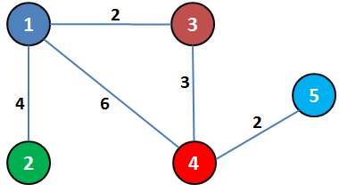

Los numeros sobre las lineas representan la distancia entre nodos.

Sabiendo esto hagamos un esquema de como se debe ver la tabla de rutas de cada nodo.

## Nodo 1 Tabla de rutas

| Node     |   Distance    |Via Node|
|----------|:-------------:|-------:|
|    1     |      0        |    1   |
|    2     |      4        |    2   |
|    3     |      2        |    3   |
|    4     |      5        |    3   |
|    5     |      7        |    4   |


## Nodo 2 Tabla de rutas

| Node     |   Distance    |Via Node|
|----------|:-------------:|-------:|
|    1     |      0        |    1   |
|    2     |      4        |    2   |
|    3     |      6        |    1   |
|    4     |      9        |    1   |
|    5     |      11       |    1   |


## Nodo 3 Tabla de rutas

| Node     |   Distance    |Via Node|
|----------|:-------------:|-------:|
|    1     |      2        |    1   |
|    2     |      6        |    1   |
|    3     |      0        |    3   |
|    4     |      3        |    4   |
|    5     |      5        |    4   |


## Nodo 4 Tabla de rutas

| Node     |   Distance    |Via Node|
|----------|:-------------:|-------:|
|    1     |      5        |    3   |
|    2     |      9        |    1   |
|    3     |      3        |    3   |
|    4     |      0        |    4   |
|    5     |      2        |    5   |


## Nodo 5 Tabla de rutas

| Node     |   Distance    |Via Node|
|----------|:-------------:|-------:|
|    1     |      7        |    4   |
|    2     |      11       |    4   |
|    3     |      5        |    4   |
|    4     |      2        |    4   |
|    5     |      0        |    5   |


En cada tabla tenemos la distancia que necesita un nodo para alcanzar a cada nodo de la red, por ejemplo en la tabla del **nodo 1** el primer valor de distancia es cero para alcanzar al mismo nodo, pero si el **nodo 1** quiere alcanzar al **nodo 5**, debera pasar a traves del **nodo 3** y **nodo 4** antes de llegar al destino , lo que da una distancia total de 7.

Hasta este punto hemos visto los tres tipos de mensajes utilizados para la opracion de AODVV2 y como se extiende un mensaje de requerimiento de ruta o RREQ en la red para encontrar un destino, tambien hemos visto que es lo que contiene una tabla de rutas.

Ahora tratare de ilustrar con un ejemplo muy sencillo como es el proceso de crear el mensaje de requerimiento de ruta y como es el proceso de retransmision del mensaje hasta encontrar la ruta hacia el destinatario.

## Manejo de tabla de rutas a partir de mensajes de requerimiento y confirmacion de rutas (RREQ,RREP)

Ahora veremos un ejemplo explicando como se genera el mensaje desde el origen , como se transmite y como es posible obtener tablas de rutas  apartir de estos mensajes.


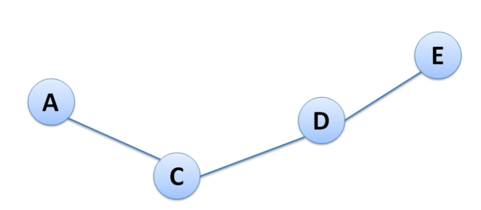

El nodo A desea enviar datos al nodo E, pero no existe una ruta valida hacia ese nodo, se debe iniciar el proceso de busqueda de ruta.

debemos tener en cuenta lo siguiente:

**1.** 
- Cada nodo debe mantener 2 contadores.
  - Un número de secuencia.
  - Broadcast_id: Se incrementa cuando la fuente genera un nuevo requerimeinto de ruta o RREQ. 

**2.**
- Tanto el nodo que genera el requerimiento de ruta como el que lo regenera, deben enviar un paquete con la siguiente informacion:
  - ```<source_addr, source_sequence#, broadcast_id, dest_addr, dest_sequence#, hop_count> ```

- **source_addr**: Es la direccion del generador del requerimiento de ruta u origen del mensaje.
- **source_sequence#**: Cada nodo mantiene su propio numero de secuencia y se inicia en 1.
- **broadcast_id**: Cada RREQ tiene su ID unico.
- **dest_sequence#**: Si no se conoce se deja vacio.
- **hop_count**: representa la distancia en saltos desde el nodo origen hasta el nodo destino.

**3.**
- Mensaje de Respuesta para confirmar que se encontro el destino RREP.(unicast), debe tener la siguiente informacion:
  - ```<source_addr, dest_addr, dest_sequence#, hop_count, lifetime>```

**4.** 
- Nodos intermedios deberan omitir paquetes duplicados


Continuando con el ejemplo, y teniendo en cuenta la informacion suministrada anteriormente, debemos crear unpaquete aodv con la siguiente informacion antes de tratar de transmitir o retransmitir algo.

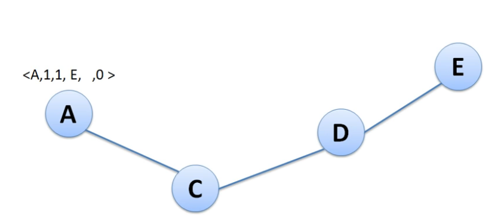

**<A, 1, 1, E, , 0>**

- A: Source address.
- 1: source sequence number.
- 1: broadcast_id.
- E: des_addr.
- no concemos el sequence number del destino al no tener conocimiento de la ruta aun, asi que ese parametro se deja en blanco.
- 0:hop count representa la distancia hacia el origen del mensaje que en este caso es cero.

al crear dicho paquete se debera transmitir como un mensaje de broadcast para que sea escuchado por todos los vecinos, en este caso en particular el unico vecino adyacente del **nodo A** es el **nodo C**, el cual recibira el paquete creado desde el nodo A.

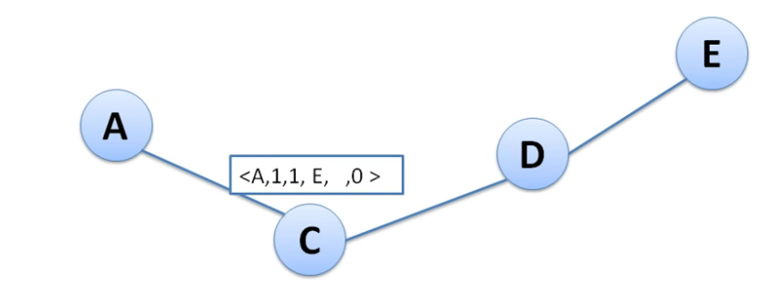

el **nodo C** al  no tener informacion sobre el **nodo E** debera incrementar el hop count actualizar su tabla de rutas y retransmitir el requerimiento de ruta RREQ.

el hop count en este caso representa la distancia entre el nodo origen del mensaje (nodo A) y el que recibe el mensaje (nodo C)

```<A, 1, 1, E, , 1>```

el ultimo parametro del paquete llamado  hop count , nos esta diciendo que desde el nodo C hasta el nodo A hay un salto de distancia. 

En la siguiente imagen observamos como se deberia de ver la tabla de rutas del nodo C; La linea roja indica que estamos almacenando la informacion del nodo que genero el RREQ dentro de la tabla de rutas, con el fin de tener la manera de regresarle un mensaje si la ruta buscada es encontrada; Tambien hay otro campo llamado next o next hop , dicho campo almacena la direccion del nodo vecino que transmite o retransmite el paquete.

como ejemplo si el nodo a transmite un RREQ, el nodo C podra almacenar la direccion del nodo A en la tabla, cuando el nodo C retransmita el RREQ, el nodo D podra almacenar la direccion del nodo C.

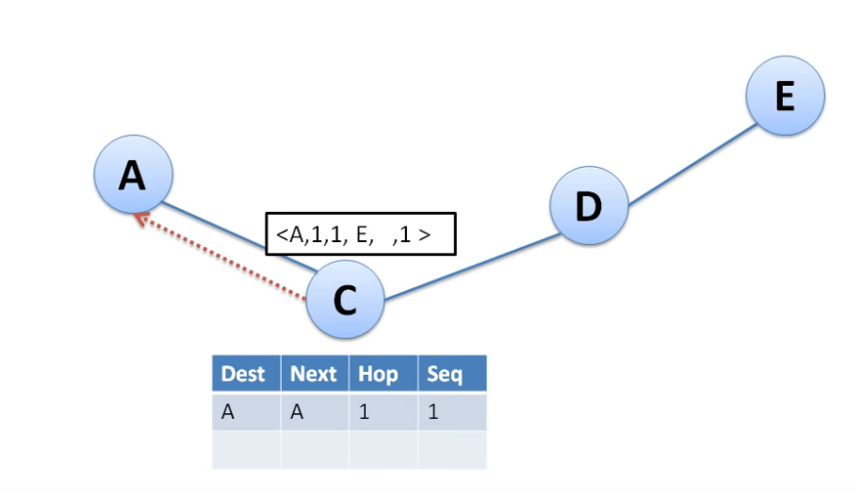

despues de actualizar la tabla de rutas, procedemos a retransmitir el mensaje

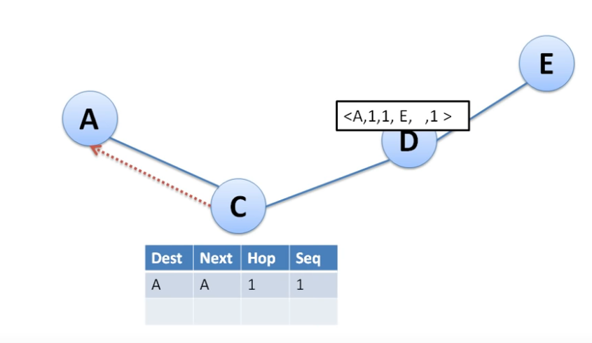

En la imegen anterior el nodo D obtiene un paquete, pero debido a que no es el destinatario, debe incrementar el hopcount, actualizar la tabla de rutas.

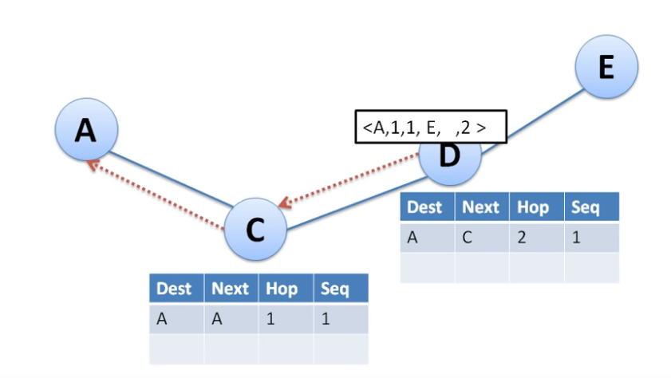


Luego de eso debera retransmitir el mensaje 
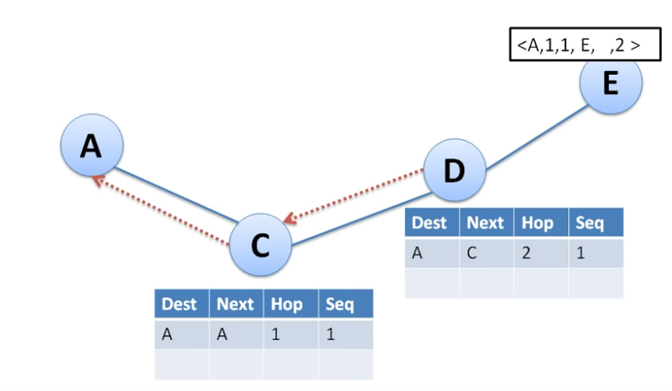

La imagen anterior muestra como el RREQ ha alcanzado al destino buscado por el originador del paquete de busqueda de ruta. ahora es el nodo destino (nodo E) el encargado de preparar un paquete RREP, para ser enviado hasta el nodo A a traves de los nodos  intermedios, cabe recordar que los mensajes RREP son mensajes de tipo unicast, lo que quiere decir que se debe usar la informacion almacenada en las tablas de rutas para poder regresar hasta el origen del todo.

antes de enviar cualquier mensaje desde el nodo E, hagamos una actualizacion en la tabla de rutas de dicho nodo y una preparacion del mensaje de RREP

**<E, A, 120, 0>**

- **E** representa el origen del mensaje.
- **A** representa el destino del mensaje.
- **120** numero d esecuencia.
- **0** representa la distancia hacia el origen del RREP, en este caso es cero, ya que estamos sobre dicho nodo.
  
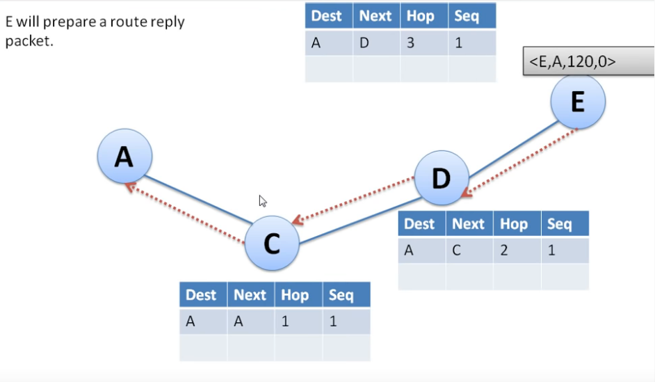

Luego de tener la tabla de rutas actualizada y de tener listo el paquete RREP debemos transmitirlo al nodo vecino (nodo D) en forma de mensaje unicast.

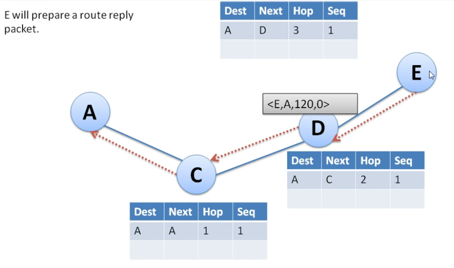

Despues de recibir el RREP, el nodo D debra actualizar su tabla de rutas con el fin de conocer un camino de regreso hacia el nodo E.

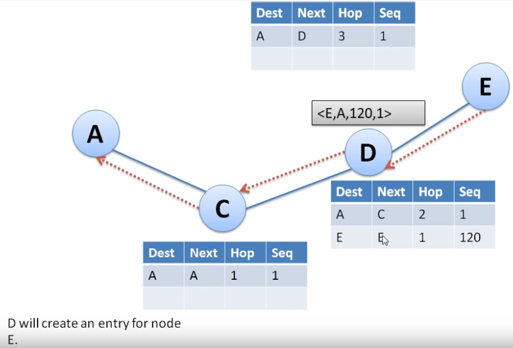

Ahora retransmitimos el paquete de RREP recreado por el nodo D

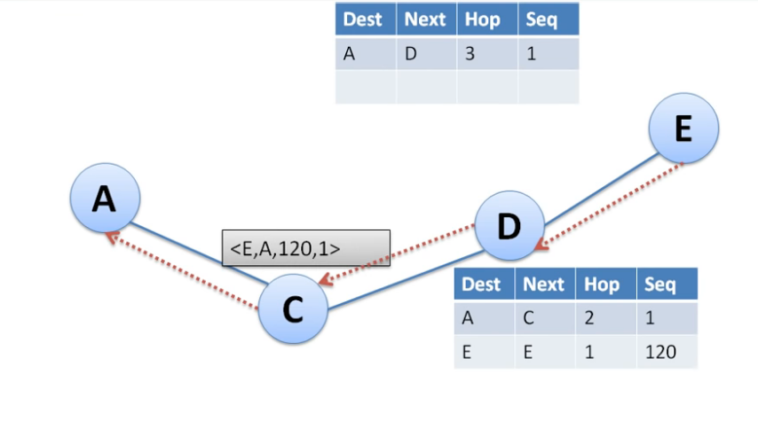

Luego de tener el paquete RREP en el nodo C, procedemos a actualizar la tabla de rutas del nodo C

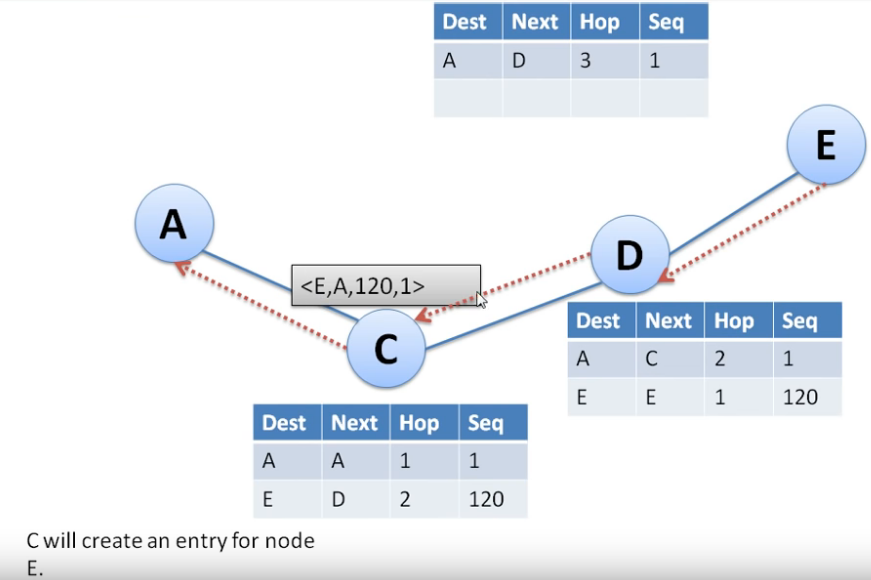

y posteriormente retransmitimos el RREP al nodo A

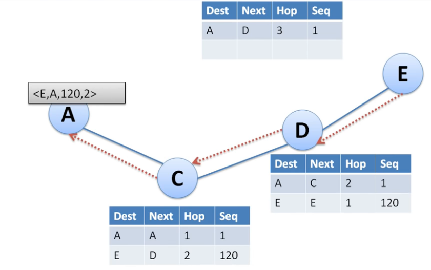

por ultimo el nodo A debera crear una entrada para el nodo C, lo que quiere decir almacenara una ruta hacia el nodo que le envioe el RREP.

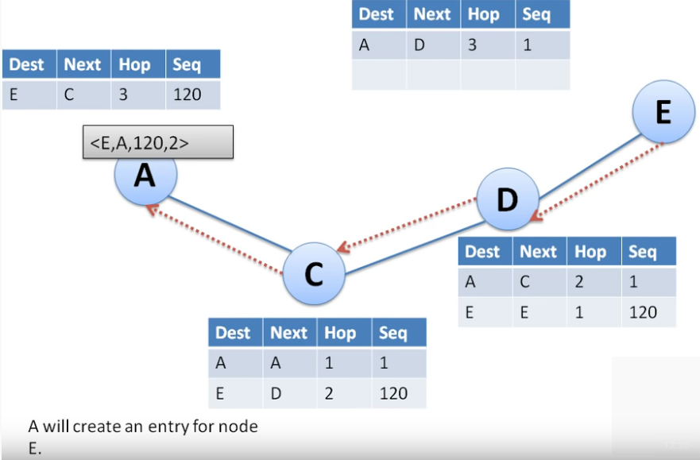


y con esto ya abremos encontrado una ruta hacia el destino o nodo E; Todos los nodo shan actualizado su tabla de rutas y tiene  informacion necesaria para enrutar paquetes hacia el nodo D.