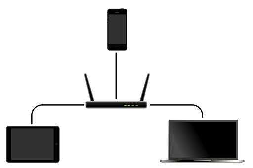

### LOCHA MESH PROJECT
---
### Resumen
Los conceptos de red inalámbrica de tipo malla o Ad-hoc, han sido estudiados a lo largo del tiempo, estableciendo diversos protocolos que con mayor o menor éxito lidian con uno de sus mayores enemigos; “single-hop” (único salto).

Hoy día, su uso se ha popularizado y ha dado pie a un campo emergente, el cual ofrece una gran cantidad de aplicaciones en las que impera la necesidad de mantener dispositivos interconectados sin desplegar una red cableada y que estos interactúen con la mayor eficiencia sin renunciar a la seguridad en la comunicación.

Sin embargo, este tipo de redes también pueden proporcionar un medio de comunicación fiable y seguro, donde ninguna persona, empresa o administración, aún siendo partícipe activo de la misma, pueda vetar, censurar o acceder a cualquier información [ref**], a menos que de forma expresa, sea el destinatario. Otro interesante campo de aplicación es en zonas afectadas por catástrofes naturales, pobre infraestructura o aquellas que han sufrido los efectos de conflictos bélicos.

Por todo lo anterior, el presente proyecto se marca como objetivo el desarrollo tanto del hardware como del software necesario para su despliegue en las situaciones descritas en el párrafo anterior y abrir la posibilidad de comunicación no sólo entre individuos de la propia red, sino también dar acceso a una comunicación global tanto hacia el interior como hacia el exterior de la misma, desarrollando un protocolo de consenso entre dispositivos, que permita mantener la integridad de los datos transmitidos, así como la seguridad y el derecho al anonimato de los individuos participantes.

### I Introducción

Redes inalámbricas como Wi-Fi (Wireless Fidelity) [ref**] son usadas en la cotidianidad por muchos de nosotros, posibilitando una comunicación local, bidireccional, segura y eficaz, además de ofrecernos una ventana a Internet y por lo tanto un acceso global a la comunicación. Los productos suministrados al mercado de consumo, no ofrecen gran cobertura, son diseñados para un entorno casero donde deben cubrir unas pocas decenas de metros, generalmente se usa una topología en estrella.

---

Los dispositivos participantes se conectan a un nodo central (Router)[ref**] de tal forma que todas las comunicaciones han de realizarse a través de este. Este marco ofrece numerosas ventajas a bajo coste pero aporta un posible fallo que ensombrece cualquiera de las mismas, este es; si falla el nodo central, cualquier dispositivo conectado a este, se queda sin conexión. Además un router inalámbrico, representa la figura de una autoridad central en la cual debemos confiar y por ende a cualquier otro dispositivo conectado al mismo.

---

**LoRaWAN** (**Lo**ng **Ra**nge **W**ide **A**rea **N**etwork)[ref**], es una especificación inalámbrica, que fue diseñada teniendo en cuenta factores como baja potencia, largo alcance y bajo consumo. La arquitectura típica suele ser de estrella, los nodos de la red  se comunican a través de una puerta de enlace (Gateway). A su vez este Gateway puede ser enlazado con un servidor central, construyendo de esta forma una doble estrella.

[fig]

La banda de radiofrecuencia en muchos casos es la denominada  ISM (Industrial, Scientific,Medical) [ref**] , abierta a todo el mundo sin necesidad de licencia, limitada en cuanto a potencia de transmisión, factor de uso y rango electromagnético a ubicación geográfica.

| Región    | Límite inferior | Límite superior | Punto medio |
|-----------|-----------------|-----------------|-------------|
| América   | 902.00 MHz      | 928.00 MHz      | 915.00 MHz  |
| Europa    | 433.05 MHz      | 434.79 MHz      | 422.92 MHz  |
| Europa(*) |                 |                 |             |
| Asia      |                 |                 |             |

LoRaWAN por lo tanto se aleja del objetivo marcado al disponer  de uno o varios nodos que hacen de concentradores o enrutadores de la comunicación, cuyo fallo desconectará a los nodos que dependen de él, tal como se describe en el caso de aplicaciones Wi-Fi.

Sin embargo **LoRa** (**Lo**ng **Ra**nge)[ref**], la modulación sobre la que se establece LoRaWAN, resulta una vehículo de transporte interesante sobre el que desarrollar este proyecto.

